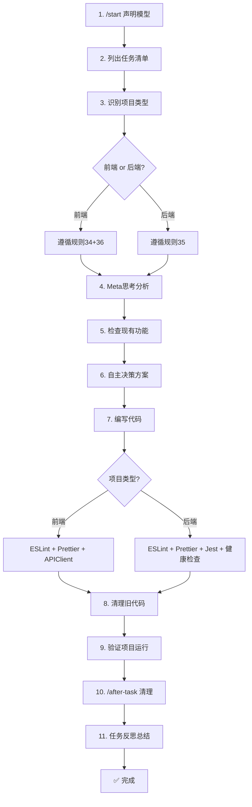

# 项目全局规则配置最终总结（36条规则完整版）

**配置完成时间**：2025年11月17日（北京时间）  
**使用模型**：Claude Sonnet 4.5  
**规则总数**：36条（新增5条）

---

## ✅ 配置完成情况

### 📁 已创建/更新文件（共10个）

```
.claude/
├── README.md                      # ✅ 已更新（36条规则概览）
├── project-rules.md               # ✅ 已更新（1602行，36条规则）
├── QUICK-REFERENCE.md             # 快速参考卡
├── SETUP-COMPLETE.md              # 初次配置总结（21条规则）
├── FINAL-SUMMARY.md               # 原始总结（21条规则）
├── FINAL-SUMMARY-31-RULES.md      # 31条规则总结
├── FINAL-SUMMARY-36-RULES.md      # ✅ 本文件 - 36条规则完整总结
└── commands/                      # 4个自定义命令
    ├── start.md                   # /start
    ├── check-rules.md             # /check-rules
    ├── before-script.md           # /before-script
    └── after-task.md              # /after-task
```

---

## 🎯 36条核心规则完整列表

### 📦 代码创建和质量（规则 1-7）
| 编号 | 规则名称 | 核心要点 |
|------|----------|----------|
| 1 | 脚本和文件创建规则 | 创建前检查现有功能，不乱生成脚本 |
| 2 | API方法命名和验证规则 | 不推测API，查看utils/api.js实际定义 |
| 3 | 代码注释规则 | 详细的简体中文注释 |
| 4 | 时区规则 | 使用北京时间（Asia/Shanghai）|
| 5 | 文档生成规则 | 长文档分步生成后合并 |
| 6 | 代码修改流程 | 理解→验证→注释→验证 |
| 7 | 质量标准 | 不增加技术债务和系统复杂度 |

### 🛡️ 功能保护和验证（规则 8-9）
| 编号 | 规则名称 | 核心要点 |
|------|----------|----------|
| 8 | 代码完整性和功能保护规则 | 不乱删除、不破坏原有功能 |
| 9 | 任务完成后的验证规则 | 验证项目可运行，即时修复问题 |

### 💡 工作方法和沟通（规则 10-11）
| 编号 | 规则名称 | 核心要点 |
|------|----------|----------|
| 10 | 深度理解和思考规则 | 透明化思考过程、问题、工具、方案 |
| 11 | 临时文件和无用文件清理规则 | 任务完成后清理临时/无用文件 |

### 📱 平台兼容性（规则 12）
| 编号 | 规则名称 | 核心要点 |
|------|----------|----------|
| 12 | 微信小程序开发规范 | 使用wx API，避免DOM操作 |

### ⚙️ 执行规范（规则 13-16）
| 编号 | 规则名称 | 核心要点 |
|------|----------|----------|
| 13 | 模型使用透明化规则 | 每次说明使用的模型 |
| 14 | 问题诊断规则 | 组件/逻辑/环境三层诊断 |
| 15 | 命令执行和超时处理规则 | 120秒超时自动重试或换方案 |
| 16 | 沟通和交流规则 | 始终使用简体中文 |

### 🔧 服务和环境（规则 17-18）
| 编号 | 规则名称 | 核心要点 |
|------|----------|----------|
| 17 | 服务重启和环境验证规则 | 代码修改后确认重启并验证环境变量 |
| 18 | 规则文档的目的和作用 | 预防问题+快速解决问题 |

### 🔗 前后端规范（规则 19-21）
| 编号 | 规则名称 | 核心要点 |
|------|----------|----------|
| 19 | 前后端接口对接规范 | 后端API是权威，前端必须适配 |
| 20 | 前端错误处理和验证规范 | 完善错误分类、参数/网络/认证验证 |
| 21 | 语言规范 | Always respond in Chinese-simplified |

### 🆕 代码清理和测试（规则 22-23）
| 编号 | 规则名称 | 核心要点 |
|------|----------|----------|
| 22 | 代码修改后的清理规则 | 删除旧代码功能，避免重复 |
| 23 | 测试和数据管理核心规则 | 统一配置、强制数据存在性检查 |

### 🆕 文档和任务管理（规则 24-25）
| 编号 | 规则名称 | 核心要点 |
|------|----------|----------|
| 24 | 长文档分步创建规则 | 分步创建后合并，不可简化 |
| 25 | 任务清单管理规则 | 列出清单、标注完成状态、不可敷衍 |

### 🆕 Git和完整性（规则 26-27）
| 编号 | 规则名称 | 核心要点 |
|------|----------|----------|
| 26 | Git操作限制规则 | 没有明确指示不自动上传 |
| 27 | 内容完整性保证规则 | 分批添加时保证完整性 |

### 🆕 规则体系和文档（规则 28-29）
| 编号 | 规则名称 | 核心要点 |
|------|----------|----------|
| 28 | Memory Rules说明 | 三层规则体系（Memory > Project > Global）|
| 29 | 文档生成分析规则 | 不任意生成.md文件，优先写入现有文档 |

### 🆕 异常和思考（规则 30-31）
| 编号 | 规则名称 | 核心要点 |
|------|----------|----------|
| 30 | 异常处理和提示规则 | 禁止模拟结果，明确提示问题来源 |
| 31 | 深度思考和Meta反思规则 | 主动思考、分享洞察、系统性分析 |

### 🆕 自主决策（规则 32）
| 编号 | 规则名称 | 核心要点 |
|------|----------|----------|
| 32 | 自主决策和执行规则 | 完全自主工作，直接执行，无需询问 |

### ⭐ 最新规则（规则 33-36）
| 编号 | 规则名称 | 核心要点 |
|------|----------|----------|
| 33 | 文档可视化规则 | 优先使用Mermaid流程图或ASCII图表 |
| 34 | 前后端职责分离规则 | 前端只处理前端，后端只处理后端 |
| 35 | 后端数据库项目开发规范 | npm run dev + Sequelize-CLI + 完整质量检查 |
| 36 | 前端项目开发规范 | ESLint + Prettier + APIClient验证 |

---

## 🔧 4个自定义命令

| 命令 | 用途 | 使用时机 |
|------|------|----------|
| `/start` | 开始任务声明 | 开始处理新任务时 |
| `/check-rules` | 规则检查 | 执行重要操作前 |
| `/before-script` | 脚本生成前检查 | 生成任何脚本前 |
| `/after-task` | 任务完成后验证 | 任务完成后 |

---

## 📋 标准工作流程（11步 - 36条规则版）



---

## ✨ 核心原则总结（12大原则）

### 原有十大核心原则（规则 1-31）

1. **不乱生成** - 创建前必查，优先扩展
2. **不推测** - API/数据格式必查实际定义
3. **简体中文** - 代码、文档、注释、回复统一简体中文
4. **完善验证** - 错误处理、参数验证、网络检查、认证验证
5. **权威原则** - 后端API是数据权威，前端必须适配
6. **清理旧代码** - 修改后删除旧功能，避免重复
7. **统一测试** - 统一数据管理，强制存在性检查
8. **任务清单** - 列出清单，标注完成，不敷衍
9. **禁止模拟** - 不生成模拟结果，明确提示问题来源
10. **深度思考** - Meta反思，系统性分析，主动洞察

### 新增两大核心原则（规则 32-36）

11. **自主决策** - 完全自主工作，直接执行，无需询问
12. **职责分离** - 前后端严格分离，使用可视化文档，完整质量检查

---

## 📊 规则分类占比（36条）

```
代码质量和创建：7条（19%）
功能保护和验证：2条（6%）
工作方法和沟通：2条（6%）
平台兼容性：1条（3%）
执行规范：4条（11%）
服务和环境：2条（6%）
前后端规范：3条（8%）
代码清理和测试：2条（6%）
文档和任务管理：2条（6%）
Git和完整性：2条（6%）
规则体系和文档：2条（6%）
异常和思考：2条（6%）
自主决策：1条（3%）
⭐ 文档和职责：2条（6%）  # 新增
⭐ 项目规范：2条（6%）    # 新增
```

---

## 🚀 从现在开始

### ✅ 我会自动遵守的规则（36条完整版）

#### 每次回答时：
- ✅ 使用简体中文回答（Always respond in Chinese-simplified）
- ✅ 说明使用的模型（Claude Sonnet 4.5）
- ✅ 列出任务完成清单
- ✅ 识别项目类型（前端/后端）
- ✅ 透明化思考过程和工具使用
- ✅ 进行Meta思考和深层分析
- ✅ 自主决策，直接执行（无需询问）

#### 创建文件前：
- ✅ 搜索现有功能（/scripts/, /routes/, /services/, /utils/）
- ✅ 优先扩展现有功能
- ✅ 评估是否真的需要新文件
- ✅ 不任意生成.md文件

#### 文档规划时：
- ✅ 优先使用Mermaid流程图
- ✅ 使用ASCII环境图表
- ✅ 避免纯文字描述复杂流程

#### API调用前：
- ✅ 查看 utils/api.js 实际定义
- ✅ 不推测方法名和参数

#### 接口对接时：
- ✅ 后端API是数据权威
- ✅ 前端必须适配后端
- ✅ 不要求修改后端格式

#### 编写代码时：
- ✅ 详细的简体中文注释
- ✅ 使用北京时间
- ✅ 完善错误处理（分类、用户友好提示）
- ✅ 完整验证（参数、网络、认证）
- ✅ 统一测试数据管理
- ✅ 强制数据存在性检查
- ✅ 不生成模拟结果（明确提示问题来源）
- ✅ 保护原有功能不被破坏
- ✅ 严格遵守前后端职责分离

#### 前端项目：
- ✅ 只处理前端任务
- ✅ 遇到后端问题 → 通知用户，询问需要提供什么信息
- ✅ 完成后运行：ESLint + Prettier + APIClient验证

#### 后端项目：
- ✅ 只处理后端任务
- ✅ 使用 npm run dev 启动（Nodemon）
- ✅ 使用 Sequelize-CLI 操作数据库
- ✅ 遇到前端问题 → 通知用户，提供API文档
- ✅ 完成后运行：ESLint + Prettier + Jest + 健康检查

#### 任务完成后：
- ✅ 删除旧代码功能（避免重复）
- ✅ 确认是否需要重启服务
- ✅ 验证环境变量正确加载
- ✅ 运行完整质量检查（根据项目类型）
- ✅ 验证项目可正常运行
- ✅ 清理临时文件和无用文件
- ✅ 移除无效引用
- ✅ 更新任务清单完成状态
- ✅ 进行任务反思和总结
- ✅ 分享深层洞察

#### Git操作：
- ✅ 没有用户明确指示，不自动上传

---

## 📖 查看规则文档

| 文档 | 用途 | 推荐阅读 | 规则数 |
|------|------|----------|--------|
| [project-rules.md](./project-rules.md) | 36条规则详细说明（1602行）| ⭐⭐⭐⭐⭐ 必读 | 36条 |
| [README.md](./README.md) | 配置使用说明和概览 | ⭐⭐⭐⭐ 推荐 | 概览 |
| [QUICK-REFERENCE.md](./QUICK-REFERENCE.md) | 快速参考卡 | ⭐⭐⭐ 日常参考 | 快速查阅 |
| 本文件 | 36条规则完整总结 | ⭐⭐ 了解全貌 | 36条 |

---

## 🎓 给团队的说明

### 如何使用这些配置

1. **新成员入职**
   - 阅读 README.md 了解规则概览
   - 阅读 project-rules.md 了解详细规则（36条）
   - 使用 QUICK-REFERENCE.md 日常查阅

2. **日常开发**
   - 使用 `/start` 开始任务（列出清单）
   - 识别项目类型（前端/后端）
   - 遵循对应的项目规范
   - 使用 `/after-task` 完成任务后验证
   - 查阅 QUICK-REFERENCE.md 快速检查

3. **遇到问题**
   - 参考 project-rules.md 的问题诊断清单
   - 按照规则文档的解决方案处理
   - 进行Meta思考和深层分析
   - 更新规则文档记录新发现

4. **跨职责问题**
   - 前端遇到后端问题 → 通知后端开发者
   - 后端遇到前端问题 → 通知前端开发者
   - 不跨界处理问题

---

## 🎉 配置完成

**状态**：✅ 完成  
**规则数量**：36条（新增5条）  
**文档文件**：10个  
**自定义命令**：4个  
**文档总行数**：1602行（project-rules.md）

### 新增规则亮点（规则 32-36）：

1. **规则32**：自主决策和执行
   - 完全自主工作
   - 所有决策自己做
   - 无需征求用户确认
   - 直接执行后告知结果

2. **规则33**：文档可视化
   - 优先使用Mermaid流程图
   - 使用ASCII环境图表
   - 提高文档可读性

3. **规则34**：前后端职责分离
   - 前端只处理前端任务
   - 后端只处理后端任务
   - 严格职责分离
   - 跨职责问题通知用户

4. **规则35**：后端项目规范
   - npm run dev 启动
   - Sequelize-CLI 操作数据库
   - 完整质量检查流程

5. **规则36**：前端项目规范
   - ESLint + Prettier检查
   - APIClient验证
   - 完整质量保证

---

## 💡 深度反思：为什么需要这些新规则？

### 问题根源分析：

1. **决策效率问题**（规则32）
   - 频繁询问用户降低效率
   - 用户期望AI自主工作
   - 需要建立自主决策机制

2. **文档可读性问题**（规则33）
   - 纯文字难以理解复杂流程
   - 需要可视化工具
   - Mermaid流程图提高理��效率

3. **职责混乱问题**（规则34）
   - 前后端职责不清
   - 跨界处理导致问题
   - 需要明确职责边界

4. **质量保证问题**（规则35-36）
   - 缺少统一的质量标准
   - 前后端项目需要不同的检查流程
   - 需要建立完整的质量检查机制

### 系统性影响：

这些新规则不仅是技术规范，更是：
- **效率提升**：自主决策减少沟通成本
- **质量保证**：完整的质量检查流程
- **职责清晰**：前后端严格分离
- **文档优化**：可视化提高理解效率

---

从现在开始，我会严格遵守所有36条规则来完成你的任务！🎉

---

**最后更新**：2025年11月17日（北京时间）
**配置版本**：v3.0（36条规则完整版）
**使用模型**：Claude Sonnet 4.5 (claude-sonnet-4-5-20250929)
