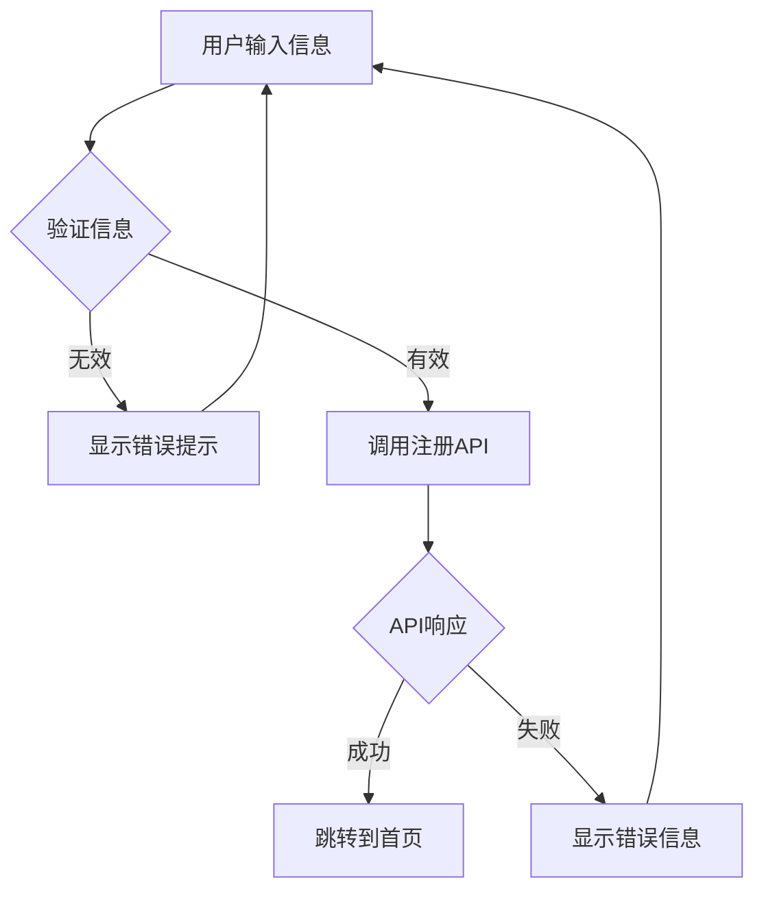

# Claude Code 项目配置说明

本目录包含项目级别的 Claude Code 配置和规则。

## 📁 目录结构

```
.claude/
├── README.md                      # 本文件
├── project-rules.md               # 项目核心规则（必读 - 45条规则）
├── QUICK-REFERENCE.md             # 规则快速参考卡
├── SETUP-COMPLETE.md              # 初次配置完成总结
├── FINAL-SUMMARY.md               # 21条规则总结
├── FINAL-SUMMARY-31-RULES.md      # 31条规则总结
├── FINAL-SUMMARY-36-RULES.md      # 36条规则总结
├── FINAL-SUMMARY-45-RULES.md      # 45条规则总结（最新）
└── commands/                      # 自定义斜杠命令
    ├── start.md                   # 开始任务声明
    ├── check-rules.md             # 检查规则遵守情况
    ├── before-script.md           # 生成脚本前的检查流程
    └── after-task.md              # 任务完成后的检查流程
```

## 🎯 核心规则（共45条）

所有规则详见 [project-rules.md](./project-rules.md)，核心原则：

### 代码创建和质量（规则 1-7）
1. **不乱生成文件** - 创建前必须检查现有功能
2. **不推测API** - 必须查看实际代码定义
3. **详细注释** - 所有代码使用简体中文详细注释
4. **北京时间** - 统一使用北京时间（Asia/Shanghai）
5. **质量优先** - 不增加技术债务和系统复杂度

### 功能保护和验证（规则 8-9）
6. **保护原有功能** - 不乱删除、不破坏现有功能
7. **完成后验证** - 确保项目可正常运行，即时修复问题

### 工作方法和沟通（规则 10-11）
8. **深度理解** - 理解所有代码、文档和注释
9. **透明沟通** - 说明思考过程、问题、工具、解决方案
10. **及时清理** - 删除临时文件、无用文件、无效引用

### 平台兼容性（规则 12）
11. **微信小程序兼容** - 符合小程序开发标准和 API 要求

### 执行规范（规则 13-16）
12. **模型透明化** - 每次说明使用的模型
13. **问题诊断** - 检查组件、逻辑、环境问题
14. **超时处理** - 120秒超时自动重试或换方案
15. **中文交流** - 始终使用简体中文

### 服务和环境（规则 17-18）
16. **服务重启验证** - 代码修改后确认是否需要重启服务并验证环境变量
17. **规则双重目标** - 预防问题+快速解决问题

### 前后端规范（规则 19-21）
18. **接口对接规范** - 后端API是权威，前端必须适配后端
19. **错误处理规范** - 完善的错误分类、参数验证、网络和认证检查
20. **语言规范** - Always respond in Chinese-simplified

### 代码清理和测试（规则 22-23）
21. **代码修改后清理** - 删除旧代码功能，避免重复
22. **测试数据管理** - 统一配置、强制数据存在性检查、模型导入一致性

### 文档和任务管理（规则 24-25）
23. **长文档分步创建** - 分步创建后合并，不可简化
24. **任务清单管理** - 列出清单、标注完成状态、不可敷衍

### Git和完整性（规则 26-27）
25. **Git操作限制** - 没有明确指示不自动上传
26. **内容完整性保证** - 分批添加时保证完整性

### 规则体系和文档（规则 28-29）
27. **Memory Rules说明** - 三层规则体系（Memory > Project > Global）
28. **文档生成分析** - 不任意生成.md文件，优先写入现有文档

### 异常和思考（规则 30-31）
29. **异常处理和提示** - 禁止模拟结果，明确提示问题来源
30. **深度思考和Meta反思** - 主动思考、分享洞察、系统性分析

### 自主决策（规则 32）
31. **自主决策和执行** - 完全自主工作，所有决策自己做，无需征求确认

### 🆕 文档和职责（规则 33-34）
32. **文档可视化** - 优先使用Mermaid流程图或ASCII图表
33. **前后端职责分离** - 前端只处理前端，后端只处理后端，严格分离

### 🆕 项目规范（规则 35-36）
34. **后端项目规范** - npm run dev启动，Sequelize-CLI操作数据库，完整质量检查
35. **后端数据库项目规范** - ESLint + Prettier + APIClient验证

### 🔥 规则执行和体验（规则 37-45）
36. **规则优先和自动化** - 规则优先、自动化优先、效率优先，失败命令立即自动重试
37. **文件模块检查** - 引用前必须验证文件/模块存在
38. **用户体验保障** - 不显示空白、有加载状态、详细错误提示
39. **真实数据原则** - 只用真实数据（验证码123456仅限开发/测试环境）
40. **错误提示准确** - 明确问题位置，提供保护措施
41. **环境适配** - Windows用`;`，Linux用`&&`
42. **文档控制** - 未经要求不生成文档
43. **时间获取** - 用date命令获取真实时间
44. **中文注释强制** - 所有技术信息必须有详细中文注释

## 🔧 自定义命令使用

### `/start` - 开始任务声明
在开始处理任务时使用，声明使用的模型和工作原则。

```
/start
```

### `/check-rules` - 检查规则
在执行重要操作前使用，确保遵守所有项目规则。

```
/check-rules
```

### `/before-script` - 脚本生成检查
在生成任何脚本前必须使用，执行完整的检查流程。

```
/before-script
```

### `/after-task` - 任务完成检查
任务完成后使用，执行完整的验证和清理流程。

```
/after-task
```

## 📝 使用场景示例

### 场景1：后端项目开发
```
用户：帮我添加一个新的API接口

Claude：
🤖 使用模型：Claude Sonnet 4.5

📋 任务清单：
- [ ] 1. 检查现有API
- [ ] 2. 实现新接口
- [ ] 3. 编写测试
- [ ] 4. 质量检查

我识别这是后端项目，将遵循规则35：
- 使用 npm run dev 启动
- 使用 Sequelize-CLI 操作数据库
- 完成后运行完整质量检查

[直接开始实现，无需询问]

✅ 已完成：
- 新增API接口 /api/v1/users
- 编写Jest测试
- ESLint检查通过
- Prettier格式化完成
- 测试全部通过
- 健康检查正常
```

### 场景2：前端项目开发
```
用户：前端页面需要调用新的API

Claude：
🤖 使用模型：Claude Sonnet 4.5

我识别这是前端项目，将遵循规则34和36：
- 只处理前端任务
- 完成后运行ESLint + Prettier + APIClient验证

[直接实现]

✅ 已完成：
- 更新APIClient方法
- 添加错误处理
- ESLint检查通过
- Prettier格式化完成
- APIClient验证通过
```

### 场景3：前端遇到后端问题
```
用户：API返回500错误

Claude：
⚠️ 这是后端问题

问题描述：
- API接口返回500服务器错误
- 接口：POST /api/v1/users
- 错误信息：Internal Server Error

根据规则34，这需要后端开��者处理。

我可以为后端开发者整理以下信息：
- 请求参数
- 错误堆栈
- 预期行为

请问需要我提供哪些信息给后端开发者？
```

### 场景4：使用Mermaid流程图
```
用户：说明一下用户注册流程

Claude：
🤖 使用模型：Claude Sonnet 4.5

根据规则33，我使用Mermaid流程图说明：



流程说明：
1. 用户输入注册信息
2. 前端验证信息格式
3. 调用后端注册API
4. 根据响应处理结果
```

## 🚀 工作流程

### 标准工作流程（11步 - 45条规则版）：
1. **开始任务** → 使用 `/start` 声明模型（简体中文）
2. **列出清单** → 创建任务完成清单
3. **识别项目** → 判断前端/后端项目
4. **深度思考** → Meta思考和深层分析
5. **检查规则** → 使用 `/check-rules` 或 `/before-script`
6. **搜索现有** → 全面搜索相关现有功能
7. **自主决策** → 选择最优方案直接执行
8. **编写代码** → 详细简体中文注释 + 北京时间
9. **质量检查** → 前端/后端完整质量检查
10. **清理旧代码** → 删除旧功能，避免重复
11. **完成任务** → 使用 `/after-task` 验证和清理

## 📋 强制检查清单

每次修改代码前必须确认：

- [ ] 已阅读 `project-rules.md`（45条规则）
- [ ] 已列出任务完成清单
- [ ] 已识别项目类型（前端/后端）
- [ ] 已进行深度思考和Meta分析
- [ ] 已搜索现有相关功能
- [ ] 已验证API方法实际定义（如适用）
- [ ] 接口对接以后端API为准（如适用）
- [ ] 已准备详细的简体中文注释
- [ ] 时间处理使用北京时间
- [ ] 完善错误处理和参数验证（不生成模拟结果）
- [ ] 统一测试数据管理和数据存在性检查
- [ ] 不会增���技术债务
- [ ] 不会增加系统复杂度
- [ ] 确认是否需要重启服务
- [ ] 修改后删除旧代码功能
- [ ] 严格遵守前后端职责分离
- [ ] 使用Mermaid流程图或ASCII图表（文档规划）

## 🎓 最佳实践

### ✅ 好的做法：
- 充分搜索和理解现有代码
- 优先扩展而不是创建
- 详细的业务逻辑注释（简体中文）
- 验证实际的代码定义
- 前端适配后端API
- 完善的错误处理和用户提示（不生成模拟结果）
- 统一测试数据管理，强制数据存在性检查
- 代码修改后删除旧功能
- 使用Mermaid流程图说明复杂流程
- 严格遵守前后端职责分离
- 前端项目：ESLint + Prettier + APIClient验证
- 后端项目：ESLint + Prettier + Jest + 健康检查
- 自主决策，直接执行（无需询问）
- 列出任务清单并标注完成状态
- 主动进行深度思考和Meta反思

### ❌ 避免的做法：
- 不检查就创建新文件
- 推测API方法名
- 前端自定义数据格式（必须适配后端）
- 省略注释或使用英文注释
- 使用非北京时间
- 错误处理不完善
- 生成模拟结果掩盖问题
- 缺少参数验证和网络检查
- 不验证数据存在性
- 代码修改后不删除旧代码
- 纯文字描述复杂流程（应使用Mermaid）
- 前端处理后端问题或后端处理前端问题
- 代码修改后不运行质量检查
- 为了快速完成而简化内容
- 没有明确指示就自动上传Git
- 询问用��做决策（应自主决策）
- 增加不必要的复杂度
- 不清理临时文件
- 只解决表面问题，不进行深层思考

## 📞 疑问处理

### 前端项目遇到后端问题：
1. 明确告知用户这是后端/数据库问题
2. 询问用户需要提供什么信息给后端开发者
3. 整理问题描述和相关信息
4. 不尝试解决后端问题

### 后端项目遇到前端问题：
1. 明确告知用户这是前端问题
2. 通知用户需要前端开发者处理
3. 提供API文档和接口说明
4. 不尝试解决前端问题

## 📖 快速参考

详细的规则说明请查看：
- **完整规则**：[project-rules.md](./project-rules.md) - 45条规则
- **快速参考**：[QUICK-REFERENCE.md](./QUICK-REFERENCE.md)
- **配置总结**：[FINAL-SUMMARY-45-RULES.md](./FINAL-SUMMARY-45-RULES.md)

## 🎯 核心原则总结（15大原则）

### 原有十大原则（规则 1-31）
1. **不乱生成** - 创建前必查，优先扩展
2. **不推测** - API/数据格式必查实际定义
3. **简体中文** - 代码、文档、注释、回复统一简体中文
4. **完善验证** - 错误处理、参数验证、网络检查、认证验证
5. **权威原则** - 后端API是数据权威，前端必须适配
6. **清理旧代码** - 修改后删除旧功能，避免重复
7. **统一测试** - 统一数据管理，强制存在性检查
8. **任务清单** - 列出清单，标注完成，不敷衍
9. **禁止模拟** - 不生成模拟结果，明确提示问题来源
10. **深度思考** - Meta反思，系统性分析，主动洞察

### 新增五大原则（规则 32-45）
11. **自主决策** - 完全自主工作，直接执行，无需询问
12. **职责分离** - 前后端严格分离，使用可视化文档，完整质量检查
13. **规则优先** - 严格遵守规则，自动化处理失败命令，效率优先
14. **用户体验** - 不显示空白、有加载状态、准确错误提示、保护措施
15. **真实数据** - 只用真实数据，环境适配，强制中文注释

---

**重要**：这些规则（共45条）是强制性的，不仅用于预防问题，更是为了在问题出现时能够快速定位和解决。规则旨在保持代码库的清晰、可维护和高质量，同时培养深度思考、自主决策和系统性优化的习惯。**规则37-45特别强调规则优先、用户体验、真实数据和环境适配。**
