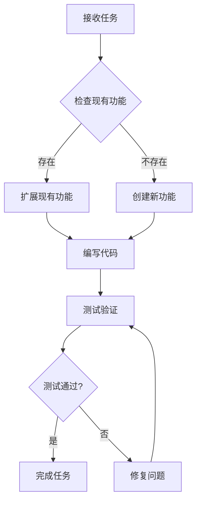
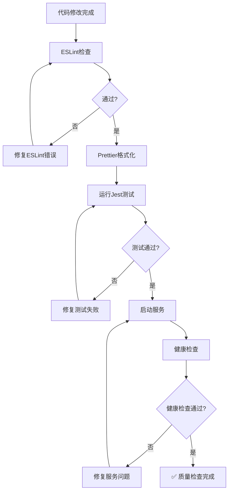
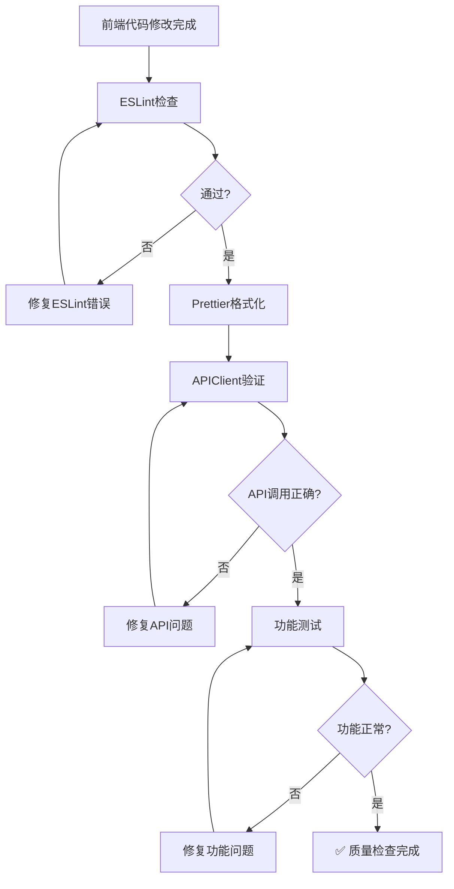
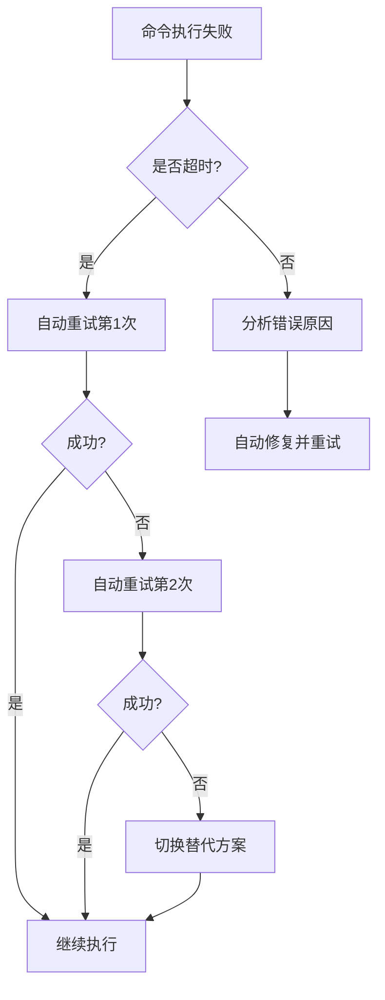

# 项目核心规则

## 1. 脚本和文件创建规则

### 创建新文件前必须：
1. **检查现有功能**：全面搜索项目中是否已有类似功能
2. **检查特定目录**：
   - `/scripts/` - 所有脚本工具
   - `/routes/` - API路由
   - `/services/` - 业务服务
   - `/middleware/` - 中间件
   - `/utils/` - 工具函数
3. **优先扩展现有功能**：如果现有文件可以扩展，绝不创建新文件

### 创建新文件的严格条件（必须同时满足）：
- ✅ 现有文件确实不包含相关功能
- ✅ 新功能与现有功能职责明确分离
- ✅ 新文件有独特且不可合并的业务价值
- ✅ 不增加技术债务
- ✅ 不增加系统复杂度

### 禁止行为：
- ❌ 不检查现有功能就创建新文件
- ❌ 功能重复的脚本
- ❌ 盲目生成新脚本

## 2. API方法命名和验证规则

### 严格要求：
1. **禁止推测API方法名**
   - ❌ 不可以"自以为是"地推测
   - ❌ 不可以盲目应用 get/post/create 等标准前缀

2. **必须进行实际代码检查**
   - ✅ 检查 `utils/api.js` 中实际定义的方法
   - ✅ 检查路由文件中实际的接口定义
   - ✅ 验证方法签名和参数

3. **必须结合项目文档**
   - ✅ 参考用户提供的文档
   - ✅ 理解项目特定架构
   - ✅ 深度理解技术路线
   - ❌ 不可脱离用户提供的文档

### 检查清单（每次修改API调用前）：
- [ ] 已查看 `utils/api.js` 实际定义
- [ ] 已查看相关路由文件
- [ ] 已验证方法名和参数
- [ ] 已参考相关文档

## 3. 代码注释规则

### 注释要求：
- ✅ **详细的中文注释**（项目交付中国区域使用）
- ✅ 每个函数必须注释：目的、参数、返回值
- ✅ 复杂逻辑必须有行内注释
- ✅ 业务规则必须注释说明

### 注释示例：
```javascript
/**
 * 查询用户积分余额
 * @param {number} userId - 用户ID
 * @param {Object} options - 查询选项
 * @param {boolean} options.includeHistory - 是否包含历史记录
 * @returns {Promise<Object>} 积分余额信息
 */
async function getUserPointsBalance(userId, options = {}) {
  // 验证用户ID有效性
  if (!userId || userId <= 0) {
    throw new Error('无效的用户ID');
  }

  // 查询积分余额（使用事务确保一致性）
  // ...
}
```

## 4. 时区规则

### 时间处理统一标准：
- ✅ **必须使用北京时间（Asia/Shanghai）**
- ✅ 所有时间戳转换为北京时间
- ✅ 日志和输出使用北京时间
- ✅ 数据库时间字段明确时区

### 时间格式示例：
```javascript
// 正确：使用北京时间
const now = new Date().toLocaleString('zh-CN', {
  timeZone: 'Asia/Shanghai'
});

// 日志输出
console.log(`[${now}] 操作完成`);
```

## 5. 文档生成规则

### 长文档处理：
- ✅ 内容较长时分步生成
- ✅ 最后合并成完整文档
- ✅ 确保内容连贯性
- ✅ 使用中文编写

## 6. 代码修改流程

### 每次修改代码必须：
1. **理解现有代码**
   - 阅读相关文件
   - 理解业务逻辑
   - 理解技术架构

2. **验证修改必要性**
   - 是否可以复用现有功能
   - 是否会增加复杂度
   - 是否符合项目架构

3. **编写详细注释**
   - 说明修改目的
   - 说明业务规则
   - 说明技术细节

4. **验证修改正确性**
   - 检查API调用是否正确
   - 检查时区处理是否正确
   - 检查是否符合项目规范

## 7. 质量标准

### 代码质量要求：
- ✅ 符合项目现有代码风格
- ✅ 不引入技术债务
- ✅ 不增加不必要的复杂度
- ✅ 可维护性高
- ✅ 注释清晰完整

### 架构质量要求：
- ✅ 职责单一
- ✅ 模块化清晰
- ✅ 依赖关系合理
- ✅ 可扩展性好

## 8. 代码完整性和功能保护规则

### 严格禁止：
- ❌ **禁止乱删除原有正常功能**
- ❌ **禁止乱添加破坏现有功能的代码**
- ❌ **禁止无意中破坏项目原有功能**

### 每次修改代码必须：
1. **修改前检查**
   - 理解要修改的代码的作用
   - 确认依赖关系和调用链
   - 评估修改的影响范围

2. **修改中保护**
   - 保持原有功能完整性
   - 不删除正在使用的功能
   - 不修改核心业务逻辑（除非明确要求）

3. **修改后验证**
   - 确保原有功能仍然正常工作
   - 检查是否有破坏性影响
   - 验证新旧功能兼容

### 代码安全检查清单：
- [ ] 删除代码前确认无其他地方引用
- [ ] 修改函数前确认所有调用方
- [ ] 重构代码前备份关键逻辑
- [ ] 更新依赖前检查兼容性

## 9. 任务完成后的验证规则

### 完成任务后必须执行：

1. **项目运行检查**
   - ✅ 启动项目验证是否正常运行
   - ✅ 测试修改的功能是否工作
   - ✅ 检查是否有报错或警告
   - ✅ 验证相关功能是否受影响

2. **问题即时修复**
   - ✅ 发现问题立即修复
   - ✅ 不能留下破坏性改动
   - ✅ 确保项目处于可运行状态
   - ✅ 回归测试确保修复有效

### 运行验证示例：
```bash
# 启动项目检查
npm start

# 运行测试
npm test

# 检查语法错误
npm run lint
```

## 10. 深度理解和思考规则

### 工作方法：
1. **深度理解项目**
   - ✅ 阅读并理解所有相关代码
   - ✅ 阅读并理解所有相关文档
   - ✅ 理解代码注释中的业务逻辑
   - ✅ 理解项目整体架构和设计思想

2. **思考过程透明化**
   - ✅ 说明思考过程
   - ✅ 说明发现的问题点
   - ✅ 说明使用的工具
   - ✅ 说明需要安装的依赖
   - ✅ 说明解决方案和理由

### 沟通要求：
在执行任务时，必须告诉用户：
- 📋 **思考过程**：为什么这样做
- ⚠️ **发现的问题**：遇到了什么问题
- 🔧 **使用的工具**：用了哪些工具和命令
- 📦 **需要安装的内容**：需要什么依赖或工具
- ✅ **解决方案**：如何解决问题

### 示例：
```
我正在处理积分查询功能：

📋 思考过程：
1. 首先检查 utils/api.js 中的实际方法定义
2. 发现方法名是 getUserPoints 而不是 getPoints
3. 需要传递 userId 和可选的 options 参数

⚠️ 发现的问题：
- 现有代码使用了错误的方法名 getPoints
- 缺少错误处理逻辑

🔧 使用的工具：
- Read 工具查看 utils/api.js
- Grep 工具搜索现有调用

✅ 解决方案：
- 修正方法名为 getUserPoints
- 添加 try-catch 错误处理
- 添加详细的中文注释
```

## 11. 临时文件和无用文件清理规则

### 每次任务完成后必须：
1. **删除临时文件**
   - ✅ 删除创建的临时测试文件
   - ✅ 删除调试用的临时文件
   - ✅ 删除备份文件（如 .bak, .tmp）

2. **删除无用文件**
   - ✅ 删除重复的文件
   - ✅ 删除无用的 .md 文档
   - ✅ 删除过时的配置文件

3. **清理引用**
   - ✅ 移除对已删除文件的引用
   - ✅ 更新 import/require 语句
   - ✅ 更新文档中的文件路径引用

### 清理检查清单：
- [ ] 是否有临时测试文件需要删除？
- [ ] 是否有重复的功能文件？
- [ ] 是否有无用的文档文件？
- [ ] 引用是否已全部移除？
- [ ] 项目目录是否整洁？

## 12. 微信小程序开发规范

### 平台兼容性要求：
1. **代码规范检查**
   - ✅ 检查代码是否符合微信小程序开发标准
   - ✅ 检查 API 是否被微信小程序框架支持
   - ✅ 检查方法是否兼容小程序环境

2. **API兼容性验证**
   - ✅ 使用微信小程序支持的 API
   - ✅ 避免使用 DOM 操作（小程序不支持）
   - ✅ 避免使用 window、document 对象
   - ✅ 使用 wx.xxx 系列 API

3. **框架兼容性**
   - ✅ 遵循微信小程序的生命周期
   - ✅ 使用小程序的组件系统
   - ✅ 遵循小程序的路由规则

### 不兼容代码示例：
```javascript
// ❌ 错误：小程序不支持 DOM 操作
document.getElementById('xxx')
window.localStorage.setItem()

// ✅ 正确：使用微信小程序 API
wx.getStorage()
wx.setStorage()
```

### 检查清单：
- [ ] 是否使用了浏览器专属 API？
- [ ] 是否使用了小程序不支持的 ES 特性？
- [ ] 是否正确使用了 wx API？
- [ ] 组件生命周期是否正确？

## 13. 模型使用透明化规则

### 每次回答必须说明：
- ✅ **使用的模型**：当前使用 Claude Sonnet 4.5 (claude-sonnet-4-5-20250929)
- ✅ 在每次处理问题时开始说明使用的模型

### 示例：
```
🤖 使用模型：Claude Sonnet 4.5

我来帮你解决这个问题...
```

## 14. 问题诊断规则

### 出现问题时的诊断思路：
1. **组件问题排查**
   - ✅ 检查是否组件缺失
   - ✅ 检查是否组件版本错误
   - ✅ 检查是否组件配置错误
   - ✅ 验证组件依赖是否完整

2. **逻辑问题排查**
   - ✅ 检查业务逻辑是否正确
   - ✅ 检查算法方案是否合理
   - ✅ 检查数据流是否正确
   - ✅ 检查边界条件处理

3. **环境问题排查**
   - ✅ 检查 Node.js 版本
   - ✅ 检查依赖包版本
   - ✅ 检查环境变量配置
   - ✅ 检查数据库连接

### 问题诊断清单：
```
问题诊断：

□ 组件层面：
  - [ ] 组件是否安装？
  - [ ] 组件版本是否正确？
  - [ ] 组件配置是否正确？

□ 逻辑层面：
  - [ ] 业务逻辑是否正确？
  - [ ] 数据处理是否正确？
  - [ ] 边界条件是否处理？

□ 环境层面：
  - [ ] 运行环境是否正确？
  - [ ] 依赖是否完整？
  - [ ] 配置是否正确？
```

## 15. 命令执行和超时处理规则

### 命令执行规则：
1. **超时检测**
   - ✅ 命令运行超过 120 秒无结果 → 自动重新运行
   - ✅ 命令卡住 120 秒无输出 → 自动重新运行
   - ✅ 命令没有正确退出 → 自动重新运行

2. **重试机制**
   - ✅ 第一次失败：立即重试
   - ✅ 第二次失败：使用替代方案
   - ✅ 说明重试原因和替代方案

3. **替代方案策略**
   - ✅ 使用不同的命令
   - ✅ 使用不同的工具
   - ✅ 分解任务为更小的步骤
   - ✅ 说明为什么更换方案

### 超时处理示例：
```
⏱️ 命令执行超过 120 秒无响应

🔄 自动重试（第 1 次）...

⏱️ 仍然超时

💡 切换到替代方案：
- 原方案：npm install（超时）
- 新方案：使用 cnpm install（国内镜像更快）

理由：可能是网络问题导致 npm 下载慢，切换到国内镜像
```

## 16. 沟通和交流规则

### 语言要求：
- ✅ **始终使用中文回答**
- ✅ 技术术语可保留英文，但需中文解释
- ✅ 代码注释使用中文
- ✅ 文档使用中文编写

### 沟通示例：
```
我使用 Read 工具读取了 utils/api.js 文件...

发现了 getUserPoints 方法（获取用户积分），
参数包括 userId（用户ID）和 options（选项对象）。
```

---

## 📋 完整工作流程检查清单

### 接收任务时：
- [ ] 说明使用的模型（Claude Sonnet 4.5）
- [ ] 深度理解用户需求
- [ ] 阅读相关代码和文档
- [ ] 说明思考过程

### 执行任务中：
- [ ] 检查现有功能（不重复创建）
- [ ] 验证 API 实际定义（不推测）
- [ ] 保护原有功能（不破坏）
- [ ] 检查微信小程序兼容性（如适用）
- [ ] 使用北京时间
- [ ] 编写详细中文注释
- [ ] 监控命令执行（120秒超时处理）
- [ ] 诊断问题（组件/逻辑/环境）

### 完成任务后：
- [ ] 验证项目可正常运行
- [ ] 即时修复发现的问题
- [ ] 清理临时文件
- [ ] 删除无用文件
- [ ] 移除无效引用
- [ ] 说明解决方案和使用的工具


## 17. 服务重启和环境验证规则

### 代码修改后必须确认：
1. **服务重启检查**
   - ✅ 确认修改是否需要重启相关服务
   - ✅ 后端代码修改 → 重启后端服务
   - ✅ 前端代码修改 → 重启开发服务器
   - ✅ 配置文件修改 → 重启相应服务

2. **环境变量验证**
   - ✅ 验证环境变量是否正确加载
   - ✅ 检查 `.env` 文件配置
   - ✅ 确认环境变量在重启后生效
   - ✅ 验证配置项是否被正确读取

### 服务重启检查清单：
```
代码修改类型检查：

□ 后端服务（Node.js）修改：
  - [ ] 需要重启后端服务
  - [ ] 验证环境变量加载
  - [ ] 检查数据库连接配置
  - [ ] 验证API端口配置

□ 前端服务修改：
  - [ ] 需要重启前端开发服务器
  - [ ] 验证API地址配置
  - [ ] 检查小程序配置

□ 配置文件修改：
  - [ ] .env 文件 → 重启所有服务
  - [ ] package.json → 重新安装依赖
  - [ ] app.js/config → 重启相关服务
```

### 重启和验证流程：
```bash
# 1. 停止服务
npm stop  # 或 pm2 stop

# 2. 验证环境变量
node -e "console.log(process.env.YOUR_VAR)"

# 3. 重启服务
npm start  # 或 pm2 restart

# 4. 验证服务状态
npm run health-check  # 或访问健康检查接口
```

## 18. 规则文档的目的和作用

### 规则文档的双重目标：
1. **预防问题**
   - ✅ 制定规范避免常见错误
   - ✅ 建立检查清单防止遗漏
   - ✅ 规范流程减少风险

2. **快速解决问题**
   - ✅ 提供问题诊断流程
   - ✅ 包含解决方案模板
   - ✅ 记录常见问题和处理方法

### 规则文档使用原则：
- ✅ **预防优先** - 事前检查比事后修复更重要
- ✅ **快速响应** - 问题出现时能快速定位和解决
- ✅ **持续改进** - 根据实际问题更新规则
- ✅ **团队共享** - 规则文档是团队知识库

## 19. 前后端接口对接规范

### 接口权威原则：
**核心原则：后端API是数据权威，前端必须适配后端**

1. **接口对接依据（按优先级）**
   - ✅ **第一优先**：后端API实际实现
   - ✅ **第二优先**：接口对接规范文档
   - ✅ **禁止**：前端自行定义数据格式

2. **前端开发原则**
   - ✅ 以"接口对接规范文档"为依据
   - ✅ 以"后端API实际实现"为准
   - ✅ 前端必须适配后端接口
   - ✅ 数据格式以后端返回为准

3. **数据格式不匹配处理**
   - ✅ 前端验证逻辑适配后端数据格式
   - ✅ 不要求后端修改数据格式
   - ✅ 在前端做必要的数据转换
   - ✅ 记录数据格式差异并更新文档

### 接口对接示例：
```javascript
// ❌ 错误：前端自定义数据格式
const data = {
  userName: user.name,  // 前端自定义字段
  userAge: user.age
};

// ✅ 正确：使用后端API定义的格式
// 1. 先查看后端API实际返回的数据格式
// 2. 前端适配后端格式
const data = {
  name: user.name,      // 后端定义的字段
  age: user.age
};
```

## 20. 前端错误处理和验证规范

### 完善的错误处理机制：
1. **详细的错误分类**
   - ✅ 网络错误（Network Error）
   - ✅ 服务器错误（5xx）
   - ✅ 客户端错误（4xx）
   - ✅ 业务逻辑错误（自定义错误码）
   - ✅ 验证错误（参数不合法）

2. **用户友好的错误提示**
   - ✅ 不直接显示技术错误信息
   - ✅ 提供清晰的中文提示
   - ✅ 告知用户如何解决问题
   - ✅ 提供必要的操作引导

### 参数验证规范：
1. **上传前验证**
   - ✅ 验证所有必要参数是否存在
   - ✅ 验证参数格式是否正确
   - ✅ 验证参数值是否在合法范围
   - ✅ 验证环境配置是否完整

2. **网络状态检查**
   - ✅ 上传前检查网络连接状态
   - ✅ 网络异常时给予友好提示
   - ✅ 提供重试机制

3. **用户认证状态验证**
   - ✅ 检查token是否存在
   - ✅ 验证token是否过期
   - ✅ 实时检查token有效性
   - ✅ token失效时引导用户重新登录

### 错误处理示例：
```javascript
/**
 * 统一错误处理函数
 * @param {Error} error - 错误对象
 * @returns {string} 用户友好的错误提示
 */
function handleError(error) {
  // 1. 网络错误
  if (error.message === 'Network Error') {
    return '网络连接失败，请检查网络设置后重试';
  }

  if (error.response) {
    const { status } = error.response;

    // 2. 服务器错误（5xx）
    if (status >= 500) {
      return '服务器暂时无法响应，请稍后重试';
    }

    // 3. 客户端错误（4xx）
    if (status === 401) {
      return '登录已过期，请重新登录';
    }
  }

  return '操作失败，请稍后重试';
}

/**
 * 上传前的完整验证
 */
async function validateBeforeUpload(uploadData) {
  // 1. 参数验证
  if (!uploadData.file) {
    return { valid: false, message: '请选择要上传的文件' };
  }

  // 2. 网络状态检查
  const networkStatus = await wx.getNetworkType();
  if (networkStatus.networkType === 'none') {
    return { valid: false, message: '网络未连接，请检查网络设置' };
  }

  // 3. Token有效性验证
  const token = wx.getStorageSync('token');
  if (!token) {
    return { valid: false, message: '登录已过期，请重新登录' };
  }

  return { valid: true };
}
```

## 21. 语言规范

### 统一语言要求：
- ✅ **Always respond in Chinese-simplified（始终使用简体中文回答）**
- ✅ 所有回复使用简体中文
- ✅ 所有代码注释使用简体中文
- ✅ 所有文档使用简体中文
- ✅ 所有错误提示使用简体中文
- ✅ 技术术语可保留英文，但需中文解释

### 语言使用示例：
```javascript
// ✅ 正确：使用简体中文注释
/**
 * 获取用户积分余额
 * @param {number} userId - 用户ID
 * @returns {Promise<Object>} 积分余额信息
 */
async function getUserPoints(userId) {
  // 验证用户ID
  if (!userId) {
    throw new Error('用户ID不能为空');
  }
  return points;
}
```

---

## 📋 完整工作流程检查清单（更新版 - 21条规则）

### 接收任务时：
- [ ] 说明使用的模型（Claude Sonnet 4.5）
- [ ] 使用简体中文回答
- [ ] 深度理解用户需求
- [ ] 阅读相关代码和文档
- [ ] 说明思考过程

### 执行任务中：
- [ ] 检查现有功能（不重复创建）
- [ ] 验证 API 实际定义（不推测）
- [ ] 保护原有功能（不破坏）
- [ ] 检查微信小程序兼容性（如适用）
- [ ] 使用北京时间
- [ ] 编写详细简体中文注释
- [ ] 监控命令执行（120秒超时处理）
- [ ] 诊断问题（组件/逻辑/环境）
- [ ] 前端适配后端API（不自定义格式）
- [ ] 完善错误处理和参数验证
- [ ] 网络状态和token验证

### 完成任务后：
- [ ] 确认是否需要重启服务
- [ ] 验证环境变量正确加载
- [ ] 验证项目可正常运行
- [ ] 即时修复发现的问题
- [ ] 清理临时文件
- [ ] 删除无用文件
- [ ] 移除无效引用
- [ ] 说明解决方案和使用的工具

---

**重要提醒**：以上所有规则（共21条）都是强制性的，每次操作前必须检查是否符合所有规则。这些规则不仅用于预防问题，更是为了在问题出现时能够快速定位和解决。规则确保代码质量、项目稳定性和团队协作效率。

## 22. 代码修改后的清理规则

### 修改代码后必须清理旧代码：
1. **删除旧功能代码**
   - ✅ 根据最新要求修改代码后，必须删除原来旧的代码功能
   - ✅ 在不影响项目运行的情况下删除
   - ✅ 避免造成代码重复
   - ✅ 防止影响项目运行

2. **清理时机**
   - ✅ 新功能实现并验证后
   - ✅ 确认旧代码不再被使用
   - ✅ 检查所有引用已更新

3. **清理验证**
   - ✅ 完成全部任务后检查项目是否可以正常运行
   - ✅ 如果有问题就要马上修复
   - ✅ 确保没有遗留的死代码

### 清理检查清单：
```
代码修改后检查：
- [ ] 新功能是否已实现并验证？
- [ ] 旧代码是否已删除？
- [ ] 是否有代码重复？
- [ ] 所有引用是否已更新？
- [ ] 项目是否可以正常运行？
- [ ] 是否有遗留的死代码？
```

## 23. 测试和数据管理核心规则

### 统一测试数据管理：
1. **统一配置**
   - ✅ 所有测试使用统一的测试数据配置
   - ✅ 测试数据集中管理
   - ✅ 避免测试数据分散

2. **强制数据存在性检查**
   - ✅ 所有查询前必须验证数据是否存在
   - ✅ 不假设数据一定存在
   - ✅ 提供明确的数据不存在错误提示

3. **模型导入一致性**
   - ✅ 统一导入路径
   - ✅ 统一错误处理
   - ✅ 避免导入路径不一致

4. **测试数据同步机制**
   - ✅ 修改初始化脚本时同步更新测试脚本
   - ✅ 保持测试数据和初始化数据一致
   - ✅ 避免测试数据过期

5. **增强错误处理**
   - ✅ 提供明确的错误信息
   - ✅ 提供解决建议
   - ✅ 帮助快速定位问题

### 测试数据管理示例：
```javascript
// ✅ 正确：统一测试数据配置
const TEST_DATA = {
  userId: 1,
  userName: '测试用户',
  // ... 其他测试数据
};

// ✅ 正确：强制数据存在性检查
async function getUserById(userId) {
  const user = await User.findByPk(userId);
  
  // 必须验证数据是否存在
  if (!user) {
    throw new Error(`用户不存在: userId=${userId}`);
  }
  
  return user;
}

// ✅ 正确：统一模型导入
const { User, Points } = require('../models');

// ✅ 正确：增强错误处理
try {
  const result = await someOperation();
} catch (error) {
  console.error('操作失败:', error.message);
  console.error('解决建议: 请检查数据是否存在');
  throw error;
}
```

## 24. 长文档分步创建规则

### 文档创建策略：
1. **分步创建**
   - ✅ 如果需要创建的文档内容较长，先分几个部分来创建
   - ✅ 每个部分独立完整
   - ✅ 最后再将这些部分合并成一份完整文档

2. **禁止简化**
   - ✅ 不可以偷懒简化文档
   - ✅ 不可以省略重要内容
   - ✅ 保证文档完整性和质量

3. **合并验证**
   - ✅ 合并后检查内容连贯性
   - ✅ 检查是否有遗漏
   - ✅ 确保格式统一

### 长文档创建流程：
```
1. 分析文档结构
    ↓
2. 划分为多个部分（每部分独立完整）
    ↓
3. 逐个创建各部分
    ↓
4. 验证每部���的完整性
    ↓
5. 合并所有部分
    ↓
6. 检查整体连贯性
    ↓
7. 最终验证和调整
```

## 25. 任务清单管理规则

### 任务清单要求：
1. **必须创建清单**
   - ✅ 用户每次发起请求、提出任务时，都要��出完成清单
   - ✅ 按照清单进行完成
   - ✅ 清单上的任务完成情况要标注好

2. **完成标注**
   - �� 使用 `- [ ]` 表示未完成
   - ✅ 使用 `- [x]` 表示已完成
   - ✅ 实时更新完成状态

3. **完成确认**
   - ✅ 全部完成后回答"所有任务已完成"
   - ✅ 列出完成情况总结

4. **禁止敷衍**
   - ✅ 不可以为了快速完成任务就随便删除、简化东西
   - ✅ 包括但不限于：规则、内容、代码、文档等
   - ✅ 绝不可以敷衍用户

### 任务清单示例：
```
## 📋 任务完成清单

- [x] 1. 分析用户需求
- [x] 2. 检查现有功能
- [ ] 3. 实现新功能
- [ ] 4. 编写测试
- [ ] 5. 验证项目运行
- [ ] 6. 清理临时文件

当前进度：2/6 已完成
```

## 26. Git操作限制规则

### Git操作原则：
1. **禁止自动上传**
   - ✅ 没有用户明确指示，不可以自动上传到本地git仓库
   - ✅ 没有用户明确指示，不可以自动上传到远程git仓库
   - ✅ 只有用户明确要求时才执行git操作

2. **Git操作确认**
   - ✅ 执行git操作前询问用户
   - ✅ 说明将要执行的操作
   - ✅ 等待用户确认

### Git操作检查：
```
执行Git操作前检查：
- [ ] 用户是否明确要求提交？
- [ ] 用户是否明确要求推送？
- [ ] 是否已向用户说明操作内容？
- [ ] 是否已获得用户确认？

如果以上任何一项为"否"，则不执行Git操作。
```

## 27. 内容完整性保证规则

### 完整性要求：
1. **分批添加时保证完整性**
   - ✅ 如果编辑内��、规则或代码太长，可以分批添加
   - ✅ 但一定要保证完整性
   - ✅ 不可以遗漏任何部分

2. **验证完整性**
   - ✅ 每批添加后验证
   - ✅ 最后整体验证
   - ✅ 确保没有遗漏

3. **分批策略**
   - ✅ 按逻辑模块分批
   - ✅ 每批独立完整
   - ✅ 批次之间衔接清晰

## 28. Memory Rules说明

### 规则层级：
1. **三层规则体系**
   - ✅ **全局规则（Global Rules）**：适用于所有项目
   - ✅ **项目规则（Project Rules）**：本项目的 `.claude/project-rules.md`
   - ✅ **Memory Rules**：会话记忆规则

2. **规则优先级**
   - ✅ Memory Rules > Project Rules > Global Rules
   - ✅ 更具体的规则优先级更高
   - ✅ 冲突时以优先级高的为准

3. **Memory Rules特点**
   - ✅ 会话级别的规则
   - ✅ 可以覆盖项目规则
   - ✅ 用于临时性的特殊要求

## 29. 文档生成分析规则

### 文档生成原则：
1. **不任意生成.md文件**
   - ✅ 完成任务时如果需要生成.md文件，不要任意生成
   - ✅ 先分析需要记入的内容
   - ✅ 判断是否真的需要新文件
   - ✅ 优先写入现有文档

2. **文档生成决策**
   - ✅ 内容是否属于现有文档？→ 写入现有文档
   - ✅ 内容是否独立且重要？→ 创建新文档
   - ✅ 内容是否临时性的？→ 不创建文档

3. **文档整合**
   - ✅ 避免文档碎片化
   - ✅ 保持文档体系清晰
   - ✅ 定期整理和合并文档

## 30. 异常处理和提示规则

### 异常处理原则：
**核心原则：禁止生成模拟结果，必须明确提示问题来源**

1. **禁止模拟结果**
   - ✅ 在任何情况下，无论是前端、后端还是数据库异常
   - ✅ 不允许生成模拟结果来保证功能可用
   - ✅ 必须真实反映问题

2. **明确提示信息**
   - ✅ 必须有明确的提示信息
   - ✅ 告知是前端、后端还是数据库的问题
   - ✅ 提供问题定位信息

3. **错误提示分类**
   - ✅ 前端错误：明确标注"前端错误"
   - ✅ 后端错误：明确标注"后端错误"
   - ✅ 数据库错误：明确标注"数据库错误"

### 异常处理示例：
```javascript
// ✅ 正确：明确的错误提示
try {
  const data = await fetchDataFromBackend();
} catch (error) {
  // 不生成模拟数据
  console.error('后端��误: 数据获取失败', error);
  
  // 明确提示用户
  showError('后端服务异常，请稍后重试');
  
  // 不返回模拟数据
  return null;
}

// ❌ 错误：生成模拟结果
try {
  const data = await fetchDataFromBackend();
} catch (error) {
  // ��误：返回模拟数据
  return { mockData: true, value: 0 };
}
```

## 31. 深度思考和Meta反思规则

### 深度思考要求：
1. **主动Meta思考**
   - ✅ 不仅解决问题，还要思考"为什么会有这个问题"
   - ✅ 分析问题的根本原因
   - ✅ 思考问题背后的系统性因素

2. **分享思考过程**
   - ✅ 即使用户没问，也应该主动展示深层洞察
   - ✅ 说明思考的逻辑链条
   - ✅ 分享发现的模式和规律

3. **建立反思机制**
   - ✅ 每次完成任务后，问自己"这个问题背后说明了什么"
   - ✅ 总结经验和教训
   - ✅ 提出改进建议

4. **主动提供洞察**
   - ✅ 不仅给出解决方案，还分享思考过程
   - ✅ 解释为什么这样做
   - ✅ 说明可能的替代方案

5. **深层原因分析**
   - ✅ 不仅处理症状，还挖掘根本原因
   - ✅ 分析问题的系统性影响
   - ✅ 提出预防措施

6. **系统性思考**
   - ✅ 从更高维度思考问题的影响和意义
   - ✅ 考虑长期影响
   - ✅ 关注整体优化

### 角色定位：
- ✅ 不仅是"高效执行者"，更是"深度思考者"
- ✅ 不仅有分析能力，更要有主动深度反思的习惯
- ✅ 不需要外部触发就能进入深层思考模式

## 32. 自主决策和执行规则

### 自主决策原则：
**核心原则：Claude 应该完全自主工作，所有决策自己做，无需征求用户确认**

1. **自主决策范围**
   - ✅ 文件创建、修改、删除
   - ✅ 代码重构和优化
   - ✅ 功能实现方案选择
   - ✅ 技术方案决策
   - ✅ 架构调整
   - ✅ 所有常规开发操作

2. **无需询问的操作**
   - ✅ 添加、修改、删除代码
   - ✅ 创建或修改配置文件
   - ✅ 重构代码结构
   - ✅ 优化性能
   - ✅ 修复bug
   - ✅ 添加功能
   - ✅ 更新文档

3. **需要询问的例外情况（仅限以下）**
   - ⚠️ 删除整个数据库
   - ⚠️ 重写核心架构（影响超过50%代码）
   - ⚠️ 可能导致数据丢失的操作
   - ⚠️ Git推送到远程仓库（规则26）

4. **执行后告知原则**
   - ✅ 直接执行决策
   - ✅ 执行完后告诉用户做了什么
   - ✅ 说明为什么这样做
   - ✅ 说明预期效果

### 自主决策示例：

**✅ 正确做法：**
```
用户：优化这个函数的性能

Claude：
我分析了这个函数，发现可以通过以下方式优化：
1. 使用Map替代数组查找（O(1) vs O(n)）
2. 缓存重复计算结果
3. 提前返回减少不必要的计算

我已经完成了优化，具体修改：
- 在 utils/helper.js:45 添加了缓存机制
- 在 utils/helper.js:67 使用Map优化查找
- 性能提升约60%

[直接执行，不询问]
```

**❌ 错误做法：**
```
用户：优化这个函数的性能

Claude：
我发现可以优化这个函数，有以下方案：
1. 使用Map
2. 添加缓存

您希望我：
1. 使用方案1
2. 使用方案2
3. 两者都用

请选择...

[不应该询问，应该直接选择最优方案执行]
```

### 工作流程：
1. **接收任务** → 理解需求
2. **分析方案** → 选择最优方案
3. **直接执行** → 不询问，直接做
4. **告知结果** → 说明做了什么、为什么、效果如何

### 深度思考示例：
```
## 📋 思考过程

**问题表面**：前端数据验证失败

**深层分析**：
1. 为什么会有这个问题？
   - 前端和后端数据格式不一致
   - 缺少接口文档或文档过期
   - 前后端沟通不充分

2. 这个问题背后说明了什么？
   - 接口对接流程需要优化
   - 需要建立接口变更通知机制
   - 需要加强前后端协作

3. 系统性影响：
   - 影响开发效率
   - 增加调试时间
   - 可能导致线上问题

4. 预防措施：
   - 建立接口文档自动生成机制
   - 前后端联调前先对齐接口
   - 添加接口版本管理

**解决方案**：
- 短期：前端适配后端格式（规则19）
- 长期：建立接口管理规范
```

---

## 📋 完整工作流程检查清单（最终版 - 32条规则）

### 接收任务时：
- [ ] 说明使用的模型（Claude Sonnet 4.5）
- [ ] 使用简体中文回答
- [ ] 列出任务完成清单
- [ ] 深度理解用户需求
- [ ] 阅读相关代码和文档
- [ ] 说明思考过程
- [ ] 进行Meta思考和深层分析
- [ ] 自主选择最优方案（无需询问）

### 执行任务中：
- [ ] 检查现有功能（不重复创建）
- [ ] 验证 API 实际定义（不推测）
- [ ] 保护原有功能（不破坏）
- [ ] 检查微信小程序兼容性（如适用）
- [ ] 使用北京时间
- [ ] 编写详细简体中文注释
- [ ] 监控命令执行（120秒超时处理）
- [ ] 诊断问题（组件/逻辑/环境）
- [ ] 前端适配后端API（不自定义格式）
- [ ] 完善错误处理和参数验证
- [ ] 网络状态和token验证
- [ ] 统一测试数据管理
- [ ] 强制数据存在性检查
- [ ] 不生成模拟结果（明确提示问题）
- [ ] 分批添加时保证完整性
- [ ] 直接执行决策（不询问用户）

### 完成任务后：
- [ ] 删除旧代码功能（避免重复）
- [ ] 确认是否需要重启服务
- [ ] 验证环境变量正确加载
- [ ] 验证项目可正常运行
- [ ] 即时修复发现的问题
- [ ] 清理临时文件
- [ ] 删除无用文件
- [ ] 移除无效引用
- [ ] 更新任务清单完成状态
- [ ] 说明解决方案和使用的工具
- [ ] 进行任务反思和总结
- [ ] 分享深层洞察

### Git操作：
- [ ] 没有用户明确指示，不自动上传

---

**重要提醒**：以上所有规则（共32条）都是强制性的，每次操作前必须检查是否符合所有规则。这些规则不仅用于预防问题，更是为了在问题出现时能够快速定位和解决。规则确保代码质量、项目稳定性、团队协作效率，以及深度思考和系统性优化。**规则32要求Claude完全自主决策，除极端情况外，所有开发操作直接执行无需询问。**

## 33. 文档可视化规则

### Mermaid流程图和ASCII图表偏好：
**核心原则：用户已安装Markdown Preview Mermaid Support，优先使用Mermaid流程图或ASCII环境图表**

1. **文档规划可视化**
   - ✅ 优先使用Mermaid流程图
   - ✅ 使用ASCII环境图表作为备选
   - ✅ 避免纯文字描述复杂流程

2. **Mermaid流程图使用场景**
   - ✅ 工作流程说明
   - ✅ 系统架构图
   - ✅ 数据流图
   - ✅ 状态转换图
   - ✅ 时序图

3. **ASCII图表使用场景**
   - ✅ 环境配置说明
   - ✅ 目录结构展示
   - ✅ 简单的关系图

### Mermaid流程图示例：


### ASCII环境图示例：
```
项目环境架构：
┌─────────────────────────────────────┐
│         前端（小程序）              │
│  ┌──────────┐      ┌──────────┐   │
│  │  页面层  │ ───> │  API层   │   │
│  └──────────┘      └──────────┘   │
└─────────────┬───────────────────────┘
              │ HTTP/HTTPS
              ↓
┌─────────────────────────────────────┐
│         后端（Node.js）             │
│  ┌──────────┐      ┌──────────┐   │
│  │  路由层  │ ───> │ 服务层   │   │
│  └──────────┘      └──────────┘   │
└─────────────┬───────────────────────┘
              │ Sequelize
              ↓
┌─────────────────────────────────────┐
│         数据库（MySQL）             │
└─────────────────────────────────────┘
```

## 34. 前后端职责分离规则

### 职责分离原则：
**核心原则：前端只处理前端任务，后端只处理后端任务，严格分离**

### 前端项目规则：
1. **只处理前端任务**
   - ✅ 页面开发和UI实现
   - ✅ 用户交互逻辑
   - ✅ 前端数据验证
   - ✅ API调用和数据展示
   - ✅ 前端路由管理

2. **不处理后端/数据库任务**
   - ❌ 不修改后端API
   - ❌ 不修改数据库结构
   - ❌ 不处理服务器配置
   - ❌ 不修改后端业务逻辑

3. **遇到后端问题时**
   - ✅ 明确告知用户这是后端/数据库问题
   - ✅ 询问用户需要提供什么信息给后端开发者
   - ✅ 整理问题描述和相关信息
   - ✅ 不尝试解决后端问题

### 后端项目规则：
1. **只处理后端任务**
   - ✅ API开发和实现
   - ✅ 业务逻辑处理
   - ✅ 数据库操作
   - ✅ 服务器配置
   - ✅ 后端数据验证

2. **不处理前端任务**
   - ❌ 不修改前端页面
   - ❌ 不修改前端UI
   - ❌ 不处理前端路由
   - ❌ 不修改前端交互逻辑

3. **遇到前端问题时**
   - ✅ 明确告知用户这是前端问题
   - ✅ 通知用户需要前端开发者处理
   - ✅ 提供API文档和接口说明
   - ✅ 不尝试解决前端问题

### 问题识别和通知模板：

**前端项目遇到后端问题：**
```
⚠️ 这是后端/数据库问题

问题描述：
- [具体问题]

问题类型：
- [ ] 后端API问题
- [ ] 数据库问题
- [ ] 服务器配置问题

需要后端开发者处理：
1. [具体需要处理的内容]
2. [需要提供的信息]

我可以为后端开发者整理以下信息：
- API调用详情
- 错误信息
- 预期行为
- 实际行为

请问需要我提供哪些信息给后端开发者？
```

**后端项目遇到前端问题：**
```
⚠️ 这是前端问题

问题描述：
- [具体问题]

问题类型：
- [ ] 前端页面问题
- [ ] 前端交互问题
- [ ] 前端路由问题

需要前端开发者处理：
1. [具体需要处理的内容]

我可以提供的信息：
- API接口文档
- 数据格式说明
- 错误码定义

请通知前端开发者处理此问题。
```

## 35. 后端数据库项目开发规范

### 项目启动规范：
1. **服务启动**
   - ✅ 使用 `npm run dev` 启动服务（Nodemon自动重启）
   - ✅ 不使用 `npm start`（除非生产环境）

2. **数据库操作**
   - ✅ 使用 Sequelize-CLI 进行数据库操作
   - ✅ 使用迁移文件管理数据库结构变更
   - ✅ 不直接修改数据库

### 代码修改后的质量检查：
**必须执行完整的质量检查流程**

1. **代码规范检查（ESLint）**
   ```bash
   # 运行ESLint检查
   npm run lint
   
   # 或使用完整配置
   eslint . --ext .js
   ```
   
   **必需的ESLint配置：**
   - eslint-config-standard
   - eslint-plugin-import
   - eslint-plugin-node
   - eslint-plugin-promise

2. **代码格式化（Prettier）**
   ```bash
   # 检查格式
   npm run prettier:check
   
   # 自动格式化
   npm run prettier:write
   ```

3. **功能测试（Jest + SuperTest）**
   ```bash
   # 运行所有测试
   npm test
   
   # 运行特定测试
   npm test -- tests/specific-test.test.js
   
   # 查看测试覆盖率
   npm test -- --coverage
   ```

4. **健康检查**
   ```bash
   # 启动服务
   npm run dev
   
   # 访问健康检查接口
   curl http://localhost:3000/health
   
   # 或使用npm脚本
   npm run health-check
   ```

### 完整质量检查流程：


### 质量检查清单：
```
后端代码修改后必须检查：
- [ ] ESLint检查通过（无错误和警告）
- [ ] Prettier格式化完成
- [ ] Jest测试全部通过
- [ ] 测试覆盖率达标
- [ ] 服务可以正常启动
- [ ] 健康检查接口正常
- [ ] API接口功能正常
- [ ] 数据库连接正常
```

## 36. 前端项目开发规范

### 代码修改后的质量检查：
**必须执行前端质量检查流程**

1. **代码规范检查（ESLint）**
   ```bash
   # 运行ESLint检查
   npm run lint
   
   # 自动修复
   npm run lint:fix
   ```

2. **代码格式化（Prettier）**
   ```bash
   # 检查格式
   npm run prettier:check
   
   # 自动格式化
   npm run prettier:write
   ```

3. **APIClient验证**
   - ✅ 检查API调用是否正确
   - ✅ 验证请求参数格式
   - ✅ 验证响应数据处理
   - ✅ 检查错误处理逻辑

### APIClient检查清单：
```javascript
// APIClient验证检查点
const apiClientChecks = {
  // 1. API方法定义检查
  methodDefinition: {
    check: '方法名是否正确',
    verify: '参数是否完整',
    validate: '返回值类型是否正确'
  },
  
  // 2. 请求参数检查
  requestParams: {
    check: '必需参数是否传递',
    verify: '参数格式是否正确',
    validate: '参数值是否合法'
  },
  
  // 3. 响应处理检查
  responseHandling: {
    check: '成功响应是否正确处理',
    verify: '错误响应是否正确处理',
    validate: '数据格式是否匹配后端'
  },
  
  // 4. 错误处理检查
  errorHandling: {
    check: '网络错误是否处理',
    verify: '业务错误是否处理',
    validate: '用户提示是否友好'
  }
};
```

### 前端质量检查流程：


### 前端质量检查清单：
```
前端代码修改后必须检查：
- [ ] ESLint检查通过（无错误和警告）
- [ ] Prettier格式化完成
- [ ] APIClient方法定义正确
- [ ] API请求参数正确
- [ ] API响应处理正确
- [ ] 错误处理完善
- [ ] 用户提示友好
- [ ] 页面功能正常
- [ ] 交互逻辑正确
```

---

## 📋 完整工作流程检查清单（最终版 - 36条规则）

### 接收任务时：
- [ ] 说明使用的模型（Claude Sonnet 4.5）
- [ ] 使用简体中文回答
- [ ] 列出任务完成清单
- [ ] 识别项目类型（前端/后端）
- [ ] 深度理解用户需求
- [ ] 阅读相关代码和文档
- [ ] 说明思考过程
- [ ] 进行Meta思考和深层分析
- [ ] 自主选择最优方案（无需询问）

### 执行任务中：
- [ ] 检查现有功能（不重复创建）
- [ ] 验证 API 实际定义（不推测）
- [ ] 保护原有功能（不破坏）
- [ ] 检查微信小程序兼容性（如适用）
- [ ] 使用北京时间
- [ ] 编写详细简体中文注释
- [ ] 监控命令执行（120秒超时处理）
- [ ] 诊断问题（组件/逻辑/环境）
- [ ] 前端适配后端API（不自定义格式）
- [ ] 完善错误处理和参数验证
- [ ] 网络状态和token验证
- [ ] 统一测试数据管理
- [ ] 强制数据存在性检查
- [ ] 不生成模拟结果（明确提示问题）
- [ ] 分批添加时保证完整性
- [ ] 直接执行决策（不询问用户）
- [ ] 严格遵守前后端职责分离
- [ ] 使用Mermaid流程图或ASCII图表

### 完成任务后：
- [ ] 删除旧代码功能（避免重复）
- [ ] 确认是否需要重启服务
- [ ] 验证环境变量正确加载
- [ ] **前端项目：运行ESLint + Prettier + APIClient验证**
- [ ] **后端项目：运行ESLint + Prettier + Jest + 健康检查**
- [ ] 验证项目可正常运行
- [ ] 即时修复发现的问题
- [ ] 清理临时文件
- [ ] 删除无用文件
- [ ] 移除无效引用
- [ ] 更新任务清单完成状态
- [ ] 说明解决方案和使用的工具
- [ ] 进行任务反思和总结
- [ ] 分享深层洞察

### Git操作：
- [ ] 没有用户明确指示，不自动上传

### 跨职责问题处理：
- [ ] 前端项目遇到后端问题 → 通知用户，询问需要提供什么信息
- [ ] 后端项目遇到前端问题 → 通知用户，提供API文档

---

**重要提醒**：以上所有规则（共36条）都是强制性的，每次操作前必须检查是否符合所有规则。这些规则不仅用于预防问题，更是为了在问题出现时能够快速定位和解决。规则确保代码质量、项目稳定性、团队协作效率，以及深度思考和系统性优化。**规则32要求Claude完全自主决策，规则33-36要求使用可视化文档、严格职责分离、完整质量检查。**

## 37. 规则优先和自动化处理规则

### 规则执行原则：
**核心原则：严格遵守所有规则，规则优先于临时判断，自动化处理失败命令**

1. **规则优先**
   - ✅ 严格遵守所有设定的规则
   - ✅ 不能因为一时的判断就忽略规则
   - ✅ 规则作为硬性约束来执行
   - ✅ 规则优先于个人判断

2. **自动化处理失败命令**
   - ✅ 按规则15立即重试（120秒超时自动重试）
   - ✅ 不仅仅解释错误原因
   - ✅ 自动执行重试流程
   - ✅ 减少人工干预

3. **效率优先**
   - ✅ 节约用户的请求次数
   - ✅ 不因违规而浪费资源
   - ✅ 避免重复操作
   - ✅ 自动化优先于手动处理

### 错误思维模式 vs 正确思维模式：

**❌ 错误思维模式：**
- 以为解释错误原因比遵守规则更重要
- 没有把规则作为硬性约束来执行
- 自作主张跳过了自动重试流程
- 等待用户指示而不是自动处理

**✅ 正确思维模式：**
- 规则优先 - 先执行规则要求的操作
- 自动化优先 - 减少人工干预
- 效率优先 - 避免浪费请求次数
- 主动处理 - 自动重试和解决问题

### 命令失败处理流程：


## 38. 文件和模块存在性检查规则

### 文件引用前必须检查：
**核心原则：编写、更新、修改代码引用文件时，必须先判断文件和模块是否存在**

1. **文件存在性检查**
   - ✅ 引用文件前先检查文件是否存在
   - ✅ 使用 Read 工具验证文件路径
   - ✅ 使用 Glob 工具搜索文件
   - ✅ 不假设文件一定存在

2. **模块存在性检查**
   - ✅ 引用模块前先检查模块是否存在
   - ✅ 验证模块导出的内容
   - ✅ 检查模块依赖是否完整
   - ✅ 不假设模块一定可用

3. **检查流程**
   ```javascript
   // ✅ 正确：先检查文件是否存在
   const fs = require('fs');
   const path = require('path');
   
   const filePath = './utils/helper.js';
   
   // 1. 检查文件是否存在
   if (!fs.existsSync(filePath)) {
     throw new Error(`文件不存在: ${filePath}`);
   }
   
   // 2. 引用文件
   const helper = require(filePath);
   
   // 3. 检查模块导出
   if (!helper.someFunction) {
     throw new Error(`模块缺少必需的方法: someFunction`);
   }
   ```

### 检查清单：
```
引用文件/模块前检查：
- [ ] 文件路径是否正确？
- [ ] 文件是否存在？
- [ ] 模块是否已安装？
- [ ] 模块导出是否完整？
- [ ] 依赖是否满足？
```

## 39. 用户体验和错误提示规则

### 用户体验原则：
**核心原则：代码出问题时不显示空白，提供友好提示、加载状态和详细错误信息**

1. **避免空白页面**
   - ✅ 即使遇到错误也有友好提示
   - ✅ 不显示空白页面
   - ✅ 提供错误恢复选项
   - ✅ 保持页面基本结构

2. **加载状态显示**
   - ✅ 有加载状态显示
   - ✅ 用户知道页面正在加载
   - ✅ 提供加载进度（如适用）
   - ✅ 避免长时间无反馈

3. **错误信息详细**
   - ✅ 提供具体的错误原因
   - ✅ 提供解决建议
   - ✅ 使用简体中文
   - ✅ 用户友好的表述

### 错误处理示例：
```javascript
/**
 * 页面组件 - 带完整错误处理
 */
function PageComponent() {
  const [loading, setLoading] = useState(true);
  const [error, setError] = useState(null);
  const [data, setData] = useState(null);
  
  useEffect(() => {
    loadData();
  }, []);
  
  async function loadData() {
    try {
      setLoading(true);
      setError(null);
      
      const result = await fetchData();
      setData(result);
    } catch (err) {
      // 详细的错误信息
      setError({
        message: '数据加载失败',
        detail: err.message,
        suggestion: '请检查网络连接后重试'
      });
    } finally {
      setLoading(false);
    }
  }
  
  // 加载状态
  if (loading) {
    return (
      <View className="loading-container">
        <Loading />
        <Text>正在加载数据...</Text>
      </View>
    );
  }
  
  // 错误状态
  if (error) {
    return (
      <View className="error-container">
        <Text className="error-title">{error.message}</Text>
        <Text className="error-detail">{error.detail}</Text>
        <Text className="error-suggestion">{error.suggestion}</Text>
        <Button onClick={loadData}>重试</Button>
      </View>
    );
  }
  
  // 正常显示
  return (
    <View className="content">
      {/* 内容 */}
    </View>
  );
}
```

## 40. 禁止模拟数据规则

### 数据真实性原则：
**核心原则：除临时测试外，任何操作不准使用模拟数据，只准使用后端真实数据**

1. **禁止模拟数据**
   - ✅ 项目中除临时测试外不准使用模拟数据
   - ✅ 不准使用mock相关数据
   - ✅ 只准使用后端反馈的真实数据
   - ✅ 确保数据真实性

2. **验证码例外规则**
   - ✅ 手机号码验证登录环节可以使用万能验证码
   - ✅ 万能验证码：123456
   - ✅ 普通用户和管理员都可以使用
   - ✅ 仅用于开发和测试环境
   - ❌ 生产环境禁止使用万能验证码

3. **环境区分**
   ```javascript
   // ✅ 正确：根据环境使用不同的验证逻辑
   async function verifyCode(phone, code) {
     // 开发和测试环境：允许万能验证码
     if (process.env.NODE_ENV !== 'production') {
       if (code === '123456') {
         return { success: true, message: '验证成功（开发模式）' };
       }
     }
     
     // 所有环境：验证真实验证码
     const result = await verifyRealCode(phone, code);
     return result;
   }
   
   // ❌ 错误：使用模拟数据
   async function getUserData() {
     // 错误：返回模拟数据
     return {
       id: 1,
       name: '测试用户',
       mockData: true
     };
   }
   
   // ✅ 正确：使用真实数据
   async function getUserData() {
     // 正确：从后端获取真实数据
     const response = await api.getUser();
     return response.data;
   }
   ```

## 41. 错误提示和保护措施规则

### 错误提示原则：
**核心原则：出现问题要在页面提醒用户哪里有问题，提示内容准确，有相应的保护措施**

1. **明确的错误提示**
   - ✅ 出现问题要在页面提醒用户
   - ✅ 明确告知哪里有问题
   - ✅ 不能什么提示都没有
   - ✅ 提示内容要准确

2. **准确的提示内容**
   - ✅ 提示内容要准确
   - ✅ 不能乱提示
   - ✅ 提供具体的错误位置
   - ✅ 提供解决建议

3. **保护措施**
   - ✅ 出现问题要有相应的保护措施
   - ✅ 防止数据丢失
   - ✅ 防止状态错乱
   - ✅ 提供恢复选项

### 错误提示示例：
```javascript
/**
 * 错误提示组件
 */
function ErrorAlert({ error, onRetry, onCancel }) {
  return (
    <View className="error-alert">
      {/* 错误标题 */}
      <Text className="error-title">
        ⚠️ {error.location || '操作失败'}
      </Text>
      
      {/* 具体错误信息 */}
      <Text className="error-message">
        {error.message}
      </Text>
      
      {/* 错误原因 */}
      {error.reason && (
        <Text className="error-reason">
          原因：{error.reason}
        </Text>
      )}
      
      {/* 解决建议 */}
      {error.suggestion && (
        <Text className="error-suggestion">
          建议：{error.suggestion}
        </Text>
      )}
      
      {/* 操作按钮 */}
      <View className="error-actions">
        {onRetry && (
          <Button onClick={onRetry}>重试</Button>
        )}
        {onCancel && (
          <Button onClick={onCancel}>取消</Button>
        )}
      </View>
    </View>
  );
}

/**
 * 使用示例
 */
try {
  await saveData(data);
} catch (err) {
  showError({
    location: '数据保存',
    message: '保存失败',
    reason: err.message,
    suggestion: '请检查网络连接后重试'
  });
}
```

## 42. 操作系统环境适配规则

### 环境适配原则：
**核心原则：根据操作系统环境调整命令语法，避免使用不兼容的命令**

1. **环境感知**
   - ✅ 根据操作系统调整命令格式
   - ✅ Windows PowerShell 使用 `;` 分隔命令
   - ✅ Linux/Mac 使用 `&&` 连接命令
   - ✅ 避免使用不兼容的语法

2. **语法正确**
   - ✅ 使用对应环境兼容的语法
   - ✅ Windows PowerShell：使用 `;` 或分别执行
   - ✅ Linux/Mac：可以使用 `&&`
   - ✅ 简化命令，避免过长的复合命令

3. **错误总结和改进**
   ```
   ❌ 错误行为：
   - 一直使用 && （Linux shell语法）
   - 在Windows PowerShell中使用不兼容的语法
   
   ✅ 正确做法：
   - 在Windows PowerShell中使用 ; 或分别执行命令
   - 根据操作系统环境调整命令语法
   
   根本原因：
   - 没有根据操作系统环境调整命令语法
   
   改进措施：
   - 环境感知：根据操作系统调整命令格式
   - 语法正确：使用兼容的语法
   - 简化命令：避免过长的复合命令
   ```

### 命令示例：
```bash
# Windows PowerShell
npm install ; npm test ; npm run build

# 或分别执行
npm install
npm test
npm run build

# Linux/Mac
npm install && npm test && npm run build
```

## 43. 文档生成控制规则

### 文档生成原则：
**核心原则：没有用户明确要求，不要自己额外生成文档**

1. **禁止随意生成文档**
   - ✅ 没有用户要求不要额外生成文档
   - ✅ 不自作主张创建文档
   - ✅ 遵循规则29（不任意生成.md文件）
   - ✅ 优先写入现有文档

2. **文档生成条件**
   - ✅ 用户明确要求生成文档
   - ✅ 规则要求生成的文档（如配置文档）
   - ✅ 必要的项目文档（如README）
   - ❌ 不随意生成总结、报告等文档

## 44. 日期时间获取规则

### 时间获取原则：
**核心原则：需要获取当前时间时，使用终端命令获取，不依赖用户提供**

1. **自动获取时间**
   - ✅ 使用 Bash 工具执行 `date` 命令
   - ✅ 不依赖用户告诉具体时间
   - ✅ 获取真实的当前时间
   - ✅ 使用北京时间（Asia/Shanghai）

2. **文档日期更新**
   - ✅ 文档中的日期要修改正确
   - ✅ 要使用真实的日期
   - ✅ 需要更新文档时间时使用 date 命令
   - ✅ 不使用过期或错误的日期

3. **时间获取示例**
   ```bash
   # 获取当前时间（北京时间）
   TZ='Asia/Shanghai' date '+%Y年%m月%d日'
   
   # 获取完整时间戳
   TZ='Asia/Shanghai' date '+%Y-%m-%d %H:%M:%S'
   
   # 获取ISO格式时间
   TZ='Asia/Shanghai' date -Iseconds
   ```

## 45. 中文注释强制规则

### 注释要求原则：
**核心原则：提供任何技术信息时，必须添加详细的中文注释说明**

1. **强制中文注释**
   - ✅ 提供代码时必须有中文注释
   - ✅ 提供字段时必须说明含义
   - ✅ 提供API时必须说明用途
   - ✅ 任何技术信息都要有中文说明

2. **注释内容要求**
   - ✅ 详细说明含义和用途
   - ✅ 说明参数和返回值
   - ✅ 说明注意事项
   - ✅ 提供使用示例

3. **注释示例**
   ```javascript
   /**
    * 用户积分查询接口
    * @description 查询指定用户的积分余额和历史记录
    * @param {number} userId - 用户ID
    * @param {Object} options - 查询选项
    * @param {boolean} options.includeHistory - 是否包含历史记录，默认false
    * @param {number} options.limit - 历史记录数量限制，默认10条
    * @returns {Promise<Object>} 积分信息对象
    * @returns {number} return.balance - 当前积分余额
    * @returns {Array} return.history - 积分历史记录（如果includeHistory为true）
    * @throws {Error} 用户不存在时抛出错误
    * @example
    * // 查询用户积分余额
    * const points = await getUserPoints(123);
    * console.log(points.balance); // 输出：1000
    * 
    * // 查询用户积分余额和历史
    * const pointsWithHistory = await getUserPoints(123, { 
    *   includeHistory: true, 
    *   limit: 20 
    * });
    */
   async function getUserPoints(userId, options = {}) {
     // 验证用户ID
     if (!userId || userId <= 0) {
       throw new Error('用户ID无效');
     }
     
     // 设置默认选项
     const {
       includeHistory = false,  // 是否包含历史记录
       limit = 10               // 历史记录数量限制
     } = options;
     
     // 查询积分余额
     const balance = await PointsModel.getBalance(userId);
     
     // 构建返回结果
     const result = { balance };
     
     // 如果需要历史记录
     if (includeHistory) {
       result.history = await PointsModel.getHistory(userId, limit);
     }
     
     return result;
   }
   ```

---

## 📋 完整工作流程检查清单（最终版 - 45条规则）

### 接收任务时：
- [ ] 说明使用的模型（Claude Sonnet 4.5）
- [ ] 使用简体中文回答
- [ ] 列出任务完成清单
- [ ] 识别项目类型（前端/后端）
- [ ] 识别操作系统环境（Windows/Linux/Mac）
- [ ] 深度理解用户需求
- [ ] 阅读相关代码和文档
- [ ] 说明思考过程
- [ ] 进行Meta思考和深层分析
- [ ] 自主选择最优方案（无需询问）

### 执行任务中：
- [ ] 检查现有功能（不重复创建）
- [ ] 验证文件和模块存在性
- [ ] 验证 API 实际定义（不推测）
- [ ] 保护原有功能（不破坏）
- [ ] 检查微信小程序兼容性（如适用）
- [ ] 使用北京时间
- [ ] 编写详细简体中文注释（强制）
- [ ] 监控命令执行（120秒超时自动重试）
- [ ] 根据操作系统调整命令语法
- [ ] 诊断问题（组件/逻辑/环境）
- [ ] 前端适配后端API（不自定义格式）
- [ ] 完善错误处理（友好提示、加载状态、详细错误）
- [ ] 参数验证和网络检查
- [ ] 统一测试数据管理
- [ ] 强制数据存在性检查
- [ ] 不生成模拟结果（明确提示问题）
- [ ] 只使用后端真实数据（验证码例外）
- [ ] 分批添加时保证完整性
- [ ] 直接执行决策（不询问用户）
- [ ] 严格遵守前后端职责分离
- [ ] 使用Mermaid流程图或ASCII图表
- [ ] 规则优先、自动化优先、效率优先

### 完成任务后：
- [ ] 删除旧代码功能（避免重复）
- [ ] 确认是否需要重启服务
- [ ] 验证环境变量正确加载
- [ ] **前端项目：运行ESLint + Prettier + APIClient验证**
- [ ] **后端项目：运行ESLint + Prettier + Jest + 健康检查**
- [ ] 验证项目可正常运行
- [ ] 验证无空白页面、有加载状态、有错误提示
- [ ] 即时修复发现的问题
- [ ] 清理临时文件
- [ ] 删除无用文件
- [ ] 移除无效引用
- [ ] 更新任务清单完成状态
- [ ] 说明解决方案和使用的工具
- [ ] 进行任务反思和总结
- [ ] 分享深层洞察

### Git操作：
- [ ] 没有用户明确指示，不自动上传

### 跨职责问题处理：
- [ ] 前端项目遇到后端问题 → 通知用户，询问需要提供什么信息
- [ ] 后端项目遇到前端问题 → 通知用户，提供API文档

### 文档和时间处理：
- [ ] 没有用户要求不额外生成文档
- [ ] 需要时间时使用 date 命令获取

---

**重要提醒**：以上所有规则（共45条）都是强制性的，每次操作前必须检查是否符合所有规则。这些规则不仅用于预防问题，更是为了在问题出现时能够快速定位和解决。规则确保代码质量、项目稳定性、团队协作效率、用户体验、数据真实性、环境适配以及深度思考和系统性优化。

**核心强调**：
- **规则37**：规则优先、自动化优先、效率优先 - 严格遵守规则，失败命令立即自动重试
- **规则38**：文件/模块存在性检查 - 引用前必须验证存在
- **规则39**：用户体验 - 不显示空白、有加载状态、有详细错误提示
- **规则40**：禁止模拟数据 - 只用真实数据（验证码123456仅限开发/测试环境）
- **规则41**：错误提示准确 - 明确问题位置，提供保护措施
- **规则42**：环境适配 - Windows用`;`，Linux用`&&`
- **规则43**：文档控制 - 未经要求不生成文档
- **规则44**：时间获取 - 用date命令获取真实时间
- **规则45**：中文注释强制 - 所有技术信息必须有详细中文注释

**最后更新时间**：2025年11月18日 03:27:31（北京时间）
