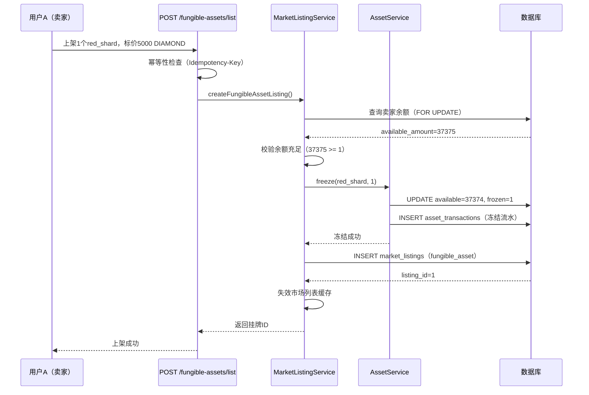
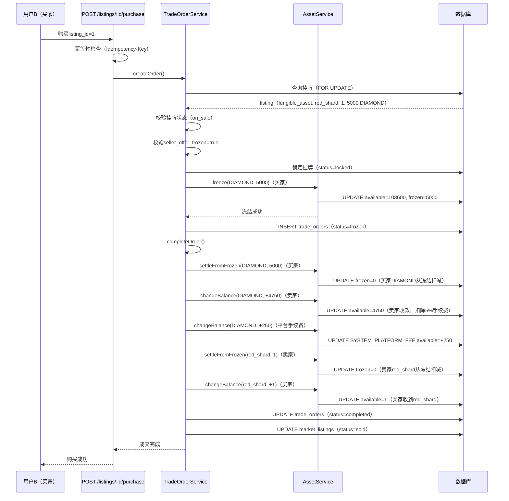
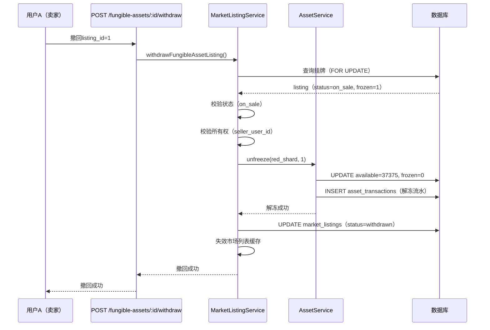

# C2C材料交易功能实施方案（red_shard/DIAMOND）

**业务需求**：用户A上架1个red_shard，标价5000 DIAMOND；用户B支付5000 DIAMOND购买  
**适用资产类型**：可叠加资产（red_shard、其他材料）  
**结算币种**：DIAMOND（钻石）  
**方案类型**：基于现有 `fungible_asset` 框架的完整实施方案  
**编制时间**：2026年01月08日 北京时间  
**数据库核查时间**：2026年01月08日（已连接真实数据库验证）  
**决策拍板时间**：2026年01月08日（所有决策已确认）  
**最终拍板时间**：2026年01月08日 20:45（补充决策已确认）  
**最终确认时间**：2026年01月08日 20:50（所有冲突项已最终确认）

---

## 🎯 核心决策汇总（已拍板 ✅）

| 决策项                   | 决策结果               | 说明                                                             |
| ------------------------ | ---------------------- | ---------------------------------------------------------------- |
| **1. 是否开闸**          | ✅ 立即全量开闸        | **不需要灰度**，立即全量开放（2026-01-08 20:50最终确认）         |
| **2. 手续费率**          | ✅ 固定5%              | 与物品交易一致                                                   |
| **3. 官方转换限制**      | ✅ 保持无限制          | 1:20比例，**确认无限制**（2026-01-08 20:50最终确认）             |
| **4. 可交易材料范围**    | ✅ 所有fungible材料    | 默认都可交易（`is_tradable=TRUE`）                               |
| **5. 定价区间限制**      | ✅ 无限制              | 卖家任意定价，市场自平衡                                         |
| **6. 基础风控**          | ✅ 仅余额校验          | 不增加复杂风控                                                   |
| **7. 搜索筛选**          | ✅ 材料类型+价格区间   | 支持筛选                                                         |
| **8. 消息通知**          | ✅ 站内信+WebSocket    | 接入现有通知服务                                                 |
| **9. 每日限额**          | ❌ 不需要              | 无限制                                                           |
| **10. 运营审核**         | ❌ 不需要              | 上架立即生效                                                     |
| **11. 上架限制**         | ✅ 共享10个            | 材料与物品共享max_active_listings=10                             |
| **12. 交易形态**         | ✅ 一单一口价          | 全量成交，不支持拆单                                             |
| **13. 白名单方案**       | ✅ 加表字段            | `is_tradable` 做强约束（DEFAULT TRUE）                           |
| **14. 自动过期**         | ✅ 3天                 | 超时自动撤回并解冻                                               |
| **15. 客服强制撤回**     | ✅ 允许                | 需操作审计                                                       |
| **16. 单次上架数量上限** | ✅ 无限制              | 卖家可自由定量（如1000个red_shard算1个挂牌）                     |
| **17. 自动过期实施阶段** | ✅ Phase 1 & Phase 2   | Phase 1实现核心逻辑，Phase 2完善监控（2026-01-08 20:50最终确认） |
| **18. 手续费系统账户**   | ✅ SYSTEM_PLATFORM_FEE | 与物品交易一致                                                   |

---

## 🆕 补充决策汇总（2026-01-08 20:45最终拍板）

基于实际代码状态和业务需求，以下补充决策已最终确认：

### 🔥 最终确认决策（2026-01-08 20:50 - 解决所有冲突项）

**冲突项1：灰度 vs 全量开闸**

- ✅ **最终决策：立即全量开闸**
- 说明：不需要灰度白名单，不需要分批开放，所有用户立即可用
- 理由：功能简单清晰，风控可控，无需灰度验证

**冲突项2：官方转换是否无限制**

- ✅ **最终决策：确认保持无限制**
- 说明：用户可无限次转换 red_shard → DIAMOND（1:20比例），无每日限额
- 理由：用户体验好，市场价格会围绕官方价自然锚定

**冲突项3：自动过期功能归属阶段**

- ✅ **最终决策：Phase 1 & Phase 2 都实现**
- 说明：
  - Phase 1：实现核心自动过期功能（定时任务、自动撤回、解冻、通知）
  - Phase 2：完善监控告警（异常挂牌监控、冻结余额告警、统计报表）
- 理由：上线即完整（Phase 1），持续优化（Phase 2）

---

### 决策16：`is_tradable` 字段实施方案

- ✅ **添加 `is_tradable` 字段**（方案A）
- 字段定义：`BOOLEAN NOT NULL DEFAULT TRUE`
- 位置：`material_asset_types` 表，`is_enabled` 字段之后
- 语义：更明确的语义，未来可以单独控制某个材料是否可交易
- 与 `is_enabled` 独立：`is_enabled=false` 影响所有功能，`is_tradable=false` 仅禁止C2C交易

### 决策17：上架数量限制具体场景

- ✅ **场景A**：用户已上架5个物品，现在想上架3个材料 → **允许**（5+3=8 < 10）
- ✅ **场景B**：用户已上架8个物品，现在想上架3个材料 → **拒绝**（8+3=11 > 10）
- ✅ **场景C**：用户上架1个材料，数量是1000个red_shard → **算1个挂牌**（不按数量算）
- ✅ **单次上架数量上限**：无限制（卖家可自由定量）

### 决策18：自动过期功能实施阶段（✅ 2026-01-08 20:50最终确认）

- ✅ **Phase 1 & Phase 2 都实现**（最终方案）
- 理由：上线即完整，无冻结余额泄漏风险
- 实施内容：
  - **Phase 1（核心功能）**：
    - 搭建定时任务框架（使用项目现有的 `scheduled-tasks.js`）
    - 定时扫描超时挂牌（status='on_sale' 且 created_at > 3天）
    - 自动撤回并解冻
    - 记录自动过期日志
  - **Phase 2（完善监控）**：
    - 异常挂牌监控（价格异常、超长时间挂牌）
    - 冻结余额异常告警
    - 自动过期统计报表

### 决策19：手续费系统账户

- ✅ **使用 `SYSTEM_PLATFORM_FEE`**
- 与物品交易（item_instance）保持一致
- 便于统一的财务核算和报表

### 决策20：消息通知实现方式

- ✅ **站内信 + WebSocket推送**
- 接入项目现有通知服务
- 站内信：持久化通知，用户可随时查看
- WebSocket：实时推送，用户在线时立即收到
- 与物品交易通知保持一致的体验

---

## 一、数据库现状核查（真实数据）

### 1.1 材料类型配置（material_asset_types）

```json
[
  {
    "asset_code": "red_shard",
    "display_name": "红色碎片",
    "group_code": "red",
    "form": "shard",
    "tier": 1,
    "is_enabled": 1
  }
]
```

**结论**：✅ red_shard 已配置且启用

### 1.2 红碎片余额分布（account_asset_balances）

```json
[
  {
    "account_id": "6",
    "available_amount": "37375",
    "frozen_amount": "0"
  },
  {
    "account_id": "5",
    "available_amount": "900",
    "frozen_amount": "0"
  }
]
```

**结论**：✅ 用户持有大量 red_shard 可用余额，冻结余额为0（未产生过冻结操作）

### 1.3 DIAMOND余额分布（account_asset_balances）

```json
[
  {
    "account_id": "6",
    "available_amount": "108600",
    "frozen_amount": "0"
  }
]
```

**结论**：✅ 用户持有大量 DIAMOND 可用余额，具备购买能力

### 1.4 市场挂牌情况（market_listings）

```json
[]
```

**结论**：⚠️ 市场当前无任何挂牌（item_instance 或 fungible_asset 均无）

### 1.5 冻结能力验证（asset_transactions）

```sql
WHERE business_type IN ('order_freeze_buyer', 'listing_freeze_seller_offer')
```

**结论**：⚠️ 未产生过任何冻结流水（功能未使用过）

---

## 二、现有架构支持度分析

### 2.1 已实现的基础能力（✅ 可直接复用）

#### A. 数据模型层（完整支持）

- **MarketListing 模型**：已支持 `listing_kind='fungible_asset'` 枚举值
  - `offer_asset_code`：标的资产代码（red_shard）
  - `offer_amount`：标的资产数量（1）
  - `price_asset_code`：结算币种（DIAMOND）
  - `price_amount`：价格金额（5000）
  - `seller_offer_frozen`：卖家标的冻结标记（必须为true）

- **TradeOrder 模型**：已支持 fungible_asset 的成交交付逻辑
  - 买家：冻结DIAMOND → 从冻结扣减
  - 卖家：冻结red_shard → 从冻结扣减 → 买家入账red_shard

- **AssetService 服务**：已实现完整的冻结/解冻/结算能力
  - `freeze()`：冻结资产（available → frozen）
  - `unfreeze()`：解冻资产（frozen → available）
  - `settleFromFrozen()`：从冻结扣减（frozen → 0）
  - `changeBalance()`：改变可用余额（入账）

#### B. 业务流程层（部分实现）

- **TradeOrderService.createOrder()**：已支持 fungible_asset 的校验与冻结
- **TradeOrderService.completeOrder()**：已支持 fungible_asset 的成交交付（双分录）
- **TradeOrderService.cancelOrder()**：已支持订单取消与解冻

### 2.2 缺失的关键能力（🔴 需要补全）

#### A. 上架流程缺失

- **路由层**：`POST /api/v4/market/fungible-assets/list` 直接返回 503
- **Service层**：`MarketListingService` 无 `createFungibleAssetListing()` 方法
- **缺失逻辑**：
  1. 卖家余额校验（available_amount >= offer_amount）
  2. 卖家资产冻结（AssetService.freeze）
  3. 创建挂牌记录（listing_kind='fungible_asset', seller_offer_frozen=true）

#### B. 撤回流程缺失

- **路由层**：`POST /api/v4/market/fungible-assets/:listing_id/withdraw` 直接返回 503
- **Service层**：`MarketListingService` 无 `withdrawFungibleAssetListing()` 方法
- **缺失逻辑**：
  1. 挂牌状态校验（status='on_sale'）
  2. 卖家资产解冻（AssetService.unfreeze）
  3. 更新挂牌状态（status='withdrawn'）

#### C. 可交易资产白名单缺失

- **风控规则**：当前无"哪些资产允许交易"的配置
- **建议方案**：在 `material_asset_types` 表增加 `is_tradable` 字段，或使用 SystemSettings 配置白名单

---

## 三、完整业务流程设计

### 3.1 上架流程（Listing Creation）



**关键参数**：

- `listing_kind`: `'fungible_asset'`
- `offer_asset_code`: `'red_shard'`
- `offer_amount`: `1`
- `price_asset_code`: `'DIAMOND'`
- `price_amount`: `5000`
- `seller_offer_frozen`: `true`（必须）

### 3.2 购买流程（Purchase & Settlement）



**资产流水记录（6笔）**：

1. 买家冻结DIAMOND：`order_freeze_buyer`（-5000 available → +5000 frozen）
2. 买家从冻结扣减DIAMOND：`order_settle_buyer_debit`（-5000 frozen）
3. 卖家入账DIAMOND：`order_settle_seller_credit`（+4750 available）
4. 平台手续费DIAMOND：`order_settle_platform_fee_credit`（+250 available）
5. 卖家从冻结扣减red_shard：`listing_settle_seller_offer_debit`（-1 frozen）
6. 买家入账red_shard：`listing_transfer_buyer_offer_credit`（+1 available）

### 3.3 撤回流程（Withdrawal）



---

## 四、代码改造清单（基于现有架构）

### 4.1 MarketListingService 新增方法

#### 方法1：createFungibleAssetListing（上架可叠加资产）

**输入参数**：

```javascript
{
  idempotency_key: 'market_list_fungible_1736323200000_abc123',
  seller_user_id: 5,
  offer_asset_code: 'red_shard',
  offer_amount: 1,
  price_amount: 5000,
  price_asset_code: 'DIAMOND'
}
```

**核心逻辑**：

1. 幂等性检查（idempotency_key）
2. 校验卖家余额充足（available_amount >= offer_amount）
3. 冻结卖家标的资产（AssetService.freeze）
4. 创建挂牌记录（listing_kind='fungible_asset', seller_offer_frozen=true）
5. 失效市场列表缓存

**关键代码片段**：

```javascript
// 2. 查询卖家余额（加锁）
const sellerBalance = await AccountAssetBalance.findOne({
  where: {
    account_id: sellerAccount.account_id,
    asset_code: offer_asset_code
  },
  lock: transaction.LOCK.UPDATE,
  transaction
})

if (!sellerBalance || sellerBalance.available_amount < offer_amount) {
  throw new Error(
    `余额不足：需要${offer_amount}个${offer_asset_code}，当前可用${sellerBalance?.available_amount || 0}个`
  )
}

// 3. 冻结卖家标的资产
await AssetService.freeze(
  {
    idempotency_key: `${idempotency_key}:freeze_seller_offer`,
    business_type: 'listing_freeze_seller_offer',
    user_id: seller_user_id,
    asset_code: offer_asset_code,
    amount: offer_amount,
    meta: { listing_action: 'create', offer_asset_code, offer_amount }
  },
  { transaction }
)

// 4. 创建挂牌记录
const listing = await MarketListing.create(
  {
    listing_kind: 'fungible_asset',
    seller_user_id,
    offer_asset_code,
    offer_amount,
    price_amount,
    price_asset_code,
    seller_offer_frozen: true, // 必须为true
    status: 'on_sale',
    idempotency_key
  },
  { transaction }
)
```

#### 方法2：withdrawFungibleAssetListing（撤回可叠加资产挂牌）

**输入参数**：

```javascript
{
  listing_id: 1,
  seller_user_id: 5
}
```

**核心逻辑**：

1. 查询挂牌并校验（status='on_sale', seller_user_id匹配）
2. 解冻卖家标的资产（AssetService.unfreeze）
3. 更新挂牌状态（status='withdrawn', seller_offer_frozen=false）
4. 失效市场列表缓存

**关键代码片段**：

```javascript
// 2. 解冻卖家标的资产
await AssetService.unfreeze(
  {
    idempotency_key: `withdraw_${listing_id}_${Date.now()}`,
    business_type: 'listing_unfreeze_seller_offer',
    user_id: listing.seller_user_id,
    asset_code: listing.offer_asset_code,
    amount: listing.offer_amount,
    meta: { listing_id, withdraw_reason: '卖家撤回' }
  },
  { transaction }
)

// 3. 更新挂牌状态
await listing.update(
  {
    status: 'withdrawn',
    seller_offer_frozen: false
  },
  { transaction }
)
```

### 4.2 路由层改造

#### 路由1：POST /api/v4/market/fungible-assets/list

**当前状态**：直接返回 503
**改造方案**：调用 `MarketListingService.createFungibleAssetListing()`

**请求示例**：

```bash
curl -X POST http://localhost:3000/api/v4/market/fungible-assets/list \
  -H "Authorization: Bearer <token>" \
  -H "Idempotency-Key: market_list_fungible_1736323200000_abc123" \
  -H "Content-Type: application/json" \
  -d '{
    "offer_asset_code": "red_shard",
    "offer_amount": 1,
    "price_amount": 5000
  }'
```

**响应示例**：

```json
{
  "success": true,
  "code": "SUCCESS",
  "message": "上架成功",
  "data": {
    "listing": {
      "listing_id": 1,
      "listing_kind": "fungible_asset",
      "offer_asset_code": "red_shard",
      "offer_amount": 1,
      "price_amount": 5000,
      "price_asset_code": "DIAMOND",
      "seller_offer_frozen": true,
      "status": "on_sale",
      "is_duplicate": false
    },
    "listing_status": {
      "current": 1,
      "limit": 10,
      "remaining": 9
    }
  },
  "timestamp": "2026-01-08T20:30:00.000+08:00",
  "version": "v4.0",
  "request_id": "req_xxx"
}
```

#### 路由2：POST /api/v4/market/fungible-assets/:listing_id/withdraw

**当前状态**：直接返回 503
**改造方案**：调用 `MarketListingService.withdrawFungibleAssetListing()`

**请求示例**：

```bash
curl -X POST http://localhost:3000/api/v4/market/fungible-assets/1/withdraw \
  -H "Authorization: Bearer <token>" \
  -H "Content-Type: application/json" \
  -d '{
    "withdraw_reason": "价格调整"
  }'
```

**响应示例**：

```json
{
  "success": true,
  "code": "SUCCESS",
  "message": "撤回成功",
  "data": {
    "listing_id": 1,
    "offer_asset_code": "red_shard",
    "offer_amount": 1,
    "withdrawn_at": "2026-01-08T20:35:00.000+08:00"
  },
  "timestamp": "2026-01-08T20:35:00.000+08:00",
  "version": "v4.0",
  "request_id": "req_xxx"
}
```

### 4.3 购买流程改造（已基本实现）

**当前状态**：`TradeOrderService.createOrder()` 和 `completeOrder()` 已支持 fungible_asset
**需要验证的关键点**：

1. ✅ 买家DIAMOND冻结（已实现）
2. ✅ 卖家red_shard从冻结扣减（已实现）
3. ✅ 买家red_shard入账（已实现）
4. ✅ 手续费计算与入账（已实现）

**无需改造**，直接复用现有 `POST /api/v4/market/listings/:listing_id/purchase`

---

## 五、风控规则设计

### 5.1 可交易资产白名单（✅ 已拍板 - 2026-01-08 20:45最终确认）

**已选方案**：方案A - 在 `material_asset_types` 表增加字段 `is_tradable` 做强约束

```sql
-- 1. 增加字段（默认 TRUE = 所有材料都可交易）
ALTER TABLE material_asset_types
ADD COLUMN is_tradable BOOLEAN NOT NULL DEFAULT TRUE
COMMENT '是否允许C2C交易（true=可交易，false=禁止交易）'
AFTER is_enabled;

-- 2. 验证配置（所有材料默认可交易）
SELECT asset_code, display_name, is_enabled, is_tradable
FROM material_asset_types
ORDER BY group_code, tier;

-- 3. 如需禁止特定材料交易（可选）
-- UPDATE material_asset_types
-- SET is_tradable = FALSE
-- WHERE asset_code IN ('POINTS', 'BUDGET_POINTS');
```

**决策说明**（2026-01-08 20:45最终确认）：

- ✅ **添加 `is_tradable` 字段**（方案A）
- ✅ 所有 fungible 材料默认都可交易（`DEFAULT TRUE`）
- ✅ 强约束在数据库层（而非 SystemSettings）
- ✅ 运营可随时调整单个材料的可交易状态
- ✅ **优点**：更明确的语义，未来可以单独控制某个材料是否可交易
- ✅ **与 `is_enabled` 字段独立**：`is_enabled=false` 影响所有功能，`is_tradable=false` 仅禁止C2C交易

### 5.2 价格限制规则（✅ 已拍板：无限制）

**决策**：✅ **卖家可以任意定价，不限制价格区间**

```javascript
// ✅ 无价格限制逻辑（让市场自由定价）
// 官方转换比例：1 red_shard = 20 DIAMOND（仅作参考）
const OFFICIAL_RATE = 20

// ❌ 不再限制价格区间
// 卖家可以标价 1 DIAMOND（低于官方价）
// 卖家可以标价 5000 DIAMOND（远高于官方价）
// 市场会自然淘汰不合理定价
```

**决策说明**：

- ✅ 卖家自由定价（1 ~ 无上限 DIAMOND）
- ✅ 市场供需自平衡（高价无人买，低价被秒杀）
- ✅ 官方转换（1:20）作为价格锚定参考
- ⚠️ 运营需监控异常高价挂牌（如 >10000 DIAMOND）

### 5.3 上架数量限制（✅ 已拍板 - 2026-01-08 20:45最终确认）

**决策**：✅ **材料与物品共享 max_active_listings=10**

```javascript
// ✅ 材料与物品共享上架限制
const MAX_ACTIVE_LISTINGS = 10 // item_instance + fungible_asset 合计

// 上架时校验（跨类型统计）
const existingCount = await MarketListing.count({
  where: {
    seller_user_id,
    status: 'on_sale' // 不区分 listing_kind
  }
})

if (existingCount >= MAX_ACTIVE_LISTINGS) {
  throw new Error(`您最多同时上架${MAX_ACTIVE_LISTINGS}个挂牌（物品+材料合计）`)
}

// ✅ 不限制单次上架数量（卖家可以一次上架1000个red_shard）
// ✅ 不限制单资产上架次数（卖家可以分10个挂牌卖red_shard）
```

**决策说明**（2026-01-08 20:45最终确认）：

- ✅ 单用户最多同时上架10个挂牌（item_instance + fungible_asset 合计）
- ✅ **不限制单次上架数量**（卖家可以一次上架任意数量材料，如1000个red_shard）
- ✅ 不限制单资产上架次数（卖家可以分多个挂牌卖同一材料）

**具体场景确认**（2026-01-08 20:45）：

- **场景A**：用户已上架5个物品，现在想上架3个材料
  - ✅ **允许**（5+3=8 < 10）
- **场景B**：用户已上架8个物品，现在想上架3个材料
  - ❌ **拒绝**（8+3=11 > 10），提示"最多同时上架10个挂牌（物品+材料合计）"
- **场景C**：用户上架1个材料，数量是1000个red_shard
  - ✅ **算1个挂牌**（不按数量算，按挂牌记录数算）
  - 说明："一单一口价全量成交"，1000个red_shard作为1个整体挂牌

### 5.4 手续费规则（✅ 已拍板 - 2026-01-08 20:45最终确认）

**当前配置**（config/fee_rules.js）：

- 统一5%手续费 + min_fee=1
- 计算基准：`price_amount`（买家支付的总额）
- **手续费入账账户**：✅ `SYSTEM_PLATFORM_FEE`（与物品交易一致）

**示例计算**：

- 成交价：5000 DIAMOND
- 手续费：5000 × 5% = 250 DIAMOND
- 卖家实收：5000 - 250 = 4750 DIAMOND
- **平台手续费入账**：`SYSTEM_PLATFORM_FEE` 账户 +250 DIAMOND

**决策说明**（2026-01-08 20:45）：

- ✅ 手续费统一入账到 `SYSTEM_PLATFORM_FEE` 系统账户
- ✅ 与物品交易（item_instance）保持一致
- ✅ 便于统一的财务核算和报表

### 5.5 官方转换与市场价格的关系（✅ 已拍板：保持无限制）

**当前官方转换规则**（material_conversion_rules）：

- 1 red_shard → 20 DIAMOND（固定比例，单向转换）

**已选方案**：✅ **保留官方转换且无限制（用户体验好）**

**市场价格自平衡机制**：

1. **低价收购套利**：如果市场价 < 20 DIAMOND，用户会买入后转换套利
   - 结果：市场价会被拉升至接近20 DIAMOND
2. **高价抛售风险**：如果市场价 > 20 DIAMOND，用户会优先转换而不买市场
   - 结果：市场价会被压低至接近20 DIAMOND
3. **价格锚定效应**：官方转换（1:20）作为市场价格的"重力中心"

**预期市场行为**：

- 正常情况：市场价围绕20 DIAMOND波动（如 15~30 DIAMOND）
- 稀缺时：市场价可能溢价至50~100 DIAMOND（用户愿意溢价买）
- 供过于求：市场价可能低至10 DIAMOND（卖家急于出手）

**决策说明**：

- ✅ 保留官方转换无限制（用户体验好）
- ✅ 市场价格无限制（让市场自由定价）
- ✅ 供需自平衡（官方转换作为价格锚定）

---

## 六、实施步骤（分阶段上线）

### Phase 1：基础能力补全（2-3天）（✅ 2026-01-08 20:45最终确认）

**任务清单**：

- [ ] MarketListingService 新增 `createFungibleAssetListing()` 方法
- [ ] MarketListingService 新增 `withdrawFungibleAssetListing()` 方法
- [ ] 路由层 `POST /fungible-assets/list` 接入 Service
- [ ] 路由层 `POST /fungible-assets/:id/withdraw` 接入 Service
- [ ] **✅ 定时任务实现**（2026-01-08 20:45最终确认）：
  - [ ] 在 `scripts/maintenance/scheduled-tasks.js` 中添加自动过期任务
  - [ ] 扫描超时挂牌（status='on_sale' 且 created_at > 3天）
  - [ ] 调用 `withdrawFungibleAssetListing()` 自动撤回并解冻
  - [ ] 记录自动过期日志和通知
- [ ] 单元测试：上架/撤回流程（含幂等性、余额不足、状态异常等）
- [ ] 集成测试：自动过期功能测试

**时间调整说明**：由于Phase 1增加了定时任务实现，预计时间从1-2天调整为2-3天

### Phase 2：风控规则配置与监控完善（1-2天）（✅ 2026-01-08 20:50最终确认）

**任务清单**：

- [ ] 数据库增加 `is_tradable` 字段（`DEFAULT TRUE`，所有材料可交易）
- [ ] 配置上架限制（`max_active_listings=10`，材料与物品共享）
- [ ] 配置自动过期时间（`listing_expiry_days=3`）
- [ ] **✅ 完善自动过期监控**（Phase 1已实现核心功能）：
  - [ ] 异常挂牌监控（价格异常、超长时间挂牌）
  - [ ] 冻结余额异常告警
  - [ ] 自动过期统计报表
- [ ] 实现客服强制撤回功能（需操作审计）
- [ ] ❌ 无需配置价格限制（市场自由定价）
- [ ] ❌ 无需配置每日限额（无限制）
- [ ] ❌ 无需限制单次上架数量（卖家可自由定量）

**时间调整说明**：Phase 2增加了监控完善功能，预计时间从1天调整为1-2天

### Phase 3：集成测试（1天）

**测试场景**：

1. **正常上架**：用户A上架1个red_shard，标价5000 DIAMOND
2. **余额不足上架**：用户余额0，尝试上架1个red_shard（预期失败）
3. **正常购买**：用户B支付5000 DIAMOND购买（预期成功，卖家收4750，平台收250）
4. **余额不足购买**：用户DIAMOND余额4000，尝试购买5000的挂牌（预期失败）
5. **正常撤回**：卖家撤回on_sale挂牌（预期成功，解冻red_shard）
6. **幂等性测试**：重复上架/购买请求（预期返回首次结果）
7. **并发测试**：2个买家同时购买同一挂牌（预期1个成功，1个失败）
8. **上架限制测试**：用户已有10个挂牌，尝试上架第11个（预期失败）
9. **自动过期测试**：挂牌3天后自动撤回并解冻（预期成功）
10. **客服强制撤回测试**：管理员强制撤回挂牌并解冻（预期成功，记录审计日志）
11. **搜索筛选测试**：按材料类型 + 价格区间筛选（预期返回正确结果）
12. **消息通知测试**：上架/成交/撤回成功后发送通知（预期收到通知）

### Phase 4：生产上线（✅ 2026-01-08 20:50最终确认：全量开闸）

**上线检查清单**：

- [ ] 数据库备份
- [ ] 监控告警配置（冻结余额异常、手续费异常）
- [ ] ✅ **全量开闸**（不需要灰度白名单，立即全量开放）
- [ ] 客服应急预案（冻结异常、退款流程）
- [ ] 性能压测（100 TPS 上架/购买）

**上线策略**（2026-01-08 20:50最终确认）：

- ✅ **立即全量开放**，不需要灰度发布
- ✅ **无需用户白名单**，所有用户立即可用
- ✅ **回滚预案**：如遇紧急问题，关闭上架接口（返回503），已有挂牌允许撤回

---

## 七、关键风险与应对

### 7.1 经济系统风险（✅ 已拍板：市场自平衡）

**风险1：套利空间（官方转换 vs 市场价格）**

- **场景**：官方 1 red_shard = 20 DIAMOND，市场价可能波动至 5~100 DIAMOND
- **决策**：✅ **保留官方转换无限制，市场价格无限制**
- **自平衡机制**：
  - 市场价 < 20 DIAMOND → 用户买入后转换套利 → 市场价上涨
  - 市场价 > 20 DIAMOND → 用户优先转换而不买市场 → 市场价下跌
  - 官方转换作为"价格重力中心"，市场价会围绕20 DIAMOND波动
- **应对**：✅ **无需额外限制，供需自平衡**

**风险2：刷量/洗资产**

- **场景**：用户A和B串通，高价互刷（A卖给B 10000 DIAMOND，B卖回给A 10000 DIAMOND）
- **决策**：✅ **不需要每日操作限额，不需要运营审核**
- **应对**：
  - ✅ 手续费5%自然损耗（每次互刷损失10%）
  - ✅ 运营监控异常交易模式（高频对倒、异常高价）
  - ⚠️ 如发现恶意刷量，客服可强制撤回挂牌

### 7.2 技术实现风险（✅ 已拍板运营兜底方案 - 2026-01-08 20:45最终确认）

**风险1：冻结余额泄漏**

- **场景**：上架后卖家资产被冻结，但因异常（代码bug/服务器宕机）未解冻
- **决策**：✅ **挂牌3天自动过期并解冻**
- **实施阶段**：✅ **Phase 1 & Phase 2 都实现**（2026-01-08 20:50最终确认）
- **应对**：
  - ✅ **Phase 1实现核心功能**：定时任务、扫描超时挂牌（status='on_sale' 且 created_at > 3天）、自动撤回并解冻、过期通知
  - ✅ **Phase 2完善监控**：异常挂牌监控、冻结余额异常告警、自动过期统计报表
  - ✅ 客服/管理员允许强制撤回并解冻（需操作审计）
- **决策理由**：上线即完整（Phase 1核心功能），持续优化（Phase 2监控完善）

**风险2：并发双买**

- **场景**：2个买家同时购买同一挂牌
- **应对**：
  - ✅ 已实现：`TradeOrderService.createOrder()` 对挂牌加 `FOR UPDATE` 锁
  - ✅ 已实现：挂牌状态 on_sale → locked 防止并发

**风险3：幂等性失效**

- **场景**：网络抖动导致重复请求，用户被重复扣款/上架
- **应对**：
  - ✅ 已实现：`idempotency_key` 唯一约束
  - ✅ 已实现：`IdempotencyService` 入口幂等拦截

---

## 八、与官方转换的协调方案

### 当前官方转换规则（✅ 2026-01-08 20:50最终确认）

- **路径**：`POST /api/v4/shop/assets/convert`
- **比例**：1 red_shard → 20 DIAMOND
- **限制**：✅ **确认保持无限制**（用户可无限次转换，无每日限额）

### 协调方案（✅ 已选方案A）

#### ✅ 已选方案A：保留官方转换无限制，市场自由定价

- **官方转换**：✅ 保持 1:20 比例，**无限制**（用户体验好）
- **市场定价**：✅ **不限制价格**，让市场自由定价
- **预期结果**：
  - 市场价会围绕官方价波动（供需关系）
  - 稀缺时市场价 > 官方价（用户愿意溢价买）
  - 供过于求时市场价 < 官方价（用户会转换而不买市场）
  - 官方转换作为"价格重力中心"，市场价自平衡

#### ❌ 未选方案B：限制市场价格区间

- **原因**：限制价格会降低市场灵活性

#### ❌ 未选方案C：关闭官方转换

- **原因**：影响用户体验，运营失去价格控制能力

---

## 九、数据库变更（可选）

### 9.1 增加 is_tradable 字段（✅ 已拍板）

```sql
-- 在 material_asset_types 表增加字段（默认 TRUE = 所有材料都可交易）
ALTER TABLE material_asset_types
ADD COLUMN is_tradable BOOLEAN NOT NULL DEFAULT TRUE
COMMENT '是否允许C2C交易（true=可交易，false=禁止交易）'
AFTER is_enabled;

-- 验证配置（所有材料默认可交易）
SELECT asset_code, display_name, is_enabled, is_tradable
FROM material_asset_types
ORDER BY group_code, tier;

-- 如需禁止特定材料交易（可选，目前不需要）
-- UPDATE material_asset_types
-- SET is_tradable = FALSE
-- WHERE asset_code IN ('POINTS', 'BUDGET_POINTS');
```

**决策说明**：

- ✅ 默认值改为 `TRUE`（所有材料都可交易）
- ✅ 运营可随时调整单个材料的可交易状态
- ✅ 强约束在数据库层（而非 SystemSettings）

### 9.2 增加系统配置（✅ 已拍板）

```sql
-- 在 system_settings 表插入配置
INSERT INTO system_settings (setting_key, setting_value, data_type, category, description, is_public, is_readonly, updated_by)
VALUES
-- ✅ 上架限制（材料与物品共享10个）
('market.max_active_listings', '10', 'number', 'market', '单用户最多同时上架挂牌数（item_instance + fungible_asset 合计）', FALSE, FALSE, 1),

-- ✅ 自动过期时间（3天）
('market.listing_expiry_days', '3', 'number', 'market', '挂牌自动过期天数（超时自动撤回并解冻）', FALSE, FALSE, 1),

-- ❌ 不需要价格限制配置（市场自由定价）
-- ('market.fungible_asset.min_price_rate', '0.5', 'number', 'market', '最低价格倍率', FALSE, FALSE, 1),
-- ('market.fungible_asset.max_price_rate', '5.0', 'number', 'market', '最高价格倍率', FALSE, FALSE, 1),

-- ❌ 不需要每日限额配置
-- ('market.daily_listing_limit', '100', 'number', 'market', '每日上架限额', FALSE, FALSE, 1);
```

**决策说明**：

- ✅ 上架限制：10个（材料与物品共享）
- ✅ 自动过期：3天
- ❌ 无价格限制
- ❌ 无每日限额

---

## 十、测试验证方案

### 10.1 单元测试用例

```javascript
describe('MarketListingService - Fungible Asset', () => {
  test('上架红碎片成功', async () => {
    const result = await MarketListingService.createFungibleAssetListing(
      {
        idempotency_key: 'test_list_001',
        seller_user_id: 5,
        offer_asset_code: 'red_shard',
        offer_amount: 1,
        price_amount: 5000,
        price_asset_code: 'DIAMOND'
      },
      { transaction }
    )

    expect(result.listing.listing_kind).toBe('fungible_asset')
    expect(result.listing.seller_offer_frozen).toBe(true)
    expect(result.listing.status).toBe('on_sale')
  })

  test('余额不足上架失败', async () => {
    await expect(
      MarketListingService.createFungibleAssetListing(
        {
          idempotency_key: 'test_list_002',
          seller_user_id: 999, // 余额为0的用户
          offer_asset_code: 'red_shard',
          offer_amount: 1,
          price_amount: 5000
        },
        { transaction }
      )
    ).rejects.toThrow('余额不足')
  })

  test('撤回挂牌成功', async () => {
    const result = await MarketListingService.withdrawFungibleAssetListing(
      {
        listing_id: 1,
        seller_user_id: 5
      },
      { transaction }
    )

    expect(result.listing.status).toBe('withdrawn')
    expect(result.listing.seller_offer_frozen).toBe(false)
  })
})
```

### 10.2 集成测试用例

```javascript
describe('Fungible Asset Trading - E2E', () => {
  test('完整交易流程：上架→购买→成交', async () => {
    // 1. 用户A上架1个red_shard，标价5000 DIAMOND
    const listingResult = await request(app)
      .post('/api/v4/market/fungible-assets/list')
      .set('Authorization', `Bearer ${tokenA}`)
      .set('Idempotency-Key', 'e2e_list_001')
      .send({
        offer_asset_code: 'red_shard',
        offer_amount: 1,
        price_amount: 5000
      })

    expect(listingResult.status).toBe(200)
    const listingId = listingResult.body.data.listing.listing_id

    // 2. 用户B购买
    const purchaseResult = await request(app)
      .post(`/api/v4/market/listings/${listingId}/purchase`)
      .set('Authorization', `Bearer ${tokenB}`)
      .set('Idempotency-Key', 'e2e_purchase_001')
      .send({})

    expect(purchaseResult.status).toBe(200)
    expect(purchaseResult.body.data.gross_amount).toBe(5000)
    expect(purchaseResult.body.data.fee_amount).toBe(250)
    expect(purchaseResult.body.data.net_amount).toBe(4750)

    // 3. 验证余额变化
    const balanceA = await AssetService.getBalance({
      user_id: userA.user_id,
      asset_code: 'DIAMOND'
    })
    const balanceB = await AssetService.getBalance({
      user_id: userB.user_id,
      asset_code: 'red_shard'
    })

    expect(balanceA.available_amount).toBe(4750) // 卖家收到4750 DIAMOND
    expect(balanceB.available_amount).toBe(1) // 买家收到1个red_shard
  })
})
```

### 10.3 手工测试脚本

```bash
#!/bin/bash
# 手工测试脚本：C2C材料交易完整流程

BASE_URL="http://localhost:3000/api/v4"
TOKEN_A="<卖家Token>"
TOKEN_B="<买家Token>"

echo "=== 测试1：用户A上架1个red_shard，标价5000 DIAMOND ==="
curl -X POST "$BASE_URL/market/fungible-assets/list" \
  -H "Authorization: Bearer $TOKEN_A" \
  -H "Idempotency-Key: manual_test_list_$(date +%s)" \
  -H "Content-Type: application/json" \
  -d '{
    "offer_asset_code": "red_shard",
    "offer_amount": 1,
    "price_amount": 5000
  }' | jq .

echo ""
echo "=== 测试2：查询市场列表 ==="
curl -X GET "$BASE_URL/market/listings?page=1&limit=20" \
  -H "Authorization: Bearer $TOKEN_B" | jq .

echo ""
echo "=== 测试3：用户B购买 ==="
LISTING_ID=1  # 从测试1的响应中获取
curl -X POST "$BASE_URL/market/listings/$LISTING_ID/purchase" \
  -H "Authorization: Bearer $TOKEN_B" \
  -H "Idempotency-Key: manual_test_purchase_$(date +%s)" \
  -H "Content-Type: application/json" \
  -d '{}' | jq .

echo ""
echo "=== 测试4：验证余额变化 ==="
curl -X GET "$BASE_URL/assets/balance?asset_code=DIAMOND" \
  -H "Authorization: Bearer $TOKEN_A" | jq .  # 卖家DIAMOND余额

curl -X GET "$BASE_URL/assets/balance?asset_code=red_shard" \
  -H "Authorization: Bearer $TOKEN_B" | jq .  # 买家red_shard余额
```

---

## 十一、监控指标

### 11.1 业务指标

- **挂牌数量**：`SELECT COUNT(*) FROM market_listings WHERE listing_kind='fungible_asset' AND status='on_sale'`
- **成交数量**：`SELECT COUNT(*) FROM trade_orders WHERE status='completed' AND listing_id IN (SELECT listing_id FROM market_listings WHERE listing_kind='fungible_asset')`
- **成交金额**：`SELECT SUM(gross_amount) FROM trade_orders WHERE status='completed' ...`
- **手续费收入**：`SELECT SUM(fee_amount) FROM trade_orders WHERE status='completed' ...`

### 11.2 风控指标

- **冻结余额异常**：`SELECT * FROM account_asset_balances WHERE frozen_amount > available_amount * 0.5`（冻结超过可用的50%）
- **超时挂牌**：`SELECT * FROM market_listings WHERE status='on_sale' AND created_at < NOW() - INTERVAL 7 DAY`
- **异常高价**：`SELECT * FROM market_listings WHERE listing_kind='fungible_asset' AND price_amount > 1000`（假设合理价格<1000）

### 11.3 性能指标

- **上架耗时**：P99 < 500ms
- **购买耗时**：P99 < 1000ms
- **缓存命中率**：市场列表缓存命中率 > 80%

---

## 十二、FAQ

### Q1：为什么你的案例（5000 DIAMOND）比官方转换价（20 DIAMOND）高250倍？

**A**：需要明确 red_shard 的稀缺性与用途：

- 如果 red_shard 稀缺且官方转换有限制（如每日只能转换10个），用户可能愿意溢价购买
- 如果 red_shard 可以无限制转换为 DIAMOND，市场价会被锚定在20 DIAMOND附近
- **建议**：先核查官方转换的限制条件（每日限额？手续费？）

### Q2：材料交易会不会冲击官方兑换市场（exchange_items）？

**A**：取决于两个市场的定位：

- **C2C市场**：用户间自由交易，价格由供需决定
- **B2C兑换**：官方商城，价格固定，库存有限
- **协调方案**：C2C主要交易"材料"，B2C主要兑换"实物商品/服务"

### Q3：需要增加哪些客服工具？（✅ 已拍板 - 2026-01-08 20:45最终确认）

**A**：

- ✅ 冻结余额异常处理（手动解冻）
- ✅ 恶意挂牌下架（管理员强制撤回，需操作审计）
- ✅ 争议订单仲裁（退款/补偿）
- ✅ 异常交易回滚（需要审计日志支持）
- ✅ 自动过期挂牌处理（3天自动撤回并解冻，**Phase 1实现**）

### Q4：上线后如何灰度发布？（✅ 已拍板：立即全量开闸 - 2026-01-08 20:50最终确认）

**A**：

- ✅ **立即全量开放**（不需要灰度，不需要白名单）
- ✅ **无需运营审核**（上架立即生效）
- ✅ **回滚预案**：关闭上架接口（返回503），已有挂牌允许撤回
- ✅ **决策理由**：功能简单清晰，风控可控，无需灰度验证

---

## 十三、实施决策检查清单（已拍板 ✅）

### 核心业务决策（2026年01月08日已确认）

- [x] **决策1：材料C2C是否开闸**
  - ✅ **立即开闸**（不再等待）

- [x] **决策2：官方转换（red_shard → DIAMOND）限制**
  - ✅ **保持无限制**（1:20比例，用户体验好）
  - 说明：市场价会围绕官方价波动，供需自平衡

- [x] **决策3：市场价格区间限制**
  - ✅ **无限制**（卖家可以任意定价）
  - 说明：不限制价格上下限，让市场自由定价

- [x] **决策4：哪些材料允许交易**
  - ✅ **所有 fungible 材料都可交易**（默认都可交易）
  - 白名单方案：**方案A - 加表字段 is_tradable 做强约束**（2026-01-08 20:50最终确认）
  - 实施：`ALTER TABLE material_asset_types ADD COLUMN is_tradable BOOLEAN NOT NULL DEFAULT TRUE`
  - 说明：新增 `is_tradable` 字段，默认值 TRUE，所有材料默认可交易

- [x] **决策5：手续费比例**
  - ✅ **保持固定5%**（与 item_instance 一致）
  - 无最小成交金额限制

- [x] **决策6：基础风控规则**
  - ✅ **仅余额校验**（不增加复杂风控）
  - 不需要每日操作限额
  - 不需要运营审核（上架立即生效）

- [x] **决策7：上架数量限制**
  - ✅ **材料与物品共享 max_active_listings=10**
  - 说明：单用户最多同时上架10个挂牌（item_instance + fungible_asset 合计）

- [x] **决策8：交易形态**
  - ✅ **一单一口价全量成交**（不支持部分购买/拆单）
  - 说明：买家必须购买卖家挂牌的全部数量

- [x] **决策9：搜索/筛选功能**
  - ✅ **按材料类型 + 价格区间筛选**

- [x] **决策10：消息通知**
  - ✅ **上架/成交/撤回成功通知**

- [x] **决策11：冻结资产运营兜底**
  - ✅ **挂牌3天自动过期并解冻**
  - ✅ **客服/管理员允许强制撤回并解冻**（需操作审计）

### 技术实施检查清单（✅ 2026-01-08 20:45最终确认）

- [ ] `MarketListingService.createFungibleAssetListing()` 已实现
- [ ] `MarketListingService.withdrawFungibleAssetListing()` 已实现
- [ ] 路由层 `POST /fungible-assets/list` 已接入
- [ ] 路由层 `POST /fungible-assets/:id/withdraw` 已接入
- [ ] **✅ 定时任务已实现**（自动过期功能，Phase 1）
- [ ] **✅ 数据库字段已添加**（`is_tradable BOOLEAN DEFAULT TRUE`）
- [ ] **✅ 消息通知已接入**（站内信 + WebSocket）
- [ ] **✅ 手续费账户已确认**（`SYSTEM_PLATFORM_FEE`）
- [ ] 单元测试覆盖率 > 80%
- [ ] 集成测试通过（包含自动过期测试）
- [ ] 性能压测通过（100 TPS）
- [ ] 监控告警配置完成
- [ ] 客服应急预案就绪

---

## 十四、参考资料

### 相关代码文件

- `services/MarketListingService.js` - 挂牌服务（需新增方法）
- `services/TradeOrderService.js` - 订单服务（已支持 fungible_asset）
- `services/AssetService.js` - 资产服务（冻结/解冻/结算）
- `routes/v4/market/sell.js` - 上架路由（需改造）
- `routes/v4/market/manage.js` - 撤回路由（需改造）
- `routes/v4/market/buy.js` - 购买路由（无需改造）
- `models/MarketListing.js` - 挂牌模型（已支持 fungible_asset）
- `models/TradeOrder.js` - 订单模型（已支持）

### 相关数据库表

- `market_listings` - 市场挂牌表
- `trade_orders` - 交易订单表
- `account_asset_balances` - 账户资产余额表（红碎片/DIAMOND余额）
- `asset_transactions` - 资产流水表（冻结/解冻/结算流水）
- `material_asset_types` - 材料类型配置表（可增加 is_tradable 字段）
- `material_conversion_rules` - 材料转换规则表（官方转换比例）

### 业界参考案例

- **Steam 社区市场**：游戏物品C2C交易，手续费5%，价格自由，有官方回收价锚定
- **网易藏宝阁**：游戏资产交易，托管模式，手续费5-10%，实名认证
- **王者荣耀铭文系统**：材料可合成但不可交易，避免经济系统复杂化
- **原神原石/纠缠之缘**：虚拟货币不可交易，仅官方兑换

---

## 十五、总结与建议

### 核心结论

你的项目**已经具备实现"C2C材料交易"的技术基础**：

- ✅ 数据模型支持（MarketListing.listing_kind='fungible_asset'）
- ✅ 冻结/解冻能力（AssetService 已实现）
- ✅ 订单成交交付逻辑（TradeOrderService 已实现）
- 🔴 缺失部分：上架/撤回的 Service 方法与路由接入（工作量约1-2天）

### 最终方案（✅ 已拍板确认）

**已确认方案**：立即全量开放所有 fungible 材料交易

1. ✅ **保留官方转换**（1:20），**无限制**（用户体验好）
2. ✅ **市场价格无限制**，让市场自由定价（供需自平衡）
3. ✅ **手续费保持5%**（与 item_instance 一致）
4. ✅ **上架限制**：单用户最多同时上架10个挂牌（材料与物品共享）
5. ✅ **自动过期**：挂牌3天自动撤回并解冻
6. ✅ **客服兜底**：允许强制撤回并解冻（需操作审计）
7. ✅ **搜索筛选**：按材料类型 + 价格区间筛选
8. ✅ **消息通知**：上架/成交/撤回成功通知
9. ✅ **无需审核**：上架立即生效
10. ✅ **无需限额**：不限制每日操作次数

**预期效果**：

- ✅ 用户可以自由交易所有材料，增加市场活跃度
- ✅ 官方转换作为"价格重力中心"，市场价自平衡
- ✅ 手续费收入增加（每笔交易5%）
- ✅ 风控可控（余额校验 + 自动过期 + 客服兜底）
- ✅ 用户体验好（无限制、无审核、立即生效）

**风险可控**：

- ✅ DIAMOND 不可充值/提现（无合规风险）
- ✅ 官方转换作为价格锚定（防止市场价格崩盘）
- ✅ 客服/运营有兜底能力（强制撤回、审计日志）

---

---

## 十六、新增功能需求清单（基于拍板决策）

### 16.1 核心交易功能（Phase 1）

- [ ] `MarketListingService.createFungibleAssetListing()` - 上架可叠加资产
- [ ] `MarketListingService.withdrawFungibleAssetListing()` - 撤回可叠加资产挂牌
- [ ] 路由 `POST /api/v4/market/fungible-assets/list` - 接入上架Service
- [ ] 路由 `POST /api/v4/market/fungible-assets/:id/withdraw` - 接入撤回Service
- [ ] 上架限制校验：材料与物品共享 `max_active_listings=10`

### 16.2 搜索筛选功能（Phase 1）

- [ ] 路由 `GET /api/v4/market/listings` 增加筛选参数
  - `asset_code`: 按材料类型筛选（如 `red_shard`）
  - `min_price`: 最低价格（如 `1000`）
  - `max_price`: 最高价格（如 `10000`）
  - `listing_kind`: 按类型筛选（`item_instance` / `fungible_asset`）

### 16.3 消息通知功能（Phase 1）（✅ 2026-01-08 20:45最终确认）

**通知方式**：✅ **站内信 + WebSocket推送**（接入现有通知服务）

- [ ] 上架成功通知：`listing_created`
  - 通知内容：您的 {asset_name} 已成功上架，标价 {price_amount} DIAMOND
  - 通知方式：站内信 + WebSocket实时推送
- [ ] 成交成功通知：`listing_sold`（卖家）
  - 通知内容：您的 {asset_name} 已售出，实收 {net_amount} DIAMOND（扣除5%手续费）
  - 通知方式：站内信 + WebSocket实时推送
- [ ] 购买成功通知：`purchase_completed`（买家）
  - 通知内容：您已成功购买 {asset_name}，花费 {gross_amount} DIAMOND
  - 通知方式：站内信 + WebSocket实时推送
- [ ] 撤回成功通知：`listing_withdrawn`
  - 通知内容：您的 {asset_name} 已撤回，{offer_amount}个已解冻
  - 通知方式：站内信 + WebSocket实时推送

**决策说明**（2026-01-08 20:45）：

- ✅ 使用项目现有的通知服务（站内信 + WebSocket）
- ✅ 站内信：持久化通知，用户可随时查看
- ✅ WebSocket：实时推送，用户在线时立即收到
- ✅ 与物品交易通知保持一致的体验

### 16.4 自动过期功能（✅ Phase 1 & Phase 2 - 2026-01-08 20:50最终确认）

**Phase 1（核心功能）**：

- [ ] 定时任务：扫描超时挂牌（`status='on_sale' AND created_at < NOW() - INTERVAL 3 DAY`）
- [ ] 自动撤回并解冻逻辑
- [ ] 过期通知：`listing_expired`
  - 通知内容：您的 {asset_name} 挂牌已超时（3天），系统已自动撤回并解冻
  - 通知方式：站内信 + WebSocket实时推送

**Phase 2（完善监控）**：

- [ ] 异常挂牌监控：`price_amount > 10000 DIAMOND`（可配置阈值）
- [ ] 冻结余额异常告警：`frozen_amount > available_amount * 0.5`
- [ ] 自动过期统计报表：每日自动撤回数量、原因分析

### 16.5 客服管理功能（Phase 2）

- [ ] 管理员强制撤回接口：`POST /api/v4/console/market/listings/:id/force-withdraw`
  - 参数：`admin_user_id`, `reason`（撤回原因）
  - 审计日志：记录操作人、操作时间、撤回原因
- [ ] 冻结余额异常监控：`frozen_amount > available_amount * 0.5`
- [ ] 异常挂牌监控：`price_amount > 10000 DIAMOND`（可配置阈值）

### 16.6 数据库变更（Phase 2）

- [ ] `ALTER TABLE material_asset_types ADD COLUMN is_tradable BOOLEAN NOT NULL DEFAULT TRUE`
- [ ] `INSERT INTO system_settings` 增加配置：
  - `market.max_active_listings = 10`
  - `market.listing_expiry_days = 3`

---

**文档编制人**：AI Assistant  
**核查方式**：Node.js 直连真实数据库（按 .env 配置）  
**数据库**：restaurant_points_dev  
**核查时间**：2026年01月08日  
**决策拍板时间**：2026年01月08日  
**架构版本**：V4.0 统一引擎架构
