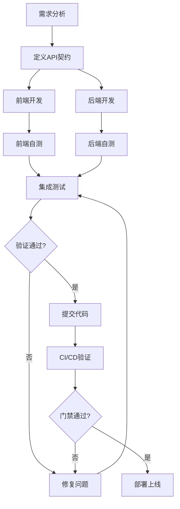

# 前后端协同开发完整性验证系统

> **创建时间**：2025年11月24日  
> **目的**：系统性预防前后端集成问题，避免"打补丁式"开发，减少技术债务

---

## 📋 目录

1. [问题根因分析](#问题根因分析)
2. [系统性预防方案](#系统性预防方案)
3. [自动化验证工具](#自动化验证工具)
4. [开发流程规范](#开发流程规范)
5. [快速检查清单](#快速检查清单)

---

## 🔍 问题根因分析

### 本次遇到的4大类问题

#### 1. API路径不匹配问题
**现象**：
```
前端调用: GET /api/v4/customer-service/sessions → 404
后端路由: GET /api/v4/admin/customer-service/sessions → 200
```

**根本原因**：
- 缺乏API契约定义
- 前后端路由注册不一致
- 没有自动化路由验证

**影响范围**：
- 所有客服管理相关的6个API端点
- 导致功能完全不可用

---

#### 2. 数据库字段不存在问题
**现象**：
```sql
HTTP 400: Unknown column 'user.avatar_url' in 'field list'
```

**根本原因**：
- 服务层代码与数据库模型不同步
- 缺少字段存在性验证
- 开发时假设字段存在而未验证

**影响范围**：
- 所有查询User表的6处代码
- 导致所有会话列表查询失败

---

#### 3. WebSocket协议不匹配问题
**现象**：
```
WebSocket connection failed: Error during handshake: 503
前端使用: 原生WebSocket连接 /ws
后端使用: Socket.IO连接 /socket.io
```

**根本原因**：
- 前后端技术栈不统一
- 缺少WebSocket技术选型文档
- 前端未加载必要的客户端库

**影响范围**：
- 实时消息通信完全失效
- 用户体验严重降级

---

#### 4. 工具类方法调用错误
**现象**：
```javascript
HTTP 400: BeijingTimeHelper.formatDisplay is not a function
```

**根本原因**：
- 开发者不了解工具类的实际API
- 缺少工具类使用文档
- IDE没有类型提示

**影响范围**：
- 所有时间格式化的5处代码
- 导致所有时间显示异常

---

## 🛡️ 系统性预防方案

### 方案1: API契约管理系统

#### 1.1 统一API定义文件
**位置**：`/docs/api-contracts/`

```javascript
// api-contracts/admin-customer-service.js
/**
 * 客服管理API契约定义
 * 前后端必须严格遵守此契约
 */
module.exports = {
  baseUrl: '/api/v4/admin/customer-service',
  
  endpoints: {
    // 获取会话列表
    getSessions: {
      method: 'GET',
      path: '/sessions',
      fullPath: '/api/v4/admin/customer-service/sessions', // ✅ 完整路径
      auth: true,
      query: ['page', 'page_size', 'status', 'search', 'admin_id'],
      response: {
        success: true,
        data: {
          sessions: Array,
          total: Number,
          page: Number,
          page_size: Number
        }
      }
    },
    
    // 获取会话消息
    getMessages: {
      method: 'GET',
      path: '/sessions/:session_id/messages',
      fullPath: '/api/v4/admin/customer-service/sessions/:session_id/messages',
      auth: true,
      params: ['session_id'],
      query: ['limit', 'before_message_id']
    },
    
    // 发送消息
    sendMessage: {
      method: 'POST',
      path: '/sessions/:session_id/send',
      fullPath: '/api/v4/admin/customer-service/sessions/:session_id/send',
      auth: true,
      params: ['session_id'],
      body: {
        content: String,
        message_type: String // optional
      }
    }
  }
}
```

#### 1.2 自动验证脚本
**位置**：`/scripts/verification/verify-api-contracts.js`

```javascript
/**
 * API契约验证脚本
 * 确保前端调用的API路径与后端注册的路由一致
 */
const fs = require('fs')
const path = require('path')

class APIContractVerifier {
  constructor() {
    this.contracts = this.loadContracts()
    this.frontendAPICalls = this.scanFrontendAPICalls()
    this.backendRoutes = this.scanBackendRoutes()
  }

  // 加载所有API契约
  loadContracts() {
    const contractDir = path.join(__dirname, '../../docs/api-contracts')
    const contracts = {}
    
    if (!fs.existsSync(contractDir)) {
      console.warn('⚠️ API契约目录不存在:', contractDir)
      return contracts
    }

    fs.readdirSync(contractDir).forEach(file => {
      if (file.endsWith('.js')) {
        const contractName = file.replace('.js', '')
        contracts[contractName] = require(path.join(contractDir, file))
      }
    })

    return contracts
  }

  // 扫描前端API调用
  scanFrontendAPICalls() {
    const calls = []
    const publicDir = path.join(__dirname, '../../public/admin')
    
    const scanFile = (filePath) => {
      const content = fs.readFileSync(filePath, 'utf8')
      
      // 匹配API调用：fetch('/api/...') 或 apiRequest('/api/...')
      const apiCallRegex = /(?:fetch|apiRequest)\s*\(\s*['"`]([^'"`]+)['"`]/g
      let match
      
      while ((match = apiCallRegex.exec(content)) !== null) {
        const url = match[1]
        if (url.startsWith('/api/')) {
          calls.push({
            file: path.relative(publicDir, filePath),
            url: url.split('?')[0], // 移除查询参数
            line: content.substring(0, match.index).split('\n').length
          })
        }
      }
    }

    // 递归扫描所有HTML和JS文件
    const scanDirectory = (dir) => {
      fs.readdirSync(dir).forEach(file => {
        const filePath = path.join(dir, file)
        const stat = fs.statSync(filePath)
        
        if (stat.isDirectory()) {
          scanDirectory(filePath)
        } else if (file.endsWith('.html') || file.endsWith('.js')) {
          scanFile(filePath)
        }
      })
    }

    scanDirectory(publicDir)
    return calls
  }

  // 扫描后端路由注册
  scanBackendRoutes() {
    const routes = []
    const routesDir = path.join(__dirname, '../../routes')
    
    const scanRouteFile = (filePath) => {
      const content = fs.readFileSync(filePath, 'utf8')
      
      // 匹配路由定义：router.get('/path', ...) 或 router.post('/path', ...)
      const routeRegex = /router\.(get|post|put|delete|patch)\s*\(\s*['"`]([^'"`]+)['"`]/g
      let match
      
      while ((match = routeRegex.exec(content)) !== null) {
        const method = match[1].toUpperCase()
        const path = match[2]
        
        routes.push({
          file: path.relative(routesDir, filePath),
          method: method,
          path: path,
          line: content.substring(0, match.index).split('\n').length
        })
      }
    }

    // 递归扫描所有路由文件
    const scanDirectory = (dir) => {
      fs.readdirSync(dir).forEach(file => {
        const filePath = path.join(dir, file)
        const stat = fs.statSync(filePath)
        
        if (stat.isDirectory()) {
          scanDirectory(filePath)
        } else if (file.endsWith('.js')) {
          scanRouteFile(filePath)
        }
      })
    }

    scanDirectory(routesDir)
    return routes
  }

  // 验证前端调用与后端路由是否匹配
  verify() {
    console.log('🔍 开始API契约验证...\n')
    
    const mismatches = []
    
    // 检查每个前端API调用
    this.frontendAPICalls.forEach(call => {
      // 构建完整路径（考虑路由层级）
      const fullPath = call.url
      
      // 在后端路由中查找匹配
      const matchedRoute = this.backendRoutes.find(route => {
        // 简化匹配：检查路径是否包含
        return this.pathMatches(fullPath, route)
      })

      if (!matchedRoute) {
        mismatches.push({
          type: 'MISSING_BACKEND_ROUTE',
          frontend: call,
          message: `前端调用的API路径后端未注册: ${call.url}`
        })
      }
    })

    // 生成报告
    this.generateReport(mismatches)
    
    return mismatches.length === 0
  }

  // 路径匹配逻辑
  pathMatches(frontendPath, backendRoute) {
    // 移除查询参数
    const cleanFrontendPath = frontendPath.split('?')[0]
    
    // 需要考虑路由挂载点
    // 例如：/api/v4/admin/customer-service/sessions
    // 后端可能分为：app.use('/api/v4/admin', adminRoutes)
    //              adminRoutes.use('/customer-service', csRoutes)
    //              csRoutes.get('/sessions', handler)
    
    // 简化实现：检查前端路径是否以某个模式结尾
    return cleanFrontendPath.includes(backendRoute.path)
  }

  // 生成验证报告
  generateReport(mismatches) {
    if (mismatches.length === 0) {
      console.log('✅ API契约验证通过！')
      console.log(`   前端API调用: ${this.frontendAPICalls.length}个`)
      console.log(`   后端路由注册: ${this.backendRoutes.length}个`)
      console.log(`   不匹配项: 0个\n`)
      return
    }

    console.log(`❌ API契约验证失败！发现 ${mismatches.length} 个不匹配项:\n`)
    
    mismatches.forEach((mismatch, index) => {
      console.log(`${index + 1}. ${mismatch.message}`)
      console.log(`   文件: ${mismatch.frontend.file}:${mismatch.frontend.line}`)
      console.log(`   路径: ${mismatch.frontend.url}\n`)
    })

    console.log('💡 修复建议:')
    console.log('   1. 检查后端路由注册是否完整')
    console.log('   2. 检查前端API调用路径是否正确')
    console.log('   3. 参考API契约文档: docs/api-contracts/\n')
  }
}

// 执行验证
if (require.main === module) {
  const verifier = new APIContractVerifier()
  const passed = verifier.verify()
  process.exit(passed ? 0 : 1)
}

module.exports = APIContractVerifier
```

---

### 方案2: 数据库模型验证系统

#### 2.1 模型字段完整性检查
**位置**：`/scripts/verification/verify-model-fields.js`

```javascript
/**
 * 数据库模型字段验证脚本
 * 确保代码中使用的字段在模型定义中存在
 */
const fs = require('fs')
const path = require('path')

class ModelFieldVerifier {
  constructor() {
    this.models = this.loadModels()
    this.serviceUsages = this.scanServiceFieldUsages()
  }

  // 加载所有模型定义
  loadModels() {
    const models = {}
    const modelsDir = path.join(__dirname, '../../models')
    
    fs.readdirSync(modelsDir).forEach(file => {
      if (file.endsWith('.js') && file !== 'index.js') {
        const modelName = file.replace('.js', '')
        const modelPath = path.join(modelsDir, file)
        const content = fs.readFileSync(modelPath, 'utf8')
        
        // 解析模型字段（简化版本）
        const fields = this.parseModelFields(content)
        models[modelName] = {
          file: file,
          fields: fields
        }
      }
    })

    return models
  }

  // 解析模型字段定义
  parseModelFields(content) {
    const fields = []
    
    // 匹配字段定义：field_name: { type: DataTypes.XXX }
    const fieldRegex = /(\w+)\s*:\s*\{[^}]*type:\s*DataTypes\./g
    let match
    
    while ((match = fieldRegex.exec(content)) !== null) {
      fields.push(match[1])
    }

    return fields
  }

  // 扫描服务层字段使用
  scanServiceFieldUsages() {
    const usages = []
    const servicesDir = path.join(__dirname, '../../services')
    
    const scanFile = (filePath) => {
      const content = fs.readFileSync(filePath, 'utf8')
      
      // 匹配attributes数组：attributes: ['field1', 'field2']
      const attributesRegex = /attributes:\s*\[([^\]]+)\]/g
      let match
      
      while ((match = attributesRegex.exec(content)) !== null) {
        const fieldsStr = match[1]
        const fields = fieldsStr
          .split(',')
          .map(f => f.trim().replace(/['"]/g, ''))
          .filter(f => f && !f.includes('*'))
        
        fields.forEach(field => {
          usages.push({
            file: path.relative(servicesDir, filePath),
            field: field,
            line: content.substring(0, match.index).split('\n').length
          })
        })
      }
    }

    // 扫描所有服务文件
    fs.readdirSync(servicesDir).forEach(file => {
      if (file.endsWith('.js')) {
        scanFile(path.join(servicesDir, file))
      }
    })

    return usages
  }

  // 验证字段使用
  verify() {
    console.log('🔍 开始模型字段验证...\n')
    
    const errors = []
    
    this.serviceUsages.forEach(usage => {
      // 尝试匹配模型
      let found = false
      
      for (const [modelName, modelInfo] of Object.entries(this.models)) {
        if (modelInfo.fields.includes(usage.field)) {
          found = true
          break
        }
      }

      if (!found) {
        errors.push({
          type: 'UNDEFINED_FIELD',
          usage: usage,
          message: `字段 '${usage.field}' 在任何模型中都未定义`
        })
      }
    })

    // 生成报告
    this.generateReport(errors)
    
    return errors.length === 0
  }

  // 生成验证报告
  generateReport(errors) {
    if (errors.length === 0) {
      console.log('✅ 模型字段验证通过！')
      console.log(`   检查的字段使用: ${this.serviceUsages.length}处`)
      console.log(`   发现的模型: ${Object.keys(this.models).length}个`)
      console.log(`   未定义字段: 0个\n`)
      return
    }

    console.log(`❌ 模型字段验证失败！发现 ${errors.length} 个未定义字段:\n`)
    
    errors.forEach((error, index) => {
      console.log(`${index + 1}. ${error.message}`)
      console.log(`   文件: ${error.usage.file}:${error.usage.line}`)
      console.log(`   字段: ${error.usage.field}\n`)
    })

    console.log('💡 修复建议:')
    console.log('   1. 检查字段名是否拼写正确')
    console.log('   2. 确认该字段在对应模型中已定义')
    console.log('   3. 运行数据库迁移确保字段存在\n')
  }
}

// 执行验证
if (require.main === module) {
  const verifier = new ModelFieldVerifier()
  const passed = verifier.verify()
  process.exit(passed ? 0 : 1)
}

module.exports = ModelFieldVerifier
```

---

### 方案3: 工具类API文档系统

#### 3.1 自动生成工具类使用文档
**位置**：`/scripts/verification/generate-utils-docs.js`

```javascript
/**
 * 工具类文档自动生成脚本
 * 基于JSDoc注释生成工具类使用文档
 */
const fs = require('fs')
const path = require('path')

class UtilsDocGenerator {
  constructor() {
    this.utilsDir = path.join(__dirname, '../../utils')
    this.outputFile = path.join(__dirname, '../../docs/工具类API参考.md')
  }

  // 生成文档
  generate() {
    console.log('📝 开始生成工具类文档...\n')
    
    let markdown = '# 工具类API参考手册\n\n'
    markdown += `> 自动生成时间：${new Date().toLocaleString('zh-CN', { timeZone: 'Asia/Shanghai' })}\n\n`
    markdown += '## 目录\n\n'
    
    const utilFiles = fs.readdirSync(this.utilsDir)
      .filter(f => f.endsWith('.js'))
      .sort()
    
    // 生成目录
    utilFiles.forEach(file => {
      const className = file.replace('.js', '')
      markdown += `- [${className}](#${className.toLowerCase()})\n`
    })
    
    markdown += '\n---\n\n'
    
    // 生成每个工具类的文档
    utilFiles.forEach(file => {
      const filePath = path.join(this.utilsDir, file)
      const content = fs.readFileSync(filePath, 'utf8')
      const className = file.replace('.js', '')
      
      markdown += `## ${className}\n\n`
      markdown += `**文件位置**：\`utils/${file}\`\n\n`
      
      // 提取类说明
      const classDescMatch = content.match(/\/\*\*\s*\n\s*\*\s*([^\n]+)/)
      if (classDescMatch) {
        markdown += `${classDescMatch[1]}\n\n`
      }
      
      // 提取所有静态方法
      markdown += '### 可用方法\n\n'
      
      const methodRegex = /\/\*\*[\s\S]*?\*\/\s*static\s+(\w+)\s*\(([^)]*)\)/g
      let match
      let methodCount = 0
      
      while ((match = methodRegex.exec(content)) !== null) {
        const methodName = match[1]
        const params = match[2]
        
        // 提取方法的JSDoc注释
        const methodStart = match.index
        const beforeMethod = content.substring(0, methodStart)
        const lastCommentStart = beforeMethod.lastIndexOf('/**')
        const comment = content.substring(lastCommentStart, methodStart)
        
        // 解析JSDoc
        const descMatch = comment.match(/\/\*\*\s*\n\s*\*\s*([^\n@]+)/)
        const description = descMatch ? descMatch[1].trim() : ''
        
        const returnMatch = comment.match(/@returns?\s*\{([^}]+)\}\s*([^\n]+)/)
        const returnType = returnMatch ? returnMatch[1] : 'void'
        const returnDesc = returnMatch ? returnMatch[2] : ''
        
        // 解析参数
        const paramMatches = [...comment.matchAll(/@param\s*\{([^}]+)\}\s*(\w+)\s*-?\s*([^\n]*)/g)]
        
        markdown += `#### \`${methodName}(${params})\`\n\n`
        markdown += `${description}\n\n`
        
        if (paramMatches.length > 0) {
          markdown += '**参数**：\n\n'
          paramMatches.forEach(pm => {
            markdown += `- \`${pm[2]}\` (\`${pm[1]}\`) - ${pm[3]}\n`
          })
          markdown += '\n'
        }
        
        markdown += `**返回值**：\`${returnType}\` - ${returnDesc}\n\n`
        
        // 提取示例
        const exampleMatch = comment.match(/@example\s*([\s\S]*?)(?=\*\/|\s*\*\s*@)/m)
        if (exampleMatch) {
          markdown += '**示例**：\n\n```javascript\n'
          markdown += exampleMatch[1].replace(/^\s*\*\s?/gm, '').trim()
          markdown += '\n```\n\n'
        }
        
        markdown += '---\n\n'
        methodCount++
      }
      
      if (methodCount === 0) {
        markdown += '无可用的静态方法\n\n'
      }
    })
    
    // 写入文件
    const docsDir = path.dirname(this.outputFile)
    if (!fs.existsSync(docsDir)) {
      fs.mkdirSync(docsDir, { recursive: true })
    }
    
    fs.writeFileSync(this.outputFile, markdown, 'utf8')
    
    console.log(`✅ 工具类文档已生成: ${this.outputFile}`)
    console.log(`   包含 ${utilFiles.length} 个工具类\n`)
  }
}

// 执行生成
if (require.main === module) {
  const generator = new UtilsDocGenerator()
  generator.generate()
}

module.exports = UtilsDocGenerator
```

---

### 方案4: 前置验证门禁系统

#### 4.1 Git Pre-commit Hook
**位置**：`.husky/pre-commit`

```bash
#!/bin/sh
. "$(dirname "$0")/_/husky.sh"

echo "🔍 执行代码提交前验证..."

# 1. ESLint检查
echo "\n1️⃣ 代码质量检查..."
npm run lint || {
  echo "❌ ESLint检查失败，请修复代码质量问题"
  exit 1
}

# 2. API契约验证
echo "\n2️⃣ API契约验证..."
node scripts/verification/verify-api-contracts.js || {
  echo "❌ API契约验证失败，请检查前后端路径一致性"
  exit 1
}

# 3. 模型字段验证
echo "\n3️⃣ 数据库字段验证..."
node scripts/verification/verify-model-fields.js || {
  echo "❌ 模型字段验证失败，请检查字段定义"
  exit 1
}

echo "\n✅ 所有验证通过，允许提交"
```

---

## 🚀 开发流程规范

### 新功能开发流程（前后端协同）



### 具体步骤

#### 步骤1：定义API契约（强制）
```javascript
// 1. 在 docs/api-contracts/ 创建契约文件
// 2. 前后端开发者共同review确认
// 3. 将契约纳入版本控制

// 示例：docs/api-contracts/user-management.js
module.exports = {
  baseUrl: '/api/v4/admin/user-management',
  endpoints: {
    getUsers: {
      method: 'GET',
      path: '/users',
      fullPath: '/api/v4/admin/user-management/users',
      // ... 详细定义
    }
  }
}
```

#### 步骤2：后端实现（TDD）
```javascript
// 1. 先写测试（基于API契约）
describe('GET /api/v4/admin/user-management/users', () => {
  it('should return user list', async () => {
    const response = await request(app)
      .get('/api/v4/admin/user-management/users')
      .set('Authorization', `Bearer ${validToken}`)
    
    expect(response.status).toBe(200)
    expect(response.body.success).toBe(true)
  })
})

// 2. 实现路由和服务层
// 3. 运行测试验证
// 4. 运行模型字段验证
```

#### 步骤3：前端实现（API Mock）
```javascript
// 1. 基于API契约实现前端逻辑
async function loadUsers() {
  // 使用契约定义的完整路径
  const response = await apiRequest('/api/v4/admin/user-management/users')
  // ...
}

// 2. 本地开发使用Mock数据
// 3. 集成测试使用真实后端
```

#### 步骤4：集成验证（自动化）
```bash
# 运行完整验证套件
npm run verify:all

# 包含以下验证：
# - API契约一致性
# - 模型字段完整性  
# - 工具类方法存在性
# - 单元测试覆盖率
# - 集成测试通过率
```

---

## ✅ 快速检查清单

### 开发新功能时必检项

#### 后端开发者检查清单
- [ ] 1. 是否定义了API契约？（`docs/api-contracts/`）
- [ ] 2. 路由是否正确注册？（检查完整路径）
- [ ] 3. 服务层使用的字段是否都在模型中定义？
- [ ] 4. 是否编写了单元测试？
- [ ] 5. 是否更新了API文档？
- [ ] 6. 工具类方法是否存在？（参考工具类API文档）
- [ ] 7. 时间处理是否使用标准方法？（`BeijingTimeHelper.formatForAPI()`）
- [ ] 8. 是否运行了`npm run verify:all`？

#### 前端开发者检查清单
- [ ] 1. 是否参考了API契约？
- [ ] 2. API调用路径是否完整？（包含所有前缀）
- [ ] 3. 是否加载了必要的第三方库？（如Socket.IO）
- [ ] 4. WebSocket连接是否使用正确的协议和路径？
- [ ] 5. 是否处理了所有可能的错误状态？
- [ ] 6. 时间显示是否符合北京时间规范？

### 集成测试检查清单
- [ ] 1. 前端能否成功调用后端API？
- [ ] 2. 数据格式是否符合预期？
- [ ] 3. 错误处理是否友好？
- [ ] 4. WebSocket实时通信是否正常？
- [ ] 5. 所有时间显示是否正确？

---

## 🔧 快速修复命令

当验证失败时，使用以下命令快速定位问题：

```bash
# 1. 检查API路径不匹配
npm run verify:api-contracts

# 2. 检查数据库字段问题
npm run verify:model-fields

# 3. 生成工具类文档
npm run generate:utils-docs

# 4. 运行完整验证
npm run verify:all

# 5. 查看前端API调用
grep -r "apiRequest\|fetch" public/admin/ | grep "/api/"

# 6. 查看后端路由注册
grep -r "router\.\(get\|post\)" routes/ | grep -v node_modules
```

---

## 📊 成本效益分析

### 不实施预防系统的成本
- **单次问题修复时间**：平均2-4小时
- **技术债务积累**：每次打补丁增加10%复杂度
- **团队信心下降**：频繁出现集成问题
- **上线风险增加**：未被发现的问题进入生产环境

### 实施预防系统的收益
- **首次投入**：编写验证脚本约4-8小时
- **每次节省**：提前发现问题，节省2-4小时
- **质量提升**：集成问题减少90%+
- **开发效率**：减少返工，提升30%+效率

---

## 🎯 总结

### 核心原则
1. **契约先行**：定义清晰的API契约
2. **自动验证**：构建自动化验证系统
3. **失败快速**：在开发阶段就发现问题
4. **文档驱动**：保持文档与代码同步

### 实施路径
1. **第一周**：建立API契约和验证脚本
2. **第二周**：集成到开发流程（pre-commit hook）
3. **第三周**：全面推广使用
4. **持续优化**：根据实际情况调整验证规则

### 预期效果
- **集成问题减少**：从频繁出现到几乎为零
- **开发效率提升**：减少返工和调试时间
- **代码质量提高**：自动化验证保证一致性
- **团队信心增强**：开发和集成更加顺畅

---

**文档维护者**：开发团队  
**最后更新**：2025年11月24日  
**版本**：v1.0
