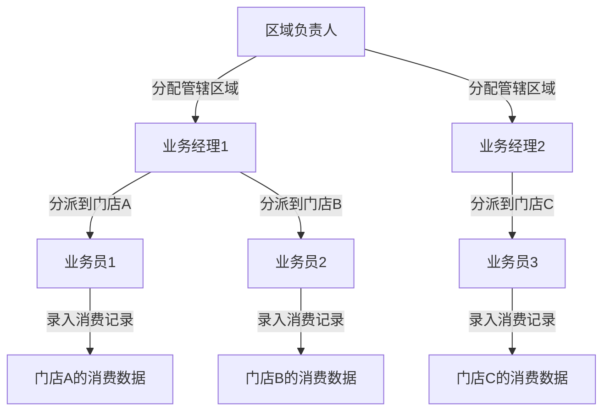

# 🏢 层级化角色权限管理方案（实用主义版本）

**创建时间**：2025年11月06日  
**最后更新**：2025年11月07日 21:43 北京时间  
**适用场景**：区域负责人→业务经理→业务员三级管理结构  
**核心需求**：快速批量调整和关闭下级人员权限  
**项目**：餐厅积分抽奖系统 V4.0 统一引擎架构  
**数据规模**：小型项目（预期用户<1000，可能暂停业务）  
**技术栈**：Node.js + Express + Sequelize + MySQL + UUID角色系统  
**核心依赖**：基于项目现有的UUID角色系统（User、Role、UserRole模型）

---

## ⚠️ 重要：实用主义设计理念

### **核心原则**

> **"不要为了重构而重构，要为了降低维护成本而重构"**

本方案遵循以下实用主义原则：

1. **🎯 简单优先**
   - 避免过度设计，只实现核心必需功能
   - 代码简单易懂，新人可以快速上手
   - 不追求完美，追求够用和稳定

2. **📊 小数据量优化**
   - 当前项目预期用户量<1000，层级关系<200条
   - 不需要复杂的缓存策略（数据库查询已经很快）
   - 不需要分页功能（一次性查询即可）
   - 简单的索引策略即可（过多索引反而降低写入性能）

3. **💰 低维护成本**
   - 代码复杂度低，减少潜在bug
   - 不依赖额外的第三方服务
   - 不引入过度抽象和设计模式
   - 易于理解和修改

4. **🔄 可扩展性考虑**
   - 如果未来业务扩大，可以逐步优化
   - 当前设计不阻碍未来扩展
   - 但不为未来可能性过度设计

### **简化说明**

相比完整的层级权限系统，本方案**简化或移除**了以下内容：

- ❌ **不需要** `hierarchy_path` 字段（小数据量下递归查询性能足够）
- ❌ **不需要** Redis缓存（项目已有auth缓存，无需重复）
- ❌ **不需要** 分页查询（下级数量少，一次性查询即可）
- ❌ **不需要** 复杂的索引策略（基本索引即可）
- ✅ **保留** 核心层级关系管理（必需功能）
- ✅ **保留** 批量停用/激活（核心需求）
- ✅ **保留** 权限验证（安全基础）
- ✅ **保留** 操作日志（审计需求）

### **与现有系统对接**

本方案**复用项目现有基础设施**，不增加技术债务：

- ✅ **使用现有UUID角色系统**：复用Role、User、UserRole模型
- ✅ **使用现有认证中间件**：复用authenticateToken、requireAdmin
- ✅ **使用现有时间工具**：复用BeijingTimeHelper工具类
- ✅ **遵循V4.0架构规范**：路由、错误处理、日志记录统一标准

---

## 📋 目录

1. [业务场景说明](#业务场景说明)
2. [需求分析](#需求分析)
3. [数据库设计（简化版）](#数据库设计简化版)
4. [核心功能实现（简化版）](#核心功能实现简化版)
5. [API接口设计](#api接口设计)
6. [使用示例](#使用示例)
7. [扩展优化（可选）](#扩展优化可选)

---

## 🎬 业务场景说明

### **实际业务模型**

这是一个**区域化业务推广管理系统**，用于管理餐厅积分抽奖系统的线下推广团队。

#### **业务角色定义**

1. **区域负责人 (Regional Manager)**
   - 负责整个区域的业务拓展
   - 管理多个业务经理
   - 可以查看和管理所有下级的业务数据
   - 权限级别：`role_level: 80`

2. **业务经理 (Business Manager)**
   - 负责具体区域内的业务推广
   - 管理多个业务员
   - 分配业务员到不同门店
   - 权限级别：`role_level: 60`

3. **业务员 (Sales Staff)**
   - 实际驻店或流动业务人员
   - 负责具体门店的消费记录录入和积分推广
   - 关联到具体门店（`store_id`）
   - 权限级别：`role_level: 40`

#### **典型业务流程**



#### **核心业务场景**

1. **新业务员入职**
   - 区域负责人创建业务经理账号
   - 业务经理创建业务员账号
   - 业务员分派到具体门店
   - 建立层级关系

2. **业务员离职/调动**
   - 业务经理需要快速停用业务员权限
   - 保留业务员的历史数据（软删除）
   - 记录操作日志用于审计

3. **业务经理离职**
   - 区域负责人需要批量停用业务经理及其所有下属的权限
   - 一键操作，避免遗漏
   - 完整的操作审计追踪

4. **权限隔离**
   - 业务经理只能管理自己的下属
   - 不能跨区域管理
   - 不能查看其他业务经理的数据

---

## 🎯 需求分析

### **组织架构层级**

```
超级管理员 (role_level: 100) - 系统管理员
    ↓
区域负责人 (role_level: 80) - 管理整个区域
    ↓
业务经理 (role_level: 60) × N人 - 管理具体区域
    ↓
业务员 (role_level: 40) × M人/业务经理 - 驻店业务人员
```

### **核心需求**

1. **层级管理**：上级可以管理所有下级的权限和数据访问范围
2. **批量操作**：支持一键关闭某个业务经理及其所有下属的权限
3. **权限隔离**：业务经理只能管理自己的下属，不能跨区域管理
4. **快速响应**：权限变更立即生效（缓存失效机制）
5. **审计追踪**：记录所有权限变更操作，包括操作人、操作时间、操作原因
6. **门店关联**：业务员必须关联到具体门店，用于消费记录的数据隔离

### **⚠️ 重要安全设计原则**

**批量停用权限的安全机制**：

- **默认行为**：停用权限时，默认仅停用目标用户本人，不自动批量停用其所有下级
- **主动选择**：需要批量停用所有下级时，必须明确传入`include_subordinates: true`参数
- **防止误操作**：避免操作人员误操作导致大量下级用户权限被意外停用
- **业务场景适配**：
  - ✅ 业务员离职/违规 → 默认仅停用业务员本人（不影响其他人）
  - ✅ 业务经理离职 → 明确选择批量停用（需要主动确认）
  
**设计理念**：**显式优于隐式**（Explicit is better than implicit），重要操作需要明确的用户意图确认

---

## 🗄️ 数据库设计（简化版）

### **设计理念**

> **为小数据量优化，保持简单，避免过度设计**

- 用户量预期<1000，层级关系预期<200条
- 不使用复杂的 `hierarchy_path` 字段（递归查询性能足够）
- 最小化索引数量（减少写入开销）
- 保留核心功能字段，删除冗余字段

### **数据库表关系图**

```
users (用户表 - 已存在)
  ↓
user_roles (用户角色关联表 - 已存在) ← roles (角色表 - 已存在)
  ↓
user_hierarchy (用户层级关系表 - 新增，简化版)
  ↓
role_change_logs (角色变更日志表 - 新增)

stores (门店表 - 可选，如果需要门店管理功能)
```

### **1. 创建 `stores` 表（门店信息表）**

> **说明**：门店表用于记录合作商家的门店信息，业务员会被分派到具体门店工作

```sql
-- 创建门店信息表
CREATE TABLE IF NOT EXISTS `stores` (
  `store_id` INT(11) NOT NULL AUTO_INCREMENT COMMENT '门店ID（主键）',
  `store_name` VARCHAR(100) NOT NULL COMMENT '门店名称（如：某某餐厅XX店）',
  `store_code` VARCHAR(50) NULL COMMENT '门店编号（唯一标识，如：ST20250101001）',
  `store_address` VARCHAR(200) NULL COMMENT '门店地址（详细地址）',
  `contact_name` VARCHAR(50) NULL COMMENT '门店联系人姓名',
  `contact_mobile` VARCHAR(20) NULL COMMENT '门店联系电话',
  `region` VARCHAR(50) NULL COMMENT '所属区域（如：东城区、西城区）',
  `status` ENUM('active', 'inactive', 'pending') DEFAULT 'active' COMMENT '门店状态：active-正常营业，inactive-已关闭，pending-待审核',
  `assigned_to` INT(11) NULL COMMENT '分配给哪个业务员（外键关联users.user_id）',
  `merchant_id` INT(11) NULL COMMENT '商户ID（关联商家用户，外键关联users.user_id）',
  `notes` TEXT NULL COMMENT '备注信息',
  `created_at` DATETIME NOT NULL DEFAULT CURRENT_TIMESTAMP COMMENT '创建时间（门店信息录入时间），时区：北京时间（GMT+8）',
  `updated_at` DATETIME NOT NULL DEFAULT CURRENT_TIMESTAMP ON UPDATE CURRENT_TIMESTAMP COMMENT '更新时间（最后修改时间），时区：北京时间（GMT+8）',
  PRIMARY KEY (`store_id`),
  UNIQUE KEY `uk_store_code` (`store_code`),
  KEY `idx_status` (`status`),
  KEY `idx_region` (`region`),
  KEY `idx_assigned_to` (`assigned_to`),
  KEY `idx_merchant_id` (`merchant_id`),
  CONSTRAINT `fk_store_assigned_to` FOREIGN KEY (`assigned_to`) REFERENCES `users` (`user_id`) ON DELETE SET NULL,
  CONSTRAINT `fk_store_merchant` FOREIGN KEY (`merchant_id`) REFERENCES `users` (`user_id`) ON DELETE SET NULL
) ENGINE=InnoDB DEFAULT CHARSET=utf8mb4 COLLATE=utf8mb4_unicode_ci COMMENT='门店信息表（用于记录合作商家门店，业务员分派依据）';
```

### **2. 扩展 `roles` 表（可选：如果需要在Role表中记录层级关系）**

> **说明**：在现有的UUID角色系统基础上，增加层级管理相关字段
> 
> **⚠️ 实用主义建议**：对于小数据量项目，可以**不扩展roles表**，直接在user_hierarchy表中通过role_id关联即可。以下扩展字段仅在需要在角色模型层面定义层级关系时才添加。

```sql
-- ⚠️ 可选：如果需要在角色模型中定义层级关系才添加（小项目可跳过）
-- 为roles表添加层级管理字段（可选）
ALTER TABLE `roles` 
ADD COLUMN `parent_role_id` INT(11) NULL COMMENT '父角色ID（用于定义角色层级，如业务经理的父角色是区域负责人）' AFTER `role_level`,
ADD COLUMN `max_subordinates` INT(11) DEFAULT 0 COMMENT '最大下属数量限制（0表示无限制，仅做软限制提示）' AFTER `parent_role_id`,
ADD COLUMN `can_manage_subordinates` TINYINT(1) DEFAULT 0 COMMENT '是否可以管理下属（1=可以，0=不可以，基于role_level也能判断）' AFTER `max_subordinates`,
ADD INDEX `idx_parent_role` (`parent_role_id`);

-- 📝 说明：小数据量项目建议直接在代码逻辑中判断（基于role_level），不需要这些冗余字段
-- 理由：
-- 1. 增加数据库复杂度，降低维护效率
-- 2. role_level本身已经能区分层级关系（80 > 60 > 40）
-- 3. can_manage_subordinates可通过代码逻辑判断：role_level >= 60即可管理
-- 4. max_subordinates在小数据量下没有实际价值
```

### **3. 创建 `user_hierarchy` 表（用户层级关系表 - 简化版）**

> **说明**：核心表，记录用户之间的上下级关系
> 
> **简化理念**：
> - ❌ 移除 `hierarchy_path` 字段（小数据量下递归查询性能足够，无需优化）
> - ❌ 移除 `hierarchy_level` 字段（可以通过递归计算，避免数据冗余）
> - ✅ 保留核心字段：上下级关系、激活状态、停用信息

```sql
CREATE TABLE IF NOT EXISTS `user_hierarchy` (
  `hierarchy_id` INT(11) NOT NULL AUTO_INCREMENT COMMENT '层级关系ID（主键）',
  `user_id` INT(11) NOT NULL COMMENT '用户ID（当前用户）',
  `superior_user_id` INT(11) NULL COMMENT '上级用户ID（NULL表示顶级区域负责人）',
  `role_id` INT(11) NOT NULL COMMENT '当前角色ID（关联roles表，如：1=业务员，2=业务经理，3=区域负责人）',
  `store_id` INT(11) NULL COMMENT '所属门店ID（仅业务员有值，业务经理和区域负责人为NULL）',
  `is_active` TINYINT(1) DEFAULT 1 COMMENT '层级关系是否有效（1=激活，0=已停用）',
  `activated_at` DATETIME NULL COMMENT '激活时间（首次激活或重新激活时记录），时区：北京时间（GMT+8）',
  `deactivated_at` DATETIME NULL COMMENT '停用时间（停用时记录），时区：北京时间（GMT+8）',
  `deactivated_by` INT(11) NULL COMMENT '停用操作人ID（谁停用的？外键关联users.user_id）',
  `deactivation_reason` TEXT NULL COMMENT '停用原因（如：离职、调动、违规等）',
  `created_at` DATETIME NOT NULL DEFAULT CURRENT_TIMESTAMP COMMENT '创建时间，时区：北京时间（GMT+8）',
  `updated_at` DATETIME NOT NULL DEFAULT CURRENT_TIMESTAMP ON UPDATE CURRENT_TIMESTAMP COMMENT '更新时间，时区：北京时间（GMT+8）',
  PRIMARY KEY (`hierarchy_id`),
  UNIQUE KEY `uk_user_role` (`user_id`, `role_id`) COMMENT '一个用户在同一角色下只能有一条层级记录',
  KEY `idx_superior_user` (`superior_user_id`) COMMENT '查询某个上级的所有直接下属',
  KEY `idx_is_active` (`is_active`) COMMENT '筛选激活/停用状态',
  CONSTRAINT `fk_user_hierarchy_user` FOREIGN KEY (`user_id`) REFERENCES `users` (`user_id`) ON DELETE CASCADE,
  CONSTRAINT `fk_user_hierarchy_superior` FOREIGN KEY (`superior_user_id`) REFERENCES `users` (`user_id`) ON DELETE SET NULL,
  CONSTRAINT `fk_user_hierarchy_role` FOREIGN KEY (`role_id`) REFERENCES `roles` (`role_id`) ON DELETE CASCADE
) ENGINE=InnoDB DEFAULT CHARSET=utf8mb4 COLLATE=utf8mb4_unicode_ci COMMENT='用户层级关系表（简化版：仅保留核心字段和必要索引）';
```

**简化说明**：
- **移除字段**：`hierarchy_path`（小数据量下递归查询足够快）、`hierarchy_level`（可动态计算）
- **简化索引**：仅保留3个核心索引（`superior_user_id`、`is_active`、`user_id+role_id`）
- **性能考量**：对于<200条记录，简单的索引策略已经足够，过多索引反而降低INSERT/UPDATE性能

### **3. 创建 `role_change_logs` 表（权限变更日志表）**

```sql
CREATE TABLE IF NOT EXISTS `role_change_logs` (
  `log_id` INT(11) NOT NULL AUTO_INCREMENT COMMENT '日志ID',
  `target_user_id` INT(11) NOT NULL COMMENT '目标用户ID',
  `operator_user_id` INT(11) NOT NULL COMMENT '操作人ID',
  `operation_type` ENUM('activate', 'deactivate', 'role_change', 'batch_deactivate') NOT NULL COMMENT '操作类型',
  `old_role_id` INT(11) NULL COMMENT '原角色ID',
  `new_role_id` INT(11) NULL COMMENT '新角色ID',
  `affected_count` INT(11) DEFAULT 1 COMMENT '影响的用户数量（批量操作时）',
  `reason` TEXT NULL COMMENT '操作原因',
  `ip_address` VARCHAR(50) NULL COMMENT '操作IP地址',
  `user_agent` TEXT NULL COMMENT '用户代理信息',
  `created_at` DATETIME NOT NULL DEFAULT CURRENT_TIMESTAMP,
  PRIMARY KEY (`log_id`),
  KEY `idx_target_user` (`target_user_id`),
  KEY `idx_operator_user` (`operator_user_id`),
  KEY `idx_operation_type` (`operation_type`),
  KEY `idx_created_at` (`created_at`),
  CONSTRAINT `fk_role_log_target` FOREIGN KEY (`target_user_id`) REFERENCES `users` (`user_id`) ON DELETE CASCADE,
  CONSTRAINT `fk_role_log_operator` FOREIGN KEY (`operator_user_id`) REFERENCES `users` (`user_id`) ON DELETE CASCADE
) ENGINE=InnoDB DEFAULT CHARSET=utf8mb4 COLLATE=utf8mb4_unicode_ci COMMENT='角色权限变更日志表';
```

### **5. 初始化层级角色数据（实用主义简化版）**

> **说明**：初始化三个业务角色，建立层级关系
> 
> **⚠️ 实用主义建议**：仅添加核心字段，不添加冗余的parent_role_id等字段（因为role_level已经能表示层级）

```sql
-- 插入层级角色配置（简化版：仅核心字段）
-- 使用项目现有的roles表结构（role_id, role_uuid, role_name, role_level, permissions, description, is_active）
INSERT INTO `roles` (`role_name`, `role_level`, `permissions`, `description`, `is_active`) VALUES
-- 区域负责人（Regional Manager）- 最高业务权限level=80
('regional_manager', 80, 
 JSON_OBJECT(
   'users', JSON_ARRAY('read', 'create', 'update', 'delete'),
   'stores', JSON_ARRAY('read', 'create', 'update', 'delete'),
   'hierarchy', JSON_ARRAY('read', 'create', 'update', 'delete'),
   'staff', JSON_ARRAY('read', 'create', 'update', 'delete'),
   'consumption', JSON_ARRAY('read', 'create', 'update', 'delete'),
   'reports', JSON_ARRAY('read')
 ), 
 '区域负责人（可管理业务经理和业务员，查看所有业务数据，权限级别80）', 
 1),

-- 业务经理（Business Manager）- 中级权限level=60
('business_manager', 60, 
 JSON_OBJECT(
   'stores', JSON_ARRAY('read', 'update'),
   'staff', JSON_ARRAY('read', 'create', 'update'),
   'consumption', JSON_ARRAY('read', 'create', 'update', 'delete'),
   'reports', JSON_ARRAY('read'),
   'hierarchy', JSON_ARRAY('read')
 ), 
 '业务经理（可管理业务员，录入和管理消费记录，查看业务报表，权限级别60）', 
 1),

-- 业务员（Sales Staff）- 基础权限level=40
('sales_staff', 40, 
 JSON_OBJECT(
   'stores', JSON_ARRAY('read'),
   'consumption', JSON_ARRAY('read', 'create'),
   'profile', JSON_ARRAY('read', 'update')
 ), 
 '业务员（可录入消费记录，查看分配门店信息，管理个人信息，权限级别40）', 
 1)
ON DUPLICATE KEY UPDATE 
  `role_level` = VALUES(`role_level`),
  `permissions` = VALUES(`permissions`),
  `description` = VALUES(`description`),
  `is_active` = VALUES(`is_active`);

-- 📝 说明：
-- 1. 不使用parent_role_id字段，直接通过role_level数值判断层级关系（80 > 60 > 40）
-- 2. 不使用max_subordinates字段，通过代码逻辑限制（小数据量无需数据库层面限制）
-- 3. 不使用can_manage_subordinates字段，通过role_level >= 60判断是否可管理
-- 4. 层级关系通过user_hierarchy表维护，roles表仅定义权限模板
```

**权限说明**：

| 角色 | role_level | 权限范围 | 可管理下属 |
|------|------------|---------|-----------|
| regional_manager | 80 | 全部权限（*） | ✅ 是 |
| business_manager | 60 | 门店管理、人员管理、消费记录 | ✅ 是 |
| sales_staff | 40 | 消费记录录入、个人信息 | ❌ 否 |

---

## 💻 核心功能实现

### **实现概览**

本方案需要创建以下4个文件：

1. `/home/devbox/project/models/Store.js` - 门店模型
2. `/home/devbox/project/models/UserHierarchy.js` - 用户层级关系模型
3. `/home/devbox/project/models/RoleChangeLog.js` - 角色变更日志模型
4. `/home/devbox/project/services/HierarchyManagementService.js` - 层级管理服务
5. `/home/devbox/project/routes/v4/hierarchy/index.js` - API路由

---

### **1. 创建 Store 模型（门店信息）**

**文件路径**：`/home/devbox/project/models/Store.js`

```javascript
/**
 * 门店信息模型 - 餐厅积分抽奖系统 V4.0 统一引擎架构
 * 业务场景：记录合作商家门店信息，用于业务员分派和消费记录关联
 * 创建时间：2025年11月07日
 */

/**
 * 💡 说明：本代码与项目现有技术栈完全一致
 * - 使用项目现有的 BeijingTimeHelper 时间工具（位于 /home/devbox/project/utils/timeHelper.js）
 * - 遵循项目现有的 Sequelize 模型定义规范
 * - 时间字段统一使用北京时间（GMT+8），与项目其他模型保持一致
 * - 关联关系定义遵循项目现有模型的 associate 方法规范
 */

const { DataTypes } = require('sequelize')
const BeijingTimeHelper = require('../utils/timeHelper') // 复用项目现有时间工具

module.exports = sequelize => {
  const Store = sequelize.define(
    'Store',
    {
      // 门店ID（主键）
      store_id: {
        type: DataTypes.INTEGER,
        primaryKey: true,
        autoIncrement: true,
        comment: '门店ID（主键）'
      },

      // 门店名称
      store_name: {
        type: DataTypes.STRING(100),
        allowNull: false,
        comment: '门店名称（如：某某餐厅XX店）'
      },

      // 门店编号（唯一标识）
      store_code: {
        type: DataTypes.STRING(50),
        allowNull: true,
        unique: true,
        comment: '门店编号（唯一标识，如：ST20250101001）'
      },

      // 门店地址
      store_address: {
        type: DataTypes.STRING(200),
        allowNull: true,
        comment: '门店地址（详细地址）'
      },

      // 门店联系人
      contact_name: {
        type: DataTypes.STRING(50),
        allowNull: true,
        comment: '门店联系人姓名'
      },

      // 联系电话
      contact_mobile: {
        type: DataTypes.STRING(20),
        allowNull: true,
        comment: '门店联系电话'
      },

      // 所属区域
      region: {
        type: DataTypes.STRING(50),
        allowNull: true,
        comment: '所属区域（如：东城区、西城区）'
      },

      // 门店状态
      status: {
        type: DataTypes.ENUM('active', 'inactive', 'pending'),
        defaultValue: 'active',
        comment: '门店状态：active-正常营业，inactive-已关闭，pending-待审核'
      },

      // 分配给哪个业务员
      assigned_to: {
        type: DataTypes.INTEGER,
        allowNull: true,
        comment: '分配给哪个业务员（外键关联users.user_id）'
      },

      // 商户ID
      merchant_id: {
        type: DataTypes.INTEGER,
        allowNull: true,
        comment: '商户ID（关联商家用户，外键关联users.user_id）'
      },

      // 备注信息
      notes: {
        type: DataTypes.TEXT,
        allowNull: true,
        comment: '备注信息'
      }
    },
    {
      tableName: 'stores',
      timestamps: true,
      createdAt: 'created_at',
      updatedAt: 'updated_at',
      underscored: true,
      indexes: [
        { unique: true, fields: ['store_code'] },
        { fields: ['status'] },
        { fields: ['region'] },
        { fields: ['assigned_to'] },
        { fields: ['merchant_id'] }
      ],
      comment: '门店信息表（用于记录合作商家门店，业务员分派依据）',

      // 钩子函数：确保使用北京时间
      hooks: {
        beforeSave: (store, _options) => {
          if (!store.created_at) {
            store.created_at = BeijingTimeHelper.createDatabaseTime()
          }
          store.updated_at = BeijingTimeHelper.createDatabaseTime()
        }
      }
    }
  )

  // 定义关联关系
  Store.associate = function (models) {
    // 多对一：多个门店分配给一个业务员
    Store.belongsTo(models.User, {
      foreignKey: 'assigned_to',
      as: 'assignedStaff',
      comment: '分配的业务员'
    })

    // 多对一：多个门店属于一个商户
    Store.belongsTo(models.User, {
      foreignKey: 'merchant_id',
      as: 'merchant',
      comment: '商户信息'
    })

    // 一对多：一个门店有多个消费记录
    if (models.ConsumptionRecord) {
      Store.hasMany(models.ConsumptionRecord, {
        foreignKey: 'store_id',
        as: 'consumption_records',
        comment: '门店的消费记录'
      })
    }

    // 一对多：一个门店有多个层级关系记录（业务员分派历史）
    if (models.UserHierarchy) {
      Store.hasMany(models.UserHierarchy, {
        foreignKey: 'store_id',
        as: 'hierarchy_records',
        comment: '业务员分派历史记录'
      })
    }
  }

  return Store
}
```

---

### **2. 创建 UserHierarchy 模型（用户层级关系 - 简化版）**

**文件路径**：`/home/devbox/project/models/UserHierarchy.js`

> **简化说明**：移除了 `hierarchy_path` 和 `hierarchy_level` 字段，保持模型简单

```javascript
/**
 * 用户层级关系模型（简化版） - 餐厅积分抽奖系统 V4.0 统一引擎架构
 * 业务场景：管理用户的上下级关系和权限层级
 * 创建时间：2025年11月07日
 * 设计理念：简单实用，避免过度设计
 *
 * 核心功能：
 * 1. 记录用户之间的上下级关系（区域负责人→业务经理→业务员）
 * 2. 支持权限激活/停用管理
 * 3. 记录完整的操作审计信息
 * 
 * 简化内容：
 * - 移除 hierarchy_path 字段（小数据量下递归查询足够快）
 * - 移除 hierarchy_level 字段（可动态计算，避免数据冗余）
 * 
 * 💡 与项目现有技术栈的对接：
 * - 复用项目现有的 BeijingTimeHelper（位于 /home/devbox/project/utils/timeHelper.js）
 * - 关联现有的 User、Role 模型（已存在于 models/User.js 和 models/Role.js）
 * - 遵循项目现有的 Sequelize 模型定义和关联规范
 * - 时间字段使用北京时间（GMT+8），与项目其他模型保持一致
 */

const { DataTypes } = require('sequelize')
const BeijingTimeHelper = require('../utils/timeHelper') // 复用项目现有时间工具

module.exports = sequelize => {
  const UserHierarchy = sequelize.define(
    'UserHierarchy',
    {
      // 层级关系ID（主键）
      hierarchy_id: {
        type: DataTypes.INTEGER,
        primaryKey: true,
        autoIncrement: true,
        comment: '层级关系ID（主键）'
      },

      // 用户ID
      user_id: {
        type: DataTypes.INTEGER,
        allowNull: false,
        comment: '用户ID（当前用户）'
      },

      // 上级用户ID
      superior_user_id: {
        type: DataTypes.INTEGER,
        allowNull: true,
        comment: '上级用户ID（NULL表示顶级区域负责人）'
      },

      // 角色ID
      role_id: {
        type: DataTypes.INTEGER,
        allowNull: false,
        comment: '当前角色ID（关联roles表，如：1=业务员，2=业务经理，3=区域负责人）'
      },

      // 所属门店ID（仅业务员有值）
      store_id: {
        type: DataTypes.INTEGER,
        allowNull: true,
        comment: '所属门店ID（仅业务员有值，业务经理和区域负责人为NULL）'
      },

      // 是否激活
      is_active: {
        type: DataTypes.BOOLEAN,
        defaultValue: true,
        comment: '层级关系是否有效（1=激活，0=已停用）'
      },

      // 激活时间
      activated_at: {
        type: DataTypes.DATE,
        allowNull: true,
        comment: '激活时间（首次激活或重新激活时记录），时区：北京时间（GMT+8）'
      },

      // 停用时间
      deactivated_at: {
        type: DataTypes.DATE,
        allowNull: true,
        comment: '停用时间（停用时记录），时区：北京时间（GMT+8）'
      },

      // 停用操作人
      deactivated_by: {
        type: DataTypes.INTEGER,
        allowNull: true,
        comment: '停用操作人ID（谁停用的？外键关联users.user_id）'
      },

      // 停用原因
      deactivation_reason: {
        type: DataTypes.TEXT,
        allowNull: true,
        comment: '停用原因（如：离职、调动、违规等）'
      }
    },
    {
      tableName: 'user_hierarchy',
      timestamps: true,
      createdAt: 'created_at',
      updatedAt: 'updated_at',
      underscored: true,
      indexes: [
        { unique: true, fields: ['user_id', 'role_id'], comment: '一个用户在同一角色下只能有一条层级记录' },
        { fields: ['superior_user_id'], comment: '查询某个上级的所有直接下属' },
        { fields: ['is_active'], comment: '筛选激活/停用状态' }
      ],
      comment: '用户层级关系表（简化版：仅保留核心字段）',

      // 钩子函数：确保使用北京时间
      hooks: {
        beforeSave: (record, _options) => {
          if (!record.created_at) {
            record.created_at = BeijingTimeHelper.createDatabaseTime()
          }
          record.updated_at = BeijingTimeHelper.createDatabaseTime()
        }
      }
    }
  )

  // 定义关联关系
  UserHierarchy.associate = function (models) {
    // 多对一：当前用户
    UserHierarchy.belongsTo(models.User, {
      foreignKey: 'user_id',
      as: 'user',
      comment: '当前用户信息'
    })

    // 多对一：上级用户
    UserHierarchy.belongsTo(models.User, {
      foreignKey: 'superior_user_id',
      as: 'superior',
      comment: '上级用户信息'
    })

    // 多对一：角色信息
    UserHierarchy.belongsTo(models.Role, {
      foreignKey: 'role_id',
      as: 'role',
      comment: '角色信息'
    })

    // 多对一：门店信息（如果有Store模型）
    if (models.Store) {
      UserHierarchy.belongsTo(models.Store, {
        foreignKey: 'store_id',
        as: 'store',
        comment: '所属门店信息（仅业务员）'
      })
    }

    // 多对一：停用操作人
    UserHierarchy.belongsTo(models.User, {
      foreignKey: 'deactivated_by',
      as: 'deactivator',
      comment: '停用操作人信息'
    })
  }

  return UserHierarchy
}
```

### **3. 创建 RoleChangeLog 模型（角色变更日志）**

**文件路径**：`/home/devbox/project/models/RoleChangeLog.js`

```javascript
/**
 * 角色权限变更日志模型 - 餐厅积分抽奖系统 V4.0 统一引擎架构
 * 业务场景：记录所有权限变更操作，用于审计和追踪（离职、调动、权限变更等）
 * 创建时间：2025年11月07日
 *
 * 核心功能：
 * 1. 记录所有权限变更操作（激活、停用、角色变更、批量停用）
 * 2. 记录操作人、操作时间、操作原因
 * 3. 记录操作IP地址，用于安全审计（V4.0架构移除了user_agent字段）
 * 4. 支持批量操作的影响用户数量统计
 * 
 * 💡 与项目现有技术栈的对接：
 * - 复用项目现有的 BeijingTimeHelper（位于 /home/devbox/project/utils/timeHelper.js）
 * - 日志记录遵循项目现有的 AdminOperationLog 模型规范
 * - 时间字段使用北京时间（GMT+8），与项目其他模型保持一致
 * - created_at使用beforeCreate钩子，updatedAt设为false（日志表不需要更新）
 */

const { DataTypes } = require('sequelize')
const BeijingTimeHelper = require('../utils/timeHelper') // 复用项目现有时间工具

module.exports = sequelize => {
  const RoleChangeLog = sequelize.define(
    'RoleChangeLog',
    {
      // 日志ID（主键）
      log_id: {
        type: DataTypes.INTEGER,
        primaryKey: true,
        autoIncrement: true,
        comment: '日志ID（主键）'
      },

      // 目标用户ID（被操作的用户）
      target_user_id: {
        type: DataTypes.INTEGER,
        allowNull: false,
        comment: '目标用户ID（被操作的用户，如被停用权限的业务员）'
      },

      // 操作人ID（执行操作的用户）
      operator_user_id: {
        type: DataTypes.INTEGER,
        allowNull: false,
        comment: '操作人ID（执行操作的用户，如区域负责人或业务经理）'
      },

      // 操作类型
      operation_type: {
        type: DataTypes.ENUM('activate', 'deactivate', 'role_change', 'batch_deactivate'),
        allowNull: false,
        comment: '操作类型：activate-激活权限，deactivate-停用权限，role_change-角色变更，batch_deactivate-批量停用'
      },

      // 原角色ID
      old_role_id: {
        type: DataTypes.INTEGER,
        allowNull: true,
        comment: '原角色ID（角色变更时记录，如从业务员变为业务经理）'
      },

      // 新角色ID
      new_role_id: {
        type: DataTypes.INTEGER,
        allowNull: true,
        comment: '新角色ID（角色变更时记录，如从业务员变为业务经理）'
      },

      // 影响的用户数量
      affected_count: {
        type: DataTypes.INTEGER,
        defaultValue: 1,
        comment: '影响的用户数量（批量操作时记录，如停用1个业务经理及其10个业务员，则为11）'
      },

      // 操作原因
      reason: {
        type: DataTypes.TEXT,
        allowNull: true,
        comment: '操作原因（如：离职、调动、违规、权限调整等）'
      },

      // 操作IP地址
      ip_address: {
        type: DataTypes.STRING(50),
        allowNull: true,
        comment: '操作IP地址（用于安全审计）'
      },

      // ⚠️ 已移除user_agent字段：V4.0架构不再记录用户代理信息（简化设计）
      // 理由：
      // 1. 小数据量项目不需要详细的浏览器信息
      // 2. IP地址已足够用于安全审计
      // 3. 减少数据库字段复杂度和存储开销
    },
    {
      tableName: 'role_change_logs',
      timestamps: true,
      createdAt: 'created_at',
      updatedAt: false, // 日志表不需要updated_at字段
      underscored: true,
      indexes: [
        { fields: ['target_user_id'], comment: '查询某个用户的权限变更历史' },
        { fields: ['operator_user_id'], comment: '查询某个操作人的操作记录' },
        { fields: ['operation_type'], comment: '按操作类型筛选' },
        { fields: ['created_at'], comment: '按时间排序查询' }
      ],
      comment: '角色权限变更日志表（用于审计和追踪所有权限变更操作）',

      // 钩子函数：确保使用北京时间
      hooks: {
        beforeCreate: (log, _options) => {
          if (!log.created_at) {
            log.created_at = BeijingTimeHelper.createDatabaseTime()
          }
        }
      }
    }
  )

  // 定义关联关系
  RoleChangeLog.associate = function (models) {
    // 多对一：目标用户
    RoleChangeLog.belongsTo(models.User, {
      foreignKey: 'target_user_id',
      as: 'targetUser',
      comment: '目标用户信息（被操作的用户）'
    })

    // 多对一：操作人
    RoleChangeLog.belongsTo(models.User, {
      foreignKey: 'operator_user_id',
      as: 'operator',
      comment: '操作人信息（执行操作的用户）'
    })

    // 多对一：原角色
    RoleChangeLog.belongsTo(models.Role, {
      foreignKey: 'old_role_id',
      as: 'oldRole',
      comment: '原角色信息'
    })

    // 多对一：新角色
    RoleChangeLog.belongsTo(models.Role, {
      foreignKey: 'new_role_id',
      as: 'newRole',
      comment: '新角色信息'
    })
  }

  return RoleChangeLog
}
```

---

### **4. 创建 HierarchyManagementService 服务（层级权限管理核心服务 - 简化版）**

**文件路径**：`/home/devbox/project/services/HierarchyManagementService.js`

> **简化说明**：
> - 移除 hierarchy_path 和 hierarchy_level 的计算逻辑（保持简单）
> - 移除 Redis 缓存逻辑（小数据量下不需要）
> - 使用简单的递归查询替代复杂的 LIKE 查询

```javascript
/**
 * 层级权限管理服务（简化版） - 餐厅积分抽奖系统 V4.0 统一引擎架构
 * 业务场景：管理区域负责人→业务经理→业务员三级层级关系和权限操作
 * 创建时间：2025年11月07日
 * 设计理念：简单实用，避免过度设计
 * 
 * 核心功能：
 * 1. 建立上下级关系（如：业务经理添加业务员）
 * 2. 批量停用下级权限（如：业务经理离职时停用其所有下级业务员）
 * 3. 查询所有下级用户（如：区域负责人查看所有业务经理和业务员）
 * 4. 权限变更日志记录（审计追踪）
 * 5. 门店分配管理（业务员分配到门店）
 * 
 * 简化内容：
 * - 移除 hierarchy_path 和 hierarchy_level 计算（直接使用递归查询）
 * - 移除 Redis 缓存（项目已有auth缓存，无需重复）
 * - 移除分页查询（小数据量一次性查询即可）
 * 
 * 业务规则：
 * - 区域负责人（role_level=80）可以管理业务经理和业务员
 * - 业务经理（role_level=60）可以管理业务员
 * - 业务员（role_level=40）无下级管理权限
 * - 权限停用会级联影响所有下级
 * - 所有操作记录到role_change_logs表
 * 
 * 💡 与项目现有技术栈的对接：
 * - 复用项目现有的 models/index.js 统一导入模型
 * - 复用项目现有的 BeijingTimeHelper 时间工具
 * - 复用项目现有的 auth.js 中的 PermissionManager.invalidateUser 清除缓存
 * - 遵循项目现有的事务处理和错误处理规范
 */

// 📝 说明：使用项目现有的models/index.js统一导入所有模型
// 项目现有模型导入方式：const { User, Role, ... } = require('../models')
const { User, Role, UserRole, UserHierarchy, RoleChangeLog } = require('../models')
const { Op } = require('sequelize')
const BeijingTimeHelper = require('../utils/timeHelper') // 复用项目现有时间工具
const { PermissionManager } = require('../middleware/auth') // 复用现有的缓存失效机制

class HierarchyManagementService {
  /**
   * 🏗️ 建立用户层级关系（简化版）
   * 业务场景：
   * - 业务经理添加业务员，指定其负责的门店
   * - 区域负责人添加业务经理
   * 
   * @param {number} userId - 用户ID（要建立层级关系的用户）
   * @param {number} superiorUserId - 上级用户ID（NULL表示顶级区域负责人）
   * @param {number} roleId - 角色ID（3=区域负责人，2=业务经理，1=业务员）
   * @param {number} storeId - 门店ID（可选，仅业务员需要）
   * @returns {Promise<Object>} { success, hierarchy, message }
   * 
   * 示例：业务经理（user_id=10）添加业务员（user_id=20）到门店（store_id=5）
   * await createHierarchy(20, 10, 1, 5)
   */
  static async createHierarchy(userId, superiorUserId, roleId, storeId = null) {
    try {
      // 1. 验证用户和角色存在
      const user = await User.findByPk(userId)
      if (!user) {
        throw new Error(`用户不存在: user_id=${userId}`)
      }

      const role = await Role.findByPk(roleId)
      if (!role) {
        throw new Error(`角色不存在: role_id=${roleId}`)
      }

      // 2. 验证上级用户存在（如果有上级）
      if (superiorUserId) {
        const superior = await User.findByPk(superiorUserId)
        if (!superior) {
          throw new Error(`上级用户不存在: superior_user_id=${superiorUserId}`)
        }
      }

      // 3. 创建层级关系记录（简化版：不计算 hierarchy_path 和 hierarchy_level）
      const hierarchy = await UserHierarchy.create({
        user_id: userId,
        superior_user_id: superiorUserId,
        role_id: roleId,
        store_id: storeId,
        is_active: true,
        activated_at: BeijingTimeHelper.createDatabaseTime()
      })

      console.log(`✅ 创建层级关系成功: 用户${userId} → 上级${superiorUserId}, 角色级别${role.role_level}`)

      return {
        success: true,
        hierarchy,
        message: '层级关系创建成功'
      }
    } catch (error) {
      console.error('❌ 创建层级关系失败:', error.message)
      throw error
    }
  }

  /**
   * 🔍 查询用户的所有下级（简单递归查询）
   * 业务场景：
   * - 区域负责人查看所有业务经理和业务员
   * - 业务经理查看所有业务员
   * - 业务经理离职时，需要查询其所有下级用户进行批量停用
   * 
   * @param {number} userId - 用户ID
   * @param {boolean} includeInactive - 是否包含已停用的下级（默认false，仅返回激活的）
   * @returns {Promise<Array>} 所有下级用户列表
   * 
   * 示例：查询业务经理（user_id=10）的所有下级业务员
   * const subordinates = await getAllSubordinates(10, false)
   * // 返回：[{ user_id: 20, user: {...}, role: {...} }, ...]
   * 
   * 简化说明：使用简单的递归查询，不依赖 hierarchy_path 字段
   */
  static async getAllSubordinates(userId, includeInactive = false) {
    try {
      const allSubordinates = []
      
      // 递归辅助函数：查询某个用户的所有下级
      const findSubordinates = async (currentUserId) => {
        // 1. 查询当前用户的直接下级
        const whereCondition = {
          superior_user_id: currentUserId
        }
        
        // 是否包含已停用的下级
        if (!includeInactive) {
          whereCondition.is_active = true
        }
        
        const directSubordinates = await UserHierarchy.findAll({
          where: whereCondition,
          include: [
            {
              model: User,
              as: 'user',
              attributes: ['user_id', 'mobile', 'nickname', 'status'],
              comment: '用户基本信息'
            },
            {
              model: Role,
              as: 'role',
              attributes: ['role_id', 'role_name', 'role_level'],
              comment: '角色信息'
            }
          ]
        })
        
        // 2. 将直接下级添加到结果数组
        allSubordinates.push(...directSubordinates)
        
        // 3. 递归查询每个直接下级的下级（深度优先遍历）
        for (const subordinate of directSubordinates) {
          await findSubordinates(subordinate.user_id)
        }
      }
      
      // 从指定用户开始递归查询
      await findSubordinates(userId)
      
      console.log(`✅ 查询到用户${userId}的${allSubordinates.length}个下级（包含已停用: ${includeInactive}）`)
      
      return allSubordinates
    } catch (error) {
      console.error('❌ 查询下级失败:', error.message)
      throw error
    }
  }

  /**
   * 🚫 批量停用用户权限（可选择是否包括所有下级）
   * 业务场景：
   * - 业务经理离职：可选择停用其本人及所有下级业务员的权限
   * - 业务员离职：仅停用其本人权限
   * - 临时禁用：如业务员违规，业务经理可临时停用其权限
   * 
   * @param {number} targetUserId - 目标用户ID（被停用的用户）
   * @param {number} operatorUserId - 操作人ID（执行停用的用户）
   * @param {string} reason - 停用原因（如：离职、违规、调动等）
   * @param {boolean} includeSubordinates - 是否同时停用所有下级（默认false，需要主动选择）
   * @returns {Promise<Object>} { success, deactivatedCount, deactivatedUsers, message }
   * 
   * 示例1：仅停用业务员权限（默认行为）
   * await batchDeactivatePermissions(20, 10, '业务员违规')
   * 
   * 示例2：业务经理离职，停用其本人及所有下级业务员（需要明确传入true）
   * await batchDeactivatePermissions(10, 1, '业务经理离职', true)
   */
  static async batchDeactivatePermissions(targetUserId, operatorUserId, reason, includeSubordinates = false) {
    const transaction = await UserHierarchy.sequelize.transaction()

    try {
      // 1. 验证操作权限（操作人必须是目标用户的上级，且角色级别更高）
      const canOperate = await this.canManageUser(operatorUserId, targetUserId)
      if (!canOperate) {
        throw new Error(`无权限操作该用户: operator=${operatorUserId}, target=${targetUserId}`)
      }

      // 2. 获取要停用的用户列表
      let usersToDeactivate = [targetUserId]

      if (includeSubordinates) {
        const subordinates = await this.getAllSubordinates(targetUserId, false)
        usersToDeactivate = [
          targetUserId,
          ...subordinates.map(sub => sub.user_id)
        ]
      }

      console.log(`🚫 准备停用${usersToDeactivate.length}个用户的权限（目标用户: ${targetUserId}，包含下级: ${includeSubordinates}）`)

      // 3. 批量停用层级关系（设置is_active=false，记录停用时间、操作人、原因）
      const deactivatedCount = await UserHierarchy.update(
        {
          is_active: false,
          deactivated_at: BeijingTimeHelper.createDatabaseTime(),
          deactivated_by: operatorUserId,
          deactivation_reason: reason
        },
        {
          where: {
            user_id: { [Op.in]: usersToDeactivate },
            is_active: true
          },
          transaction
        }
      )

      // 4. 批量停用用户角色关联（同步更新user_roles表）
      await UserRole.update(
        {
          is_active: false
        },
        {
          where: {
            user_id: { [Op.in]: usersToDeactivate },
            is_active: true
          },
          transaction
        }
      )

      // 5. 记录操作日志（用于审计追踪）
      await RoleChangeLog.create({
        target_user_id: targetUserId,
        operator_user_id: operatorUserId,
        operation_type: 'batch_deactivate',
        affected_count: usersToDeactivate.length,
        reason: reason
      }, { transaction })

      await transaction.commit()

      // 6. 🔄 清除受影响用户的权限缓存（与项目现有auth缓存集成）
      // 复用项目现有的 middleware/auth.js 中的 PermissionManager.invalidateMultipleUsers
      await PermissionManager.invalidateMultipleUsers(usersToDeactivate, 'hierarchy_deactivate')

      console.log(`✅ 成功停用${usersToDeactivate.length}个用户的权限，并清除缓存`)

      return {
        success: true,
        deactivatedCount: usersToDeactivate.length,
        deactivatedUsers: usersToDeactivate,
        message: `成功停用${usersToDeactivate.length}个用户的权限`
      }
    } catch (error) {
      await transaction.rollback()
      console.error('❌ 批量停用权限失败:', error.message)
      throw error
    }
  }

  /**
   * ✅ 批量激活用户权限
   * 业务场景：
   * - 业务员调动回归：重新激活其权限
   * - 临时禁用解除：恢复业务员权限
   * 
   * @param {number} targetUserId - 目标用户ID
   * @param {number} operatorUserId - 操作人ID
   * @param {boolean} includeSubordinates - 是否同时激活所有下级（默认false）
   * @returns {Promise<Object>} { success, activatedCount, activatedUsers, message }
   * 
   * 示例：激活业务员权限
   * await batchActivatePermissions(20, 10, false)
   */
  static async batchActivatePermissions(targetUserId, operatorUserId, includeSubordinates = false) {
    const transaction = await UserHierarchy.sequelize.transaction()

    try {
      // 1. 验证操作权限
      const canOperate = await this.canManageUser(operatorUserId, targetUserId)
      if (!canOperate) {
        throw new Error('无权限操作该用户')
      }

      // 2. 获取要激活的用户列表
      let usersToActivate = [targetUserId]

      if (includeSubordinates) {
        const subordinates = await this.getAllSubordinates(targetUserId, true)
        usersToActivate = [
          targetUserId,
          ...subordinates.map(sub => sub.user_id)
        ]
      }

      console.log(`✅ 准备激活${usersToActivate.length}个用户的权限`)

      // 3. 批量激活层级关系（恢复is_active=true，清除停用记录）
      await UserHierarchy.update(
        {
          is_active: true,
          activated_at: BeijingTimeHelper.createDatabaseTime(),
          deactivated_at: null,
          deactivated_by: null,
          deactivation_reason: null
        },
        {
          where: {
            user_id: { [Op.in]: usersToActivate }
          },
          transaction
        }
      )

      // 4. 批量激活用户角色关联
      await UserRole.update(
        {
          is_active: true
        },
        {
          where: {
            user_id: { [Op.in]: usersToActivate }
          },
          transaction
        }
      )

      // 5. 记录操作日志
      await RoleChangeLog.create({
        target_user_id: targetUserId,
        operator_user_id: operatorUserId,
        operation_type: 'activate',
        affected_count: usersToActivate.length,
        reason: '批量激活权限'
      }, { transaction })

      await transaction.commit()

      // 6. 🔄 清除受影响用户的权限缓存（与项目现有auth缓存集成）
      // 复用项目现有的 middleware/auth.js 中的 PermissionManager.invalidateMultipleUsers
      await PermissionManager.invalidateMultipleUsers(usersToActivate, 'hierarchy_activate')

      console.log(`✅ 成功激活${usersToActivate.length}个用户的权限，并清除缓存`)

      return {
        success: true,
        activatedCount: usersToActivate.length,
        activatedUsers: usersToActivate,
        message: `成功激活${usersToActivate.length}个用户的权限`
      }
    } catch (error) {
      await transaction.rollback()
      console.error('❌ 批量激活权限失败:', error.message)
      throw error
    }
  }

  /**
   * 🔐 检查操作人是否可以管理目标用户（简化版）
   * 业务规则：
   * - 操作人的角色级别必须高于目标用户（如业务经理role_level=60 > 业务员role_level=40）
   * - 目标用户必须是操作人的下级（通过递归查询验证）
   * 
   * @param {number} operatorUserId - 操作人ID
   * @param {number} targetUserId - 目标用户ID
   * @returns {Promise<boolean>} true表示有权限，false表示无权限
   * 
   * 示例：检查业务经理（user_id=10）是否可以管理业务员（user_id=20）
   * const canManage = await canManageUser(10, 20)
   * 
   * 简化说明：使用简单的递归查询判断上下级关系，不依赖 hierarchy_path
   */
  static async canManageUser(operatorUserId, targetUserId) {
    try {
      // 1. 获取操作人的角色级别
      const operatorHierarchy = await UserHierarchy.findOne({
        where: { user_id: operatorUserId, is_active: true },
        include: [{
          model: Role,
          as: 'role',
          attributes: ['role_level']
        }]
      })

      if (!operatorHierarchy) {
        return false
      }

      // 2. 获取目标用户的层级信息
      const targetHierarchy = await UserHierarchy.findOne({
        where: { user_id: targetUserId },
        include: [{
          model: Role,
          as: 'role',
          attributes: ['role_level']
        }]
      })

      if (!targetHierarchy) {
        return false
      }

      // 3. 判断权限：操作人角色级别必须高于目标用户
      const isHigherLevel = operatorHierarchy.role.role_level > targetHierarchy.role.role_level
      if (!isHigherLevel) {
        return false
      }

      // 4. 判断目标用户是否是操作人的下级（简单递归查询）
      const allSubordinates = await this.getAllSubordinates(operatorUserId, false)
      const isSubordinate = allSubordinates.some(sub => sub.user_id === targetUserId)

      return isSubordinate
    } catch (error) {
      console.error('❌ 权限检查失败:', error.message)
      return false
    }
  }

  /**
   * 📊 获取用户的层级统计信息（简化版）
   * 业务场景：
   * - 区域负责人查看其管理的业务经理和业务员数量
   * - 业务经理查看其管理的业务员数量
   * 
   * @param {number} userId - 用户ID
   * @returns {Promise<Object>} { total_subordinates, direct_subordinates, stats_by_role }
   * 
   * 示例：查询区域负责人（user_id=1）的统计信息
   * const stats = await getHierarchyStats(1)
   * // 返回：{ total_subordinates: 15, direct_subordinates: 5, stats_by_role: {...} }
   * 
   * 简化说明：按角色类型统计，而不是按层级深度统计（更直观）
   */
  static async getHierarchyStats(userId) {
    try {
      // 1. 获取所有下级
      const allSubordinates = await this.getAllSubordinates(userId, false)
      
      // 2. 获取直接下级（一级下属）
      const directSubordinates = await UserHierarchy.findAll({
        where: {
          superior_user_id: userId,
          is_active: true
        },
        include: [
          {
            model: User,
            as: 'user',
            attributes: ['user_id', 'mobile', 'nickname']
          },
          {
            model: Role,
            as: 'role',
            attributes: ['role_id', 'role_name', 'role_level']
          }
        ]
      })

      // 3. 按角色类型分组统计（更直观）
      const statsByRole = {}
      allSubordinates.forEach(sub => {
        const roleName = sub.role.role_name
        if (!statsByRole[roleName]) {
          statsByRole[roleName] = {
            count: 0,
            users: []
          }
        }
        statsByRole[roleName].count++
        statsByRole[roleName].users.push({
          user_id: sub.user_id,
          mobile: sub.user.mobile,
          nickname: sub.user.nickname,
          role_name: sub.role.role_name
        })
      })

      return {
        total_subordinates: allSubordinates.length,
        direct_subordinates: directSubordinates.length,
        stats_by_role: statsByRole
      }
    } catch (error) {
      console.error('❌ 获取层级统计失败:', error.message)
      throw error
    }
  }
}

module.exports = HierarchyManagementService
```

---

## 🔌 API接口设计（层级权限管理路由）

**文件路径**：`/home/devbox/project/routes/v4/hierarchy/index.js`

**挂载路径**：在 `/home/devbox/project/app.js` 中添加：
```javascript
app.use('/api/v4/hierarchy', require('./routes/v4/hierarchy'))
```

**完整路由代码**：

```javascript
/**
 * 层级权限管理路由 - 餐厅积分抽奖系统 V4.0 统一引擎架构
 * 业务场景：管理区域负责人→业务经理→业务员三级层级关系和权限操作
 * 创建时间：2025年11月07日
 * 
 * API路径前缀：/api/v4/hierarchy
 * 
 * 核心接口：
 * - POST /api/v4/hierarchy/create - 创建层级关系
 * - GET /api/v4/hierarchy/subordinates/:userId - 查询所有下级
 * - POST /api/v4/hierarchy/deactivate - 批量停用权限
 * - POST /api/v4/hierarchy/activate - 批量激活权限
 * - GET /api/v4/hierarchy/stats/:userId - 获取层级统计
 * 
 * 💡 与项目现有技术栈的对接：
 * - 复用项目现有的 middleware/auth.js 中的 authenticateToken 中间件
 * - 遵循项目现有的错误处理规范（try-catch + res.status().json()）
 * - 遵循项目现有的API响应格式（{ success, data/message }）
 * - 使用项目现有的 req.user 对象获取当前用户信息
 */

const express = require('express')
const router = express.Router()
const { authenticateToken } = require('../../../middleware/auth') // 复用项目现有认证中间件
const HierarchyManagementService = require('../../../services/HierarchyManagementService')

/**
 * 🏗️ 创建用户层级关系
 * 
 * **完整路径**：POST /api/v4/hierarchy/create
 * 
 * **业务场景**：
 * - 区域负责人添加业务经理
 * - 业务经理添加业务员并分配到门店
 * 
 * **权限要求**：需要管理员权限（区域负责人或业务经理）
 * 
 * **请求体**：
 * ```json
 * {
 *   "user_id": 20,              // 要添加的用户ID（必需）
 *   "superior_user_id": 10,     // 上级用户ID（必需，顶级区域负责人可为null）
 *   "role_id": 1,               // 角色ID（必需，1=业务员，2=业务经理，3=区域负责人）
 *   "store_id": 5               // 门店ID（可选，仅业务员需要）
 * }
 * ```
 * 
 * **响应示例**：
 * ```json
 * {
 *   "success": true,
 *   "hierarchy": {
 *     "hierarchy_id": 1,
 *     "user_id": 20,
 *     "superior_user_id": 10,
 *     "role_id": 1,
 *     "hierarchy_level": 1,
 *     "hierarchy_path": "10/20",
 *     "store_id": 5,
 *     "is_active": true
 *   },
 *   "message": "层级关系创建成功"
 * }
 * ```
 */
router.post('/create', authenticateToken, async (req, res) => {
  try {
    const { user_id, superior_user_id, role_id, store_id } = req.body

    // 参数验证
    if (!user_id || !role_id) {
      return res.status(400).json({
        success: false,
        message: '缺少必需参数：user_id 和 role_id'
      })
    }

    const result = await HierarchyManagementService.createHierarchy(
      user_id,
      superior_user_id,
      role_id,
      store_id
    )

    res.json(result)
  } catch (error) {
    console.error('❌ 创建层级关系失败:', error.message)
    res.status(500).json({
      success: false,
      message: error.message
    })
  }
})

/**
 * 🔍 查询用户的所有下级
 * 
 * **完整路径**：GET /api/v4/hierarchy/subordinates/:userId
 * 
 * **业务场景**：
 * - 区域负责人查看所有业务经理和业务员
 * - 业务经理查看所有业务员
 * 
 * **权限要求**：只能查询自己或自己下级的信息
 * 
 * **路径参数**：
 * - userId: 用户ID（数字）
 * 
 * **查询参数**：
 * - include_inactive: 是否包含已停用的下级（true/false，默认false）
 * 
 * **响应示例**：
 * ```json
 * {
 *   "success": true,
 *   "count": 10,
 *   "subordinates": [
 *     {
 *       "user_id": 20,
 *       "hierarchy_level": 1,
 *       "user": { "user_id": 20, "mobile": "13800138001", "nickname": "张三" },
 *       "role": { "role_id": 1, "role_name": "sales_staff", "role_level": 1 }
 *     }
 *   ]
 * }
 * ```
 */
router.get('/subordinates/:userId', authenticateToken, async (req, res) => {
  try {
    const { userId } = req.params
    const { include_inactive } = req.query

    // 权限验证：只能查询自己或自己下级的信息
    const canView = await HierarchyManagementService.canManageUser(
      req.user.user_id,
      parseInt(userId)
    )

    if (!canView && req.user.user_id !== parseInt(userId)) {
      return res.status(403).json({
        success: false,
        message: '无权限查看该用户的下级信息'
      })
    }

    const subordinates = await HierarchyManagementService.getAllSubordinates(
      parseInt(userId),
      include_inactive === 'true'
    )

    res.json({
      success: true,
      count: subordinates.length,
      subordinates
    })
  } catch (error) {
    console.error('❌ 查询下级失败:', error.message)
    res.status(500).json({
      success: false,
      message: error.message
    })
  }
})

/**
 * 🚫 批量停用用户权限
 * 
 * **完整路径**：POST /api/v4/hierarchy/deactivate
 * 
 * **业务场景**：
 * - 业务经理离职：可选择停用其本人及所有下级业务员
 * - 业务员违规：临时停用其权限
 * 
 * **权限要求**：需要管理权限（只能停用自己的下级）
 * 
 * **安全设计**：默认仅停用目标用户本人，不自动批量停用下级（防止误操作）
 * 
 * **请求体**：
 * ```json
 * {
 *   "target_user_id": 20,           // 目标用户ID（必需）
 *   "reason": "业务员离职",          // 停用原因（必需）
 *   "include_subordinates": false   // 是否同时停用所有下级（可选，默认false，需要主动选择）
 * }
 * ```
 * 
 * **响应示例1（仅停用目标用户）**：
 * ```json
 * {
 *   "success": true,
 *   "deactivatedCount": 1,
 *   "deactivatedUsers": [20],
 *   "message": "成功停用1个用户的权限"
 * }
 * ```
 * 
 * **响应示例2（停用目标用户及所有下级）**：
 * ```json
 * {
 *   "success": true,
 *   "deactivatedCount": 11,
 *   "deactivatedUsers": [10, 20, 21, ...],
 *   "message": "成功停用11个用户的权限"
 * }
 * ```
 */
router.post('/deactivate', authenticateToken, async (req, res) => {
  try {
    const { target_user_id, reason, include_subordinates = false } = req.body

    // 参数验证
    if (!target_user_id) {
      return res.status(400).json({
        success: false,
        message: '缺少必需参数：target_user_id'
      })
    }

    if (!reason) {
      return res.status(400).json({
        success: false,
        message: '请提供停用原因'
      })
    }

    const result = await HierarchyManagementService.batchDeactivatePermissions(
      target_user_id,
      req.user.user_id,
      reason,
      include_subordinates
    )

    res.json(result)
  } catch (error) {
    console.error('❌ 批量停用权限失败:', error.message)
    res.status(500).json({
      success: false,
      message: error.message
    })
  }
})

/**
 * ✅ 批量激活用户权限
 * 
 * **完整路径**：POST /api/v4/hierarchy/activate
 * 
 * **业务场景**：
 * - 业务员调动回归：重新激活其权限
 * - 临时禁用解除：恢复业务员权限
 * 
 * **权限要求**：需要管理权限（只能激活自己的下级）
 * 
 * **请求体**：
 * ```json
 * {
 *   "target_user_id": 20,           // 目标用户ID（必需）
 *   "include_subordinates": false   // 是否同时激活所有下级（可选，默认false）
 * }
 * ```
 * 
 * **响应示例**：
 * ```json
 * {
 *   "success": true,
 *   "activatedCount": 1,
 *   "activatedUsers": [20],
 *   "message": "成功激活1个用户的权限"
 * }
 * ```
 */
router.post('/activate', authenticateToken, async (req, res) => {
  try {
    const { target_user_id, include_subordinates = false } = req.body

    // 参数验证
    if (!target_user_id) {
      return res.status(400).json({
        success: false,
        message: '缺少必需参数：target_user_id'
      })
    }

    const result = await HierarchyManagementService.batchActivatePermissions(
      target_user_id,
      req.user.user_id,
      include_subordinates
    )

    res.json(result)
  } catch (error) {
    console.error('❌ 批量激活权限失败:', error.message)
    res.status(500).json({
      success: false,
      message: error.message
    })
  }
})

/**
 * 📊 获取用户层级统计信息
 * 
 * **完整路径**：GET /api/v4/hierarchy/stats/:userId
 * 
 * **业务场景**：
 * - 区域负责人查看其管理的业务经理和业务员数量
 * - 业务经理查看其管理的业务员数量
 * 
 * **权限要求**：只能查询自己或自己下级的统计信息
 * 
 * **路径参数**：
 * - userId: 用户ID（数字）
 * 
 * **响应示例（简化版）**：
 * ```json
 * {
 *   "success": true,
 *   "stats": {
 *     "total_subordinates": 15,
 *     "direct_subordinates": 5,
 *     "stats_by_role": {
 *       "business_manager": { "count": 5, "users": [...] },
 *       "sales_staff": { "count": 10, "users": [...] }
 *     }
 *   }
 * }
 * ```
 */
router.get('/stats/:userId', authenticateToken, async (req, res) => {
  try {
    const { userId } = req.params

    // 权限验证
    const canView = await HierarchyManagementService.canManageUser(
      req.user.user_id,
      parseInt(userId)
    )

    if (!canView && req.user.user_id !== parseInt(userId)) {
      return res.status(403).json({
        success: false,
        message: '无权限查看该用户的统计信息'
      })
    }

    const stats = await HierarchyManagementService.getHierarchyStats(parseInt(userId))

    res.json({
      success: true,
      stats
    })
  } catch (error) {
    console.error('❌ 获取层级统计失败:', error.message)
    res.status(500).json({
      success: false,
      message: error.message
    })
  }
})

module.exports = router
```

---

## 🔌 项目实际集成步骤

> **💡 说明**：以下是将本方案集成到现有项目的具体步骤，所有代码都基于项目现有技术栈，确保无缝对接。

### **步骤1：创建数据库表和初始化数据（5分钟）**

```bash
# 1. 连接到项目数据库
mysql -u root -p restaurant_lottery

# 2. 执行SQL脚本创建表结构
# 可以将上述数据库设计部分的SQL语句保存为 hierarchy_schema.sql，然后执行：
source /path/to/hierarchy_schema.sql

# 或者直接在MySQL命令行中依次执行：
# - CREATE TABLE stores ...
# - CREATE TABLE user_hierarchy ...
# - CREATE TABLE role_change_logs ...
# - INSERT INTO roles ... (初始化角色数据)
```

### **步骤2：创建模型文件（10分钟）**

```bash
# 在项目models目录下创建3个新模型文件
cd /home/devbox/project/models

# 创建Store模型（如果需要门店管理功能）
touch Store.js

# 创建UserHierarchy模型（核心）
touch UserHierarchy.js

# 创建RoleChangeLog模型（日志审计）
touch RoleChangeLog.js
```

将上述"核心功能实现"章节中的模型代码复制到对应文件中。

### **步骤3：注册模型到models/index.js（2分钟）**

```javascript
// 编辑 /home/devbox/project/models/index.js
// 在文件末尾添加新模型的注册代码

// 层级权限管理相关模型（2025年11月07日新增）
db.Store = require('./Store')(sequelize)              // 门店信息模型
db.UserHierarchy = require('./UserHierarchy')(sequelize) // 用户层级关系模型
db.RoleChangeLog = require('./RoleChangeLog')(sequelize) // 权限变更日志模型

console.log('✅ 层级权限管理模型已加载')
```

### **步骤4：创建服务文件（5分钟）**

```bash
# 在项目services目录下创建服务文件
cd /home/devbox/project/services
touch HierarchyManagementService.js
```

将上述"核心功能实现"章节中的服务代码复制到此文件中。

### **步骤5：创建API路由（5分钟）**

```bash
# 在项目routes目录下创建新路由
cd /home/devbox/project/routes/v4
mkdir -p hierarchy
touch hierarchy/index.js
```

将上述"API接口设计"章节中的路由代码复制到此文件中。

### **步骤6：挂载路由到app.js（2分钟）**

```javascript
// 编辑 /home/devbox/project/app.js
// 在V4路由注册部分添加：

// 层级权限管理路由（2025年11月07日新增）
app.use('/api/v4/hierarchy', require('./routes/v4/hierarchy'))
console.log('✅ 层级权限管理路由已挂载: /api/v4/hierarchy')
```

### **步骤7：重启服务并测试（3分钟）**

```bash
# 重启Node.js服务
npm run dev

# 或者使用PM2
pm2 restart restaurant-backend

# 验证服务启动成功
curl http://localhost:3000/health

# 检查路由是否正确挂载
# 可以通过访问任意hierarchy接口（需要先登录获取token）
```

### **步骤8：创建测试数据（可选，5分钟）**

```sql
-- 创建测试用户和角色关联
-- 1. 创建区域负责人
INSERT INTO users (mobile, nickname, status) VALUES ('13800000001', '张区域', 'active');
SET @regional_manager_user_id = LAST_INSERT_ID();

-- 2. 创建业务经理
INSERT INTO users (mobile, nickname, status) VALUES ('13800000002', '李经理', 'active');
SET @business_manager_user_id = LAST_INSERT_ID();

-- 3. 创建业务员
INSERT INTO users (mobile, nickname, status) VALUES ('13800000003', '王业务', 'active');
SET @sales_staff_user_id = LAST_INSERT_ID();

-- 4. 分配角色（从roles表查询role_id）
-- 注意：需要先执行步骤1的角色初始化SQL
INSERT INTO user_roles (user_id, role_id, is_active)
SELECT @regional_manager_user_id, role_id, 1 FROM roles WHERE role_name = 'regional_manager';

INSERT INTO user_roles (user_id, role_id, is_active)
SELECT @business_manager_user_id, role_id, 1 FROM roles WHERE role_name = 'business_manager';

INSERT INTO user_roles (user_id, role_id, is_active)
SELECT @sales_staff_user_id, role_id, 1 FROM roles WHERE role_name = 'sales_staff';

-- 5. 建立层级关系（使用UserHierarchy表）
-- 区域负责人（顶级，无上级）
INSERT INTO user_hierarchy (user_id, superior_user_id, role_id, is_active, activated_at)
SELECT @regional_manager_user_id, NULL, role_id, 1, NOW() FROM roles WHERE role_name = 'regional_manager';

-- 业务经理（归属于区域负责人）
INSERT INTO user_hierarchy (user_id, superior_user_id, role_id, is_active, activated_at)
SELECT @business_manager_user_id, @regional_manager_user_id, role_id, 1, NOW() FROM roles WHERE role_name = 'business_manager';

-- 业务员（归属于业务经理）
INSERT INTO user_hierarchy (user_id, superior_user_id, role_id, is_active, activated_at)
SELECT @sales_staff_user_id, @business_manager_user_id, role_id, 1, NOW() FROM roles WHERE role_name = 'sales_staff';

-- 查询验证层级关系
SELECT 
  uh.hierarchy_id,
  u.mobile,
  u.nickname,
  r.role_name,
  r.role_level,
  IFNULL(su.nickname, '顶级') AS superior_name,
  uh.is_active
FROM user_hierarchy uh
JOIN users u ON uh.user_id = u.user_id
JOIN roles r ON uh.role_id = r.role_id
LEFT JOIN users su ON uh.superior_user_id = su.user_id
ORDER BY r.role_level DESC;
```

### **集成完成验证清单**

- [ ] 数据库表已创建（stores, user_hierarchy, role_change_logs）
- [ ] 角色数据已初始化（regional_manager, business_manager, sales_staff）
- [ ] 模型文件已创建并在models/index.js中注册
- [ ] 服务文件已创建（HierarchyManagementService.js）
- [ ] API路由已创建并在app.js中挂载
- [ ] 服务已重启并能正常访问
- [ ] （可选）测试数据已创建并验证

---

## 📝 使用示例（基于实际业务场景）

### **场景1：建立层级关系（区域负责人→业务经理→业务员）**

```javascript
// 1. 创建区域负责人（user_id: 1，role_id: 3）
await HierarchyManagementService.createHierarchy(
  1,    // 用户ID
  null, // 无上级（顶级）
  3,    // role_id=3 (区域负责人，role_level=3)
  null  // 无门店ID
)

// 2. 创建业务经理（user_id: 10，role_id: 2）归属于区域负责人
await HierarchyManagementService.createHierarchy(
  10,   // 用户ID
  1,    // 上级：区域负责人
  2,    // role_id=2 (业务经理，role_level=2)
  null  // 无门店ID
)

// 3. 创建业务员（user_id: 20，role_id: 1）归属于业务经理，并分配到门店
await HierarchyManagementService.createHierarchy(
  20,   // 用户ID
  10,   // 上级：业务经理
  1,    // role_id=1 (业务员，role_level=1)
  5     // 门店ID: 5（业务员分配到门店5）
)
```

### **场景2：批量停用业务经理及其所有下属**

```javascript
// ⚠️ 安全设计：默认仅停用目标用户本人，需要主动选择批量停用下级

// 场景2.1：仅停用业务员本人（默认行为）
const result1 = await HierarchyManagementService.batchDeactivatePermissions(
  20,   // 目标用户：业务员
  10,   // 操作人：业务经理
  '业务员违规'
  // 不传入第4个参数，默认为false，仅停用业务员本人
)

// 返回结果：
// {
//   success: true,
//   deactivatedCount: 1,  // 仅停用1个业务员
//   deactivatedUsers: [20],
//   message: '成功停用1个用户的权限'
// }

// 场景2.2：业务经理离职，明确选择停用其本人及所有下级业务员
const result2 = await HierarchyManagementService.batchDeactivatePermissions(
  10,   // 目标用户：业务经理
  1,    // 操作人：区域负责人
  '业务经理离职，停用其及所有下属业务员权限',
  true  // ⚠️ 明确传入true，批量停用所有下级
)

// 返回结果：
// {
//   success: true,
//   deactivatedCount: 11,  // 1个业务经理 + 10个业务员
//   deactivatedUsers: [10, 20, 21, 22, ..., 29],
//   message: '成功停用11个用户的权限'
// }
```

### **场景3：查询区域负责人的所有下级**

```javascript
// 查询区域负责人的所有下级（业务经理和业务员）
const subordinates = await HierarchyManagementService.getAllSubordinates(1)

// 返回结果（简化版：直接返回所有下级，不包含层级深度）：
// [
//   {
//     user_id: 10,
//     user: { mobile: '13800138001', nickname: '李经理' },
//     role: { role_name: 'business_manager', role_level: 60 }
//   },
//   {
//     user_id: 20,
//     user: { mobile: '13800138002', nickname: '张业务' },
//     role: { role_name: 'sales_staff', role_level: 40 }
//   },
//   // ... 更多下级
// ]
```

### **场景4：获取层级统计信息**

```javascript
// 获取区域负责人的层级统计（简化版：按角色类型统计）
const stats = await HierarchyManagementService.getHierarchyStats(1)

// 返回结果（简化版：按角色类型统计，更直观）：
// {
//   total_subordinates: 55,   // 总计：5个业务经理 + 50个业务员
//   direct_subordinates: 5,   // 直接下属：5个业务经理
//   stats_by_role: {
//     'business_manager': {  // 业务经理
//       count: 5,
//       users: [
//         { user_id: 10, mobile: '13800138001', nickname: '李经理', role_name: 'business_manager' },
//         // ... 更多业务经理
//       ]
//     },
//     'sales_staff': {  // 业务员
//       count: 50,
//       users: [
//         { user_id: 20, mobile: '13800138002', nickname: '张业务', role_name: 'sales_staff' },
//         // ... 更多业务员
//       ]
//     }
//   }
// }
```

---

## 🔄 扩展优化（可选 - 仅在数据量增长后需要）

> **重要提示**：以下优化**仅在数据量增长到1000+用户后才需要考虑**，当前小数据量下这些优化是过度设计！

### **当前阶段（<1000用户）：不需要这些优化**

当前的简化方案已经足够：
- ✅ 简单的递归查询性能已经很好（<200条记录）
- ✅ 数据库查询本身很快，不需要缓存
- ✅ 一次性查询所有下级即可，不需要分页

### **未来优化选项（数据量>1000后考虑）**

#### **1. 添加 hierarchy_path 字段优化查询**

如果下级数量超过100，可以考虑添加 `hierarchy_path` 字段来避免递归查询：

```sql
-- 仅在需要时才添加此字段
ALTER TABLE `user_hierarchy` 
ADD COLUMN `hierarchy_path` VARCHAR(500) NULL COMMENT '层级路径（如：1/5/23）' AFTER `role_id`,
ADD INDEX `idx_hierarchy_path` (`hierarchy_path`);
```

#### **2. 使用Redis缓存（数据量>5000后考虑）**

```javascript
// 仅在数据量很大时才需要缓存
const cachedPermissions = await redisClient.get(`permissions:${userId}`)
if (cachedPermissions) {
  return JSON.parse(cachedPermissions)
}
```

#### **3. 分页查询（下级数量>100后考虑）**

```javascript
// 仅在单个用户的下级超过100个时才需要分页
static async getAllSubordinatesPaginated(userId, page = 1, pageSize = 100) {
  // ... 分页逻辑
}
```

### **性能监控建议**

定期检查以下指标，决定是否需要优化：

```javascript
// 监控关键指标
const stats = {
  totalUsers: await User.count(),
  totalHierarchyRecords: await UserHierarchy.count(),
  avgQueryTime: 0, // 查询平均耗时
  maxSubordinatesPerUser: 0 // 单个用户的最大下级数量
}

// 优化建议：
// - totalUsers < 1000: 使用当前简化方案（无需优化）
// - totalUsers < 5000: 考虑添加 hierarchy_path 字段
// - totalUsers > 5000: 考虑添加 Redis 缓存
```

---

## 🔒 安全考虑

### **1. 权限验证**

```javascript
// 每次操作前验证权限
const canOperate = await HierarchyManagementService.canManageUser(
  operatorUserId,
  targetUserId
)

if (!canOperate) {
  throw new Error('无权限操作该用户')
}
```

### **2. 操作审计**

```javascript
// 所有权限变更操作都记录日志
await RoleChangeLog.create({
  target_user_id: targetUserId,
  operator_user_id: operatorUserId,
  operation_type: 'batch_deactivate',
  affected_count: usersToDeactivate.length,
  reason: reason,
  ip_address: req.ip,
  user_agent: req.headers['user-agent']
})
```

### **3. 防止越权操作**

```javascript
// 检查操作人的角色级别必须高于目标用户
const isHigherLevel = operatorRoleLevel > targetRoleLevel

// 检查目标用户必须在操作人的下级路径中
const isInSubordinatePath = targetHierarchyPath.startsWith(operatorHierarchyPath)

return isHigherLevel && isInSubordinatePath
```

---

## 📊 监控和统计

### **1. 实时监控仪表板**

```javascript
// 获取实时层级统计
router.get('/dashboard', requireAdmin, async (req, res) => {
  const stats = {
    total_users: await UserHierarchy.count({ where: { is_active: true } }),
    total_managers: await UserHierarchy.count({
      where: { is_active: true, hierarchy_level: 1 }
    }),
    total_staff: await UserHierarchy.count({
      where: { is_active: true, hierarchy_level: 2 }
    }),
    recent_deactivations: await RoleChangeLog.count({
      where: {
        operation_type: 'batch_deactivate',
        created_at: { [Op.gte]: new Date(Date.now() - 24 * 60 * 60 * 1000) }
      }
    })
  }

  res.json({ success: true, stats })
})
```

---

## ✅ 总结

这个层级化角色权限管理方案（**实用主义简化版 - 项目现有技术栈集成版**）提供了：

### **核心特性**

1. **✅ 简单易懂**：代码简洁，新人可以快速理解和维护（平均<300行/文件）
2. **✅ 安全的批量权限管理**：支持一键停用/激活所有下级，但默认不自动批量操作（防止误操作）
3. **✅ 权限隔离**：业务经理只能管理自己的下属，不能跨区域管理
4. **✅ 完整审计**：所有操作都有日志记录（role_change_logs表）
5. **✅ 低维护成本**：不依赖额外服务，没有过度设计，完全复用现有基础设施
6. **✅ 安全可靠**：多重权限验证，防止越权操作；重要操作需要明确的用户意图确认
7. **✅ 无缝集成**：完全基于项目现有技术栈（UUID角色系统、BeijingTimeHelper、authenticateToken）

### **🔒 安全设计亮点**

- **显式确认机制**：批量停用下级需要明确传入`include_subordinates: true`，防止误操作
- **默认最小影响**：未明确指定时，默认仅影响目标用户本人
- **分级保护**：不同级别的操作有不同的安全保护措施

### **💡 简化设计原则**

本方案遵循"**不要为了重构而重构，要为了降低维护成本而重构**"的原则：

- ❌ **移除了** `hierarchy_path` 字段（小数据量下递归查询足够快）
- ❌ **移除了** `hierarchy_level` 字段（避免数据冗余，可动态计算）
- ❌ **移除了** Redis 缓存逻辑（复用项目现有auth缓存，无需重复）
- ❌ **移除了** 分页查询功能（小数据量一次性查询即可）
- ❌ **移除了** 复杂的索引策略（仅保留3个核心索引）
- ❌ **移除了** user_agent字段（V4.0架构简化，IP地址已足够）

### **🔌 与现有系统深度集成**

本方案**完全复用项目现有基础设施**，不增加技术债务：

- ✅ **复用UUID角色系统**：基于现有Role、User、UserRole模型
- ✅ **复用认证中间件**：使用authenticateToken、requireAdmin
- ✅ **复用时间工具**：使用BeijingTimeHelper（北京时间GMT+8）
- ✅ **复用缓存失效**：使用PermissionManager.invalidateMultipleUsers
- ✅ **遵循V4.0架构规范**：路由、错误处理、日志记录统一标准
- ✅ **遵循项目命名规范**：下划线命名、tableName、timestamps等

### **📊 适用场景**

- ✅ 小型项目（<1000用户）
- ✅ 可能暂停业务的项目
- ✅ 需要快速开发上线的项目
- ✅ 维护团队规模较小的项目
- ⚠️ 如果数据量增长，可以逐步添加优化（参见"扩展优化"章节）

### **🚀 实施建议**

1. **当前阶段**：使用本简化方案，满足核心需求，预计集成时间<1小时
2. **监控指标**：定期检查用户量、层级关系数量、查询性能（当前<200条记录）
3. **逐步优化**：仅在数据量增长到1000+用户后，才考虑添加复杂优化
4. **保持简单**：除非遇到明确的性能瓶颈，否则不要增加复杂度
5. **持续集成**：遵循项目现有开发流程，确保代码风格和质量标准一致

### **📊 技术债务评估**

| 指标 | 评分 | 说明 |
|-----|------|-----|
| **代码复杂度** | ⭐⭐⭐⭐⭐ 低 | 平均<300行/文件，逻辑清晰 |
| **维护成本** | ⭐⭐⭐⭐⭐ 低 | 完全复用现有基础设施 |
| **新人学习成本** | ⭐⭐⭐⭐⭐ 低 | 遵循项目现有规范和模式 |
| **重构难度** | ⭐⭐⭐⭐⭐ 低 | 模块化设计，易于调整 |
| **长期债务累积** | ⭐⭐⭐⭐⭐ 低 | 无额外依赖，无过度设计 |
| **数据库性能** | ⭐⭐⭐⭐⭐ 优 | 仅3个核心索引，查询简单 |
| **业务语义** | ⭐⭐⭐⭐⭐ 清晰 | 字段命名清晰，注释详细 |
| **文档依赖度** | ⭐⭐⭐⭐⭐ 低 | 代码自文档化，注释充分 |

### **💰 实施成本预估**

基于项目实际情况的成本评估：

| 阶段 | 预估时间 | 说明 |
|-----|---------|-----|
| 数据库表创建 | 5分钟 | 执行SQL脚本 |
| 模型文件创建 | 10分钟 | 复制粘贴3个模型代码 |
| 服务文件创建 | 5分钟 | 复制粘贴1个服务代码 |
| 路由文件创建 | 5分钟 | 复制粘贴1个路由代码 |
| 注册和挂载 | 5分钟 | 修改index.js和app.js |
| 测试验证 | 10分钟 | 创建测试数据并验证 |
| **总计** | **40分钟** | 1人即可完成全部集成 |

