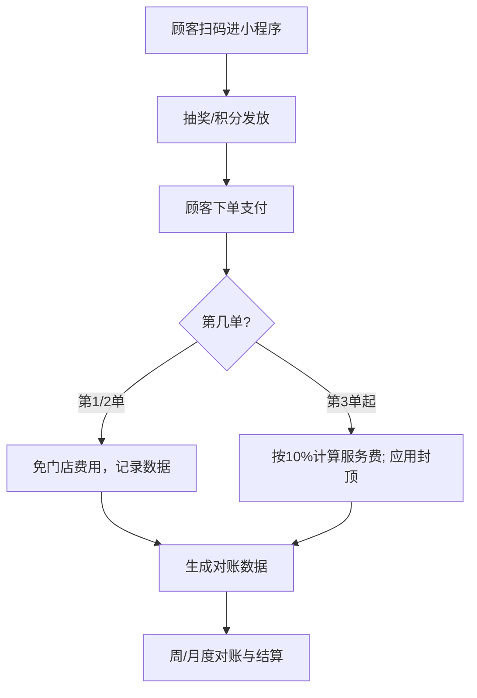

## 餐饮联营抽奖合作方案（微信小程序） v1.0

### 元信息
- **文档用途**: 面向餐饮门店老板的合作说明、签约要点与落地SOP
- **适用对象**: 餐饮门店（堂食/外带均可）、收银员/店长/老板
- **更新时间（北京时间）**: 2025-10-24 02:47:42 CST

### 价值主张（三句话）
- **引流增收**: 扫码抽奖+积分，提升复购与客单；把“到店流量”沉淀为“可触达会员”。
- **零风险试用**: 每位顾客前两单免费抽奖，门店不付费；用数据说话再决定长期合作。
- **结果付费**: 自第3单起，按顾客实付金额10%计费，可设置“单笔/月度封顶”，成本透明可控。

## 合作范围与价格聚焦（≥¥40，排除快餐/简餐）
- 适用客单：单次消费金额≥¥40（含税；如涉及服务费，以顾客实付为准）。
- 不覆盖：快餐/简餐等低客单、高频刚需品类（本方案不适用）。
- 推荐品类：正餐/家常菜/火锅/烧烤/烤肉/小酒馆/餐吧/饮品烘焙（≥¥40客单）。
- 计费适配：沿用“首单0%、第二单低费、第三单起10%+封顶”，并可配置“单笔/月度封顶”。

## 合作模式（二选一，建议先推B）

### 方案A：两单免 + 第3单起收10%
- 顾客权益：每位顾客前两单参与抽奖免门店费用（奖品成本由我方承担）。
- 收费规则：自第3单起，对“顾客当笔实付金额”的10%作为运营服务费。
- 适用：愿意快速验证、对规则简洁度有偏好的门店。

### 方案B：10%分成 + 封顶（单笔/按月）
- 顾客权益：首单免费抽；第二单优惠抽；第三单起恢复正常抽（开始计费）。
- 收费规则：10%分成；支持“单笔封顶（如不超过¥8）”与“月度封顶（如¥15,000）”。
- 适用：利润薄、强控制成本、追求风险可控的门店（更易签约）。

## 阶梯收费方案（首单免、第二单减、第三单起正常）
- 设计目标：降低签约阻力、平滑成本曲线、提升第二/第三单复购率。

### 计费口径（两版可选，选其一即可）
- 比例版：
  - 第1单：0%；
  - 第2单：5%（建议单笔封顶¥3–4）；
  - 第3单起：10%（建议单笔封顶¥8–10，且可配“月度封顶”）。
- 固定额版：
  - 第1单：0%；
  - 第2单：固定¥2/单（不按比例）；
  - 第3单起：10%（建议单笔封顶¥8–10，且可配“月度封顶”）。

### 行业参数模板（≥¥40客单适配）
- 正餐/烤肉/火锅（客单≥¥40）：第二单5%且封顶¥4–5；第三单起10%，单笔封顶¥8–10；建议配置月度封顶。
- 饮品/烘焙（客单≥¥40）：第二单5%且封顶¥4；第三单起10%，单笔封顶¥8–10；月度封顶可选。
- 高客单（≥¥80）场景：第三单起10%，单笔封顶¥10–12；建议启用月度封顶（如¥15,000）以控旺季成本。

### 计数与口径（避免争议）
- 订单序号定义：`order_index=1/2/3+`，以“同一用户openid + 品牌/门店维度”统计。
- 计次范围：可选“品牌级共享”或“单门店内计次”，签约时明确写入。
- 计次有效期：默认长期有效；若需成本控制，可选“自然月清零”。

### 风控与退款
- 反刷：设备指纹 + 手机号 + openid 多因子；异常频次/跨店切换拉黑或人工复核。
- 退款：按净额重算服务费；发生在第2/3+单的退款，按当期冲减。

### AB测试与阈值（试运行14天）
- 对照组：A（阶梯方案） vs B（直接10%+封顶）。
- 关键指标：第二单转化率、第三单复购率、券核销率、单笔毛利变化、服务费占比、客诉率。
- 成功阈值：A组复购率较B组≥+5%；运营费/毛利≤25%；核销率≥30%。

### 老板沟通一句话
- “首单不计费，第二单象征性低费，第三单恢复常规；有单笔/月度封顶与退款冲减、对账透明。”

## 小程序对接编排（到店/堂食）
- 登录/身份认证（微信小程序）
  - 授权手机号→后端以 `mobile` 作为唯一标识；开发/测试阶段支持万能验证码 `123456`（仅开发环境）。
  - 登录成功后获取 JWT；前端所有请求在 Header 携带 `Authorization: Bearer <token>`。
- 抽奖/领券/核销流程
  - 扫码进小程序→登录→抽奖（`/api/v4/unified-engine/lottery/draw`）→领券→到店核销（记录 `writeoff_status`）。
  - 退款按净额冲减：发生在第2/3+单的退款，对应当期结算冲减（`refunded`/`refund_amount` 字段）。
- 对账与结算
  - 以“顾客实付金额”为计费基数；按“10%+封顶（单笔/月度）”计算；每周/月导出明细对账。
- 埋点与风控
  - 每次抽奖、核销、退款、积分变动均埋点；绑定设备指纹+手机号+openid，异常频次自动风控/拉黑。

## ≥¥40堂食打法（东莞/广州/深圳通用）
- 获客
  - 台卡/桌贴物料：主打“首单免费抽、第二单低费、第三单起10%+封顶”，引导进小程序成为会员。
  - 开业期奖池：高频小奖+低频大奖，配门店内屏/本地平台探店引流。
- 留存
  - 保底机制：连续未中奖用户加权（后端 `consecutive_fail_count` 支持）。
  - 会员积分：结合 `Product` 兑换商城，二单强激励（5%或固定¥2）。
- 变现
  - 第三单起 10% 分成；≥¥40建议“单笔封顶¥8–10 + 月封顶¥15,000”；≥¥80可将单笔封顶上调至¥10–12。

## 三阶段路线图与KPI
- 30天（验证期）
  - 试点3店（深/广/莞各1）：参与率≥35%，二单转化≥25%，三单复购≥12%，核销率≥30%，投诉≤0.5%。
- 90天（拓展期）
  - 扩展到“1城3商圈”，新增火锅/烧烤/小酒馆：复购≥18%，客单+3%～5%，运营费/毛利≤25%，月封顶触发率≤15%。
- 180天（规模期）
  - 连锁总部化（多店总控+会员标签投券）：月活会员≥15k，复购≥22%，本地曝光≥50万，退款核减误差≤1%。

## 合规与工程建议（中国区/北京时间）
- 时区统一：后端与日志均为 Asia/Shanghai；结算、对账时间一律北京时。
- 授权合规：仅在授权后收集手机号/openid；退出合作支持数据导出/删除。
- 失败保护：抽奖与扣积分使用数据库事务；网络波动启用重试与幂等。
- 运维：开发 nodemon、生产 PM2 单实例；健康检查、限流与告警常开。

## 立即执行清单（落地动作）
- 锁定首批门店：深/广/莞各1家（客单≥¥40），明确商圈与品类（正餐/烧烤/火锅）。
- 费率参数确定：二单低费（5%或¥2）；三单起10%；单笔封顶¥8–10；月封顶¥15,000。
- 小程序改版：首屏入口=抽奖/领券/会员中心/核销；登录统一“手机号授权+短信验证码（开发 123456）”。

## 实物奖品联营（玉石首饰：展示价值=3×服务费）
- 定义与原则
  - 展示价值（消费者可见价）：按“单笔服务费×3”生成（例：门店该单服务费¥100，则展示价值¥300，可在淘宝/京东同款对标）。
  - 真实成本（内部口径）：由我方承担并严格低于展示价值，差额用于承担运营/物流/售后与风险金。
  - 奖品类型：`physical`（实物），在抽奖引擎中作为奖品类型配置，发放后进入“待发货/已发货/完成/售后”状态流转。
- 运营策略
  - 奖池结构：高频小奖（抵扣券/次日回流券）+ 低频大奖（玉石首饰）；大奖触发率与毛利挂钩，按月调优。
  - 价值锚定：小程序“奖品详情”展示第三方平台参考价链接（或同款截图）与防伪说明，提升感知价值与信任。
  - 发货与售后：设置7天内发货SLA，异常赔付（如等值券或同档位首饰）；支持一换一（非人为损坏）。
- 计费口径优化（与10%分成兼容）
  - 仍以“顾客实付金额”为计费基数：首单0%、二单低费（5%或¥2）、第三单起10%（单笔封顶/按月封顶）。
  - 大奖成本不向门店单列收费：由我方用“展示价值=3×服务费”的毛利空间覆盖，门店仅承担原有服务费，不额外加价。
  - KPI联动：若当月大奖触发超预算，则降低下月大奖概率或调整封顶参数，确保“运营费/毛利≤25%”。
- 对账字段扩展（实物类）
  - `prize_type`：physical（实物）
  - `prize_title`：如“天然和田玉手串A12”
  - `prize_display_value`：展示价值（元），= 服务费×3（例：100→300）
  - `delivery_status`：待发货/已发货/完成/售后
  - `logistics_no`：快递单号（有则填）
  - `after_sales_status`：无/换货/退货/维修
  - 以上字段仅用于透明化，不影响“以实付金额为基数”的计费。
- 合同条款补充
  - “展示价值说明”：展示价值为营销参考价（来源：平台同款/自营对标），非回收价；我方负责发货与售后。
  - “成本与收费关系”：大奖成本由我方承担，不额外向门店收取；门店仅按既定费率与封顶规则结算。
  - “风险与SLA”：7天内发货；缺货提供同档位等值替代或补偿券；非人为损坏支持一换一。

## 计费口径与结算（务必写入合同）
- **计费基数（关键定义）**: 顾客实付金额（不含配送费/包装费/平台服务费；发生退款的订单按“净额”计费）。
- **费率与封顶**: 费率10%；可选“单笔封顶¥X + 月度封顶¥Y”。
- **账期**: T+7 或 T+30（可选其一）；退款在当期冲减。
- **发票**: 月结后由我方按实际结算额开具增值税发票（普票/专票）。

### 对账字段（结算数据透明）
| 字段名 | 类型 | 说明 |
|---|---|---|
| store_id | string | 门店ID（用于区分门店对账） |
| order_id | string | 订单号/支付流水号（唯一） |
| openid | string | 顾客小程序唯一标识（隐私脱敏展示） |
| paid_at | datetime | 支付时间（北京时间，格式YYYY-MM-DD HH:mm:ss） |
| amount_paid | number | 实付金额（单位：元，保留两位小数） |
| fee_rate | number | 费率（默认0.10） |
| fee_capped | boolean | 是否触发单笔封顶（true/false） |
| fee_amount | number | 本单应计服务费（含封顶规则后） |
| refunded | boolean | 是否退款（true/false） |
| refund_amount | number | 退款金额（元），无退款填0 |
| writeoff_status | string | 核销状态（未核销/已核销/过期） |
| order_index | int | 订单序号（1=首单、2=第二单、3+=第三单及以上） |
| applied_rate | number | 实际应用费率（考虑阶梯与封顶后） |
| applied_cap | number | 实际应用封顶金额（元），未触发为0 |
| billing_rule_version | string | 计费规则版本（如 STEP-2025-10） |

> 注：以上字段用于“每周/每月对账”汇总；退款当期冲减，确保计费与现金一致。

## 试用与KPI（先跑数据再签长约）
- **试用期**: 14天（可延长至30天）。
- **上线目标**:
  - 抽奖参与率≥35%；
  - 复购率提升≥6%；
  - 券核销率≥30%；
  - 活动带动加购（客单价）≥3%。
- **止损条款**: 未达标可随时停止；达标则进入长期合作（按选择的A/B方案）。

## 门店落地SOP（最短当天上线）
1. 物料布置：台卡/桌贴/收银贴（含小程序码与“前两单免费抽”醒目标识）。
2. 员工培训（5分钟）：
   - 话术：欢迎语 + “扫码抽奖，前两单免费”；
   - 操作：顾客点单前或后扫码→抽奖→领券→下次到店核销。
3. 收银配合：
   - 现场核销：出示券码，前台一键核销；
   - 高峰容错：允许顾客自助核销，前台抽查。
4. 数据复盘：
   - 周报：新客数、参与率、核销率、复购率、活动ROI；
   - 优化：奖品结构（高频小奖+低频大奖）、时段加权（午/晚高峰）。

### 收银员话术卡（贴在收银台即可）
- “到店扫码抽奖，前两单免费参与～”
- “抽到的优惠券下次来用，结账给我看一下券码就行。”
- “活动走小程序，您的信息只用于本店服务，不骚扰。”

## 常见异议与回应（现场可直接用）
- 利润薄承担不起 → 有单笔/月度封顶；只在顾客消费后计费，跑不出效果可随时停。
- 担心影响收银 → 操作不变；扫码—抽奖—核销均在小程序内，前台只需一扫一核。
- 数据透明度 → 对账字段全开放，退款当期冲减；支持每周对账，降低分歧。
- 顾客隐私合规 → 仅在顾客授权后收集；数据仅用于到店相关营销，可签署隐私与数据安全条款。

## 收益测算（举例，给老板看的算式）
- 假设：客单¥80、日均单量100、参与率60%、复购提升10%、工作日26天。
- 月流水≈¥80×100×26=¥208,000；参与流水≈¥208,000×60%=¥124,800。
- 运营费（10%）≈¥12,480；若设月封顶¥15,000，则不超过封顶。
- 结合复购提升与加购（如+5%），净增毛利通常覆盖服务费并留出正向收益。

## 合同关键条款（务必写清）
1. 服务范围与职责：我方（运营策略、物料、数据复盘）；门店（引导扫码、核销配合）。
2. 计费口径：以顾客“实付金额”为基数；明确不计入项与退款冲减；A/B方案及封顶参数。
3. 账期与发票：T+7/T+30，发票种类与开票流程。
4. 数据与隐私：仅基于授权使用；数据范围、保存周期、安全措施、退出时数据处理。
5. 试用与退出：14天试用止损条款；任一方可在试用内随时终止；结算以实际对账为准。

## 流程图（Mermaid）

## 附录：对账文件样例（列说明）
| 列名 | 示例 | 说明 |
|---|---|---|
| store_id | ST001 | 门店ID |
| order_id | 202510230001 | 订单号/支付流水号 |
| openid | oAbc***xyz | 顾客标识（脱敏） |
| paid_at | 2025-10-23 12:30:05 | 北京时间 |
| amount_paid | 86.50 | 实付金额（元） |
| fee_rate | 0.10 | 费率 |
| fee_capped | true | 是否触发单笔封顶 |
| fee_amount | 8.00 | 计算后本单服务费 |
| refunded | false | 是否退款 |
| refund_amount | 0.00 | 退款金额（元） |
| writeoff_status | 已核销 | 券状态 |

---
如需我方提供“门店单页、员工话术卡、对账Excel模板”，请告知，我们可根据贵店客群与品类进行定制化调整，并在试用期（14天）提供周度复盘与优化建议。

## 合作模式与计费口径扩展（可选）
- 模式C：累计消费阶梯（适合连锁与高复购）
  - 规则：按用户在自然月累计“实付金额”设置阶梯费率：0–¥5000：8%；¥5000–¥15000：6%；¥15000+：4%。
  - 说明：提升复购与客单；对大客体量更友好，便于签长期。
  - 对账字段：新增 `monthly_user_paid_sum`（自然月累计实付，结算期内计算用）。
- 模式D：券面额联动（适合≥¥80客单）
  - 规则：第二单发放面额券（如¥8/¥12），当笔核销成功后费率打折（第三单起 10%→8%）；若触发大额券核销，当月费率再-1pp（至7%）。
  - 说明：强力拉动二→三单；以券成本换取更低平台费，提升商家接受度。
  - 对账字段：`coupon_face_value`、`coupon_redeemed`、`effective_rate_after_coupon`。
- 模式E：场景时段差异化
  - 规则：午市（11:30–13:30）费率8%，晚市（18:00–21:00）10%，其他时段6%；单笔/按月封顶不变。
  - 说明：帮助门店在非高峰做拉升，高峰保持利润。
  - 对账字段：`served_timeslot`（午/晚/其他），用于结算分段。
- 模式F：保底+分成（保守型）
  - 规则：按店月保底（如¥2000），若按分成（10%+封顶）计算金额高于保底，则按分成；否则按保底收取。
  - 说明：平台抗风险，亦可配“试用期免保底”。
  - 合同要点：明确定义“保底适用周期、试用期、超保底回退逻辑”。
- 模式G：流量包/广告置换（联动小红书/视频号）
  - 规则：商家购买流量包（如本地探店/短视频曝光），可享费率下调（10%→8%）或更高单笔封顶（¥10→¥12）。
  - 说明：适合推广期；以营销资源置换费用，提升成交率。
  - 对账字段：`media_package_id`、`media_value`、`discounted_fee_rate`。

### 统一计费口径补充
- 基数不变：一律以“顾客实付金额”为计费基数；退款按净额当期冲减。
- 可叠加项：阶梯、券联动、时段差异、封顶与月封顶可叠加，但需合同列清优先级：
  1) 订单净额 → 2) 券影响后有效费率 → 3) 单笔封顶 → 4) 自然月合并后再判断月封顶/保底。
- 报表输出：提供“订单明细+月度汇总”两张表；明细含本次实际有效费率、封顶触发位；汇总含阶梯区间统计。

