# 餐厅积分抽奖系统 v3.0 - 后端数据库项目架构文档

## 📖 项目概述

### 🎯 项目名称

餐厅积分抽奖系统 v3.0 - 分离式微服务架构

### 🏗️ 架构特点

- **完全分离式设计**：积分系统与抽奖系统独立运行
- **事件驱动架构**：模块间通过事件总线通信
- **微服务设计**：各业务模块独立可扩展
- **智能化预留**：为AI和智能推荐预留接口

## 🏆 技术栈总览

### 核心技术栈

```
运行环境：Node.js v20.18.0+
Web框架：Express.js v4.18.2
数据库：MySQL 8.0+ (通过Sequelize ORM)
缓存：Redis v5.8.0 (支持内存降级)
对象存储：Sealos Cloud Storage
实时通信：WebSocket + Socket.IO
```

### 开发工具链

```
包管理：npm v8.0.0+
代码质量：ESLint + Prettier + Standard配置
测试框架：Jest v29.7.0 + SuperTest
数据库迁移：Sequelize CLI v6.6.2
进程管理：Nodemon (开发) / PM2 (生产)
容器化：Docker + Kubernetes + Sealos
```

## 🎨 系统架构图

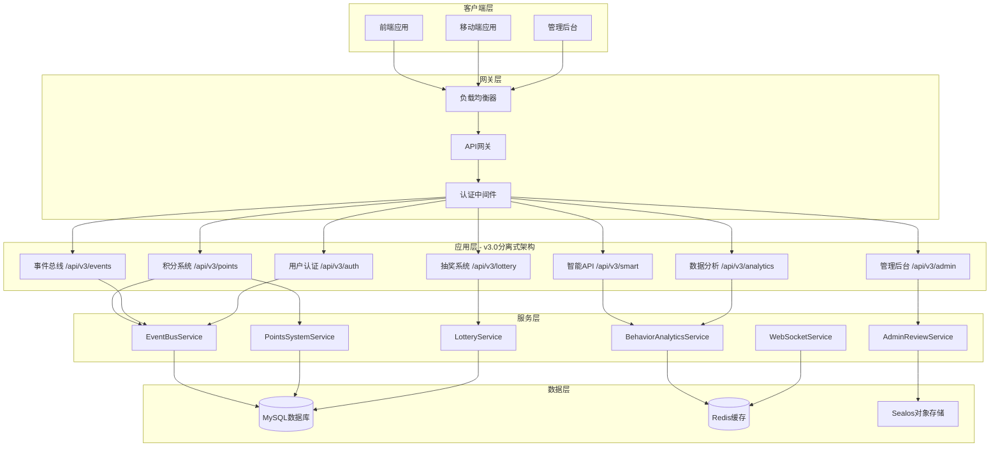

## 🔄 分离式架构详细流程图

### 事件驱动通信流程

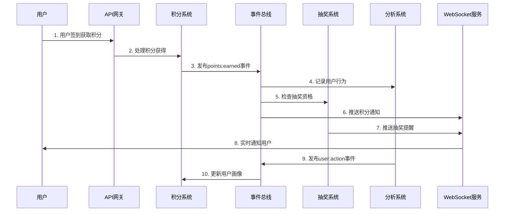

### 积分系统完整业务流程

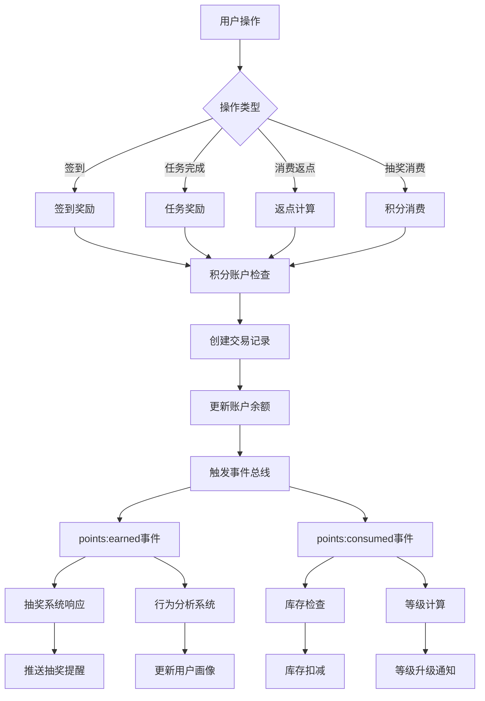

### 抽奖系统核心算法流程

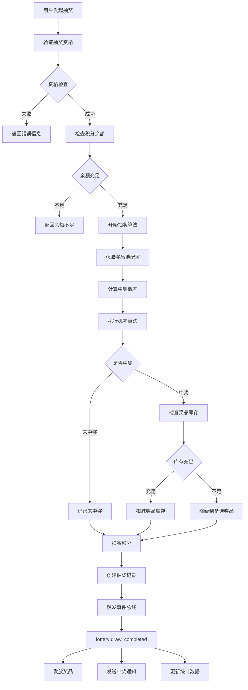

## 📁 详细项目目录结构分析

### 🔥 实际项目架构（ASCII艺术版）

```
餐厅积分抽奖系统 v3.0 分离式架构
┌─────────────────────────────────────────────────────────────────┐
│                        🚀 应用入口层                           │
├─────────────────────────────────────────────────────────────────┤
│  app.js (398行) - 应用启动入口                                 │
│  ├── Express框架初始化                                         │
│  ├── 中间件配置 (Helmet, CORS, 压缩)                          │
│  ├── 路由注册 (V3版本API)                                     │
│  ├── WebSocket服务启动                                        │
│  └── 优雅关闭处理                                             │
└─────────────────────────────────────────────────────────────────┘
               │
               ▼
┌─────────────────────────────────────────────────────────────────┐
│                      🛣️ API路由层 (V3)                        │
├─────────────────────────────────────────────────────────────────┤
│  routes/v3/ (7个路由文件, ~2900行)                             │
│  ├── auth.js (399行)     - 🔐 认证授权系统                    │
│  ├── points.js (447行)   - 💰 积分系统接口                    │
│  ├── lottery.js (429行)  - 🎲 抽奖系统接口                    │
│  ├── admin.js (423行)    - 👨‍💼 管理后台接口                   │
│  ├── smart.js (365行)    - 🧠 智能API (预留)                 │
│  ├── events.js (404行)   - 🔄 事件总线接口                    │
│  └── analytics.js (398行) - 📊 数据分析接口                   │
└─────────────────────────────────────────────────────────────────┘
               │
               ▼
┌─────────────────────────────────────────────────────────────────┐
│                      🔒 中间件层                               │
├─────────────────────────────────────────────────────────────────┤
│  middleware/ (6个中间件, ~1300行)                              │
│  ├── auth.js (225行)              - JWT认证中间件             │
│  ├── adminAuth.js (90行)           - 管理员权限验证            │
│  ├── validation.js (107行)         - 请求参数验证              │
│  ├── analyticsValidation.js (345行) - 分析数据验证            │
│  ├── fieldTransform.js (184行)     - 字段转换处理             │
│  └── errorHandler.js (349行)       - 统一错误处理             │
└─────────────────────────────────────────────────────────────────┘
               │
               ▼
┌─────────────────────────────────────────────────────────────────┐
│                    ⚙️ 业务服务层 (核心)                        │
├─────────────────────────────────────────────────────────────────┤
│  services/ (14个服务, ~8000行)                                 │
│                                                                 │
│  🔄 事件驱动服务 EventBusService.js (515行)                   │
│     ├── 事件发布订阅机制                                       │
│     ├── 8种内置事件处理器                                     │
│     ├── 异步事件处理                                           │
│     └── 事件历史记录 (1000条)                                 │
│                                                                 │
│  💰 积分系统服务 PointsSystemService.js (602行)               │
│     ├── 积分账户管理                                           │
│     ├── 交易记录处理                                           │
│     ├── 积分规则引擎                                           │
│     └── 统计报表生成                                           │
│                                                                 │
│  🎲 抽奖系统服务 LotteryService.js (794行)                    │
│     ├── 抽奖活动管理                                           │
│     ├── 概率算法引擎                                           │
│     ├── 奖品库存管理                                           │
│     └── 防作弊机制                                             │
│                                                                 │
│  💬 WebSocket服务 WebSocketService.js (1118行)                │
│     ├── 实时通信管理                                           │
│     ├── 聊天系统完整实现                                       │
│     ├── 消息推送系统                                           │
│     └── 心跳检测机制                                           │
│                                                                 │
│  📊 行为分析服务 BehaviorAnalyticsService.js (605行)          │
│     ├── 用户行为追踪                                           │
│     ├── 用户画像构建                                           │
│     ├── 智能推荐引擎                                           │
│     └── 实时数据统计                                           │
│                                                                 │
│  🖼️ 其他核心服务                                             │
│     ├── ImageResourceService (525行) - 图片资源管理           │
│     ├── TransactionService (959行)   - 交易处理               │
│     ├── AdminReviewService (743行)   - 审核系统               │
│     ├── TradeService (729行)         - 贸易逻辑               │
│     ├── InventoryService (522行)     - 库存管理               │
│     └── PermissionService (443行)    - 权限服务               │
└─────────────────────────────────────────────────────────────────┘
               │
               ▼
┌─────────────────────────────────────────────────────────────────┐
│                  🗃️ 数据模型层 (ORM)                          │
├─────────────────────────────────────────────────────────────────┤
│  models/ (23个模型, ~6000行)                                   │
│                                                                 │
│  📋 核心业务模型 (15个)                                       │
│  ├── 👤 用户系统模型                                         │
│  │   ├── User.js (247行)               - 用户基础信息         │
│  │   ├── UserPointsAccount.js (469行)   - 用户积分账户       │
│  │   ├── UserInventory.js (230行)       - 用户库存           │
│  │   └── CustomerSession.js (168行)     - 客户会话           │
│  │                                                             │
│  ├── 💰 积分系统模型                                         │
│  │   └── PointsTransaction.js (583行)   - 积分交易记录       │
│  │                                                             │
│  ├── 🎲 抽奖系统模型                                         │
│  │   ├── LotteryCampaign.js (590行)     - 抽奖活动           │
│  │   ├── LotteryPrize.js (284行)        - 抽奖奖品           │
│  │   └── LotteryDraw.js (301行)         - 抽奖记录           │
│  │                                                             │
│  ├── 🖼️ 资源管理模型                                         │
│  │   ├── ImageResources.js (317行)      - 图片资源           │
│  │   ├── Product.js (242行)             - 商品模型           │
│  │   └── TradeRecord.js (300行)         - 交易记录           │
│  │                                                             │
│  └── ⚙️ 系统管理模型                                         │
│      ├── BusinessEvent.js (346行)       - 业务事件           │
│      ├── AdminStatus.js (187行)         - 管理员状态         │
│      ├── BusinessConfigs.js (200行)     - 业务配置           │
│      └── 其他管理模型...                                     │
│                                                                 │
│  📊 智能分析模型 (4个)                                       │
│  └── analytics/                                               │
│      ├── AnalyticsBehavior.js (284行)     - 用户行为记录     │
│      ├── AnalyticsUserProfile.js (351行)  - 用户画像         │
│      ├── AnalyticsRecommendation.js (467行) - 智能推荐       │
│      └── AnalyticsRealtimeStats.js (523行) - 实时统计        │
└─────────────────────────────────────────────────────────────────┘
               │
               ▼
┌─────────────────────────────────────────────────────────────────┐
│                    🛠️ 工具支撑层                              │
├─────────────────────────────────────────────────────────────────┤
│  utils/ (2个工具类, ~730行)                                    │
│  ├── ApiResponse.js (383行)        - 统一API响应格式          │
│  └── FieldTransformer.js (346行)   - 字段转换器               │
│                                                                 │
│  config/ (配置管理)                                            │
│  ├── database.js (101行)           - 数据库配置               │
│  ├── field-transform.js (39行)     - 字段转换配置             │
│  └── config.json (49行)            - JSON配置文件             │
└─────────────────────────────────────────────────────────────────┘
               │
               ▼
┌─────────────────────────────────────────────────────────────────┐
│                     💾 数据存储层                              │
├─────────────────────────────────────────────────────────────────┤
│  🗄️ MySQL 8.0+ 数据库                                         │
│  ├── 连接地址: dbconn.sealosbja.site:42182                    │
│  ├── 数据库名: restaurant_points_dev                          │
│  ├── 字符集: utf8mb4_unicode_ci                               │
│  ├── 时区: UTC (+00:00)                                       │
│  └── 连接池: 最大10个连接                                     │
│                                                                 │
│  🚀 Redis 缓存 (可选)                                         │
│  ├── 主缓存: Redis 5.8.0                                      │
│  ├── 降级方案: 内存缓存                                       │
│  └── 用途: 用户行为分析缓存                                   │
│                                                                 │
│  ☁️ Sealos对象存储                                           │
│  ├── 图片资源存储                                             │
│  ├── 文件上传管理                                             │
│  └── CDN加速支持                                              │
└─────────────────────────────────────────────────────────────────┘
```

### 🔄 事件总线架构详解

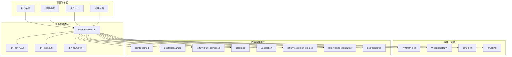

## 🗃️ 数据模型层详细设计

### 📊 数据库ER关系图

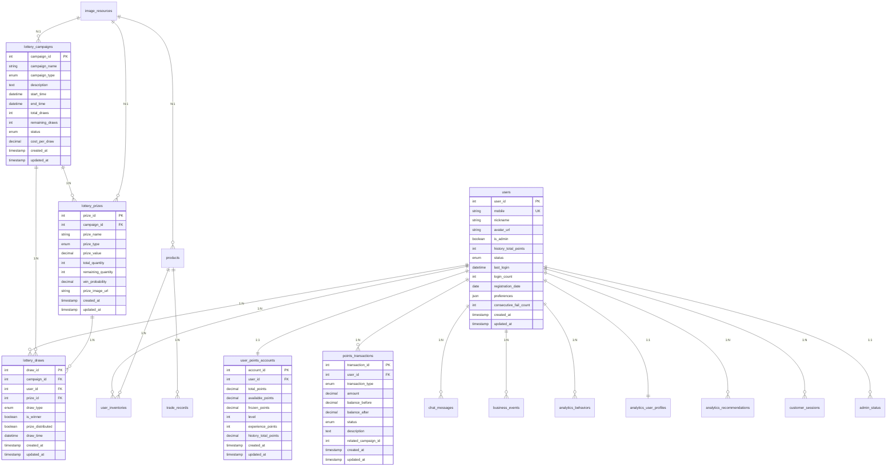

### 📈 用户行为分析数据流

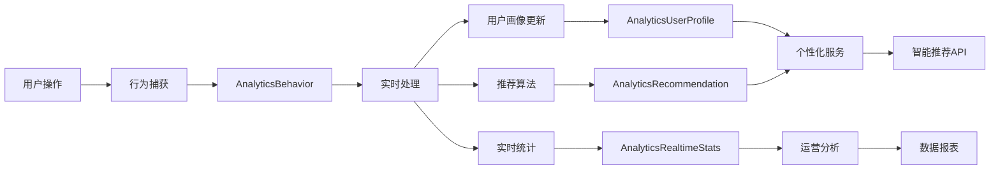

## ⚙️ 业务服务层详细架构

### 🔄 事件总线服务 (EventBusService.js - 515行)

#### 核心功能架构

```
EventBusService 事件总线核心
├── 🎯 事件发布订阅机制
│   ├── emit(eventType, eventData, options) - 事件发布
│   ├── on(eventType, handler) - 事件监听
│   ├── off(eventType, handler) - 取消监听
│   └── once(eventType, handler) - 一次性监听
│
├── 🔄 异步事件处理
│   ├── _processEventAsync(event) - 异步处理
│   ├── _recordEvent(event) - 数据库记录
│   ├── _addToHistory(event) - 内存历史记录
│   └── _generateEventId() - 唯一ID生成
│
├── ⚡ 高性能事件路由
│   ├── 内存事件历史缓存 (最大1000条)
│   ├── 事件优先级处理 (normal/high/critical)
│   ├── 失败重试机制 (最大3次)
│   └── 事件状态跟踪 (pending/processing/completed/failed)
│
└── 🛡️ 内置事件处理器 (8种)
    ├── points:earned - 积分获得事件处理
    ├── points:consumed - 积分消费事件处理
    ├── points:expired - 积分过期事件处理
    ├── lottery:draw_completed - 抽奖完成事件处理
    ├── lottery:campaign_created - 活动创建事件处理
    ├── lottery:prize_distributed - 奖品发放事件处理
    ├── user:login - 用户登录事件处理
    └── user:action - 用户行为事件处理
```

#### 事件处理流程图

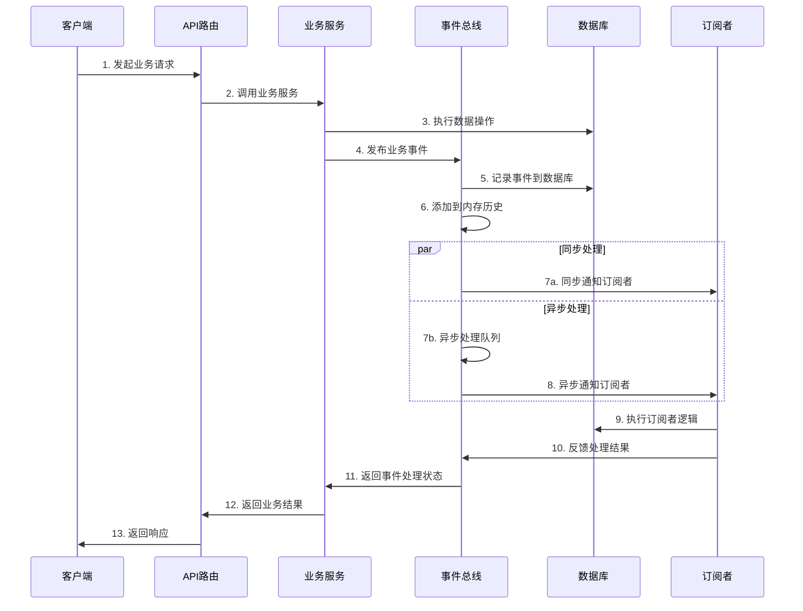

### 💰 积分系统服务 (PointsSystemService.js - 602行)

#### 积分系统完整架构图

```
PointsSystemService 积分系统核心
├── 💳 积分账户管理模块
│   ├── createAccount(userId) - 创建积分账户
│   │   ├── 初始化账户余额 (0积分)
│   │   ├── 设置初始等级 (1级)
│   │   └── 记录账户创建事件
│   │
│   ├── getAccountBalance(userId) - 查询积分余额
│   │   ├── 获取可用积分
│   │   ├── 获取冻结积分
│   │   └── 获取历史总积分
│   │
│   ├── freezePoints(userId, amount) - 积分冻结
│   │   ├── 验证可用余额
│   │   ├── 转移到冻结区域
│   │   └── 记录冻结操作
│   │
│   └── unfreezePoints(userId, amount) - 积分解冻
│       ├── 验证冻结余额
│       ├── 转移到可用区域
│       └── 记录解冻操作
│
├── 💸 积分交易处理模块
│   ├── earnPoints(userId, amount, reason) - 积分获得
│   │   ├── 验证用户账户状态
│   │   ├── 创建收入交易记录
│   │   ├── 更新账户余额
│   │   ├── 检查等级升级
│   │   └── 触发points:earned事件
│   │
│   ├── consumePoints(userId, amount, reason) - 积分消费
│   │   ├── 验证可用余额充足
│   │   ├── 创建支出交易记录
│   │   ├── 扣减用户积分
│   │   └── 触发points:consumed事件
│   │
│   ├── transferPoints(fromUserId, toUserId, amount) - 积分转账
│   │   ├── 验证转出用户余额
│   │   ├── 验证转入用户存在
│   │   ├── 执行转账事务
│   │   └── 记录转账流水
│   │
│   └── rollbackTransaction(transactionId) - 交易回滚
│       ├── 查找原始交易记录
│       ├── 验证回滚条件
│       ├── 执行反向操作
│       └── 标记回滚状态
│
├── 📋 积分规则引擎模块
│   ├── 签到奖励规则
│   │   ├── 连续签到倍数 (1x, 2x, 3x...)
│   │   ├── 月度签到奖励
│   │   └── 节假日特殊奖励
│   │
│   ├── 任务完成奖励规则
│   │   ├── 基础任务奖励
│   │   ├── 动态任务奖励
│   │   └── 成就解锁奖励
│   │
│   ├── 消费返点规则
│   │   ├── 基础返点比例 (1%-5%)
│   │   ├── VIP等级倍数
│   │   └── 活动期间加成
│   │
│   └── 等级升级规则
│       ├── 经验值计算公式
│       ├── 等级权益配置
│       └── 升级奖励发放
│
└── 📊 积分统计报表模块
    ├── getUserRanking(period) - 用户积分排行
    │   ├── 日排行榜
    │   ├── 周排行榜
    │   └── 月排行榜
    │
    ├── getPointsFlowStats(userId, period) - 积分流水统计
    │   ├── 收入统计
    │   ├── 支出统计
    │   └── 净收入统计
    │
    ├── getSourceAnalysis(period) - 积分来源分析
    │   ├── 签到获得占比
    │   ├── 任务获得占比
    │   └── 其他来源占比
    │
    └── getTrendAnalysis(period) - 积分趋势分析
        ├── 每日积分变化
        ├── 用户活跃度趋势
        └── 消费习惯分析
```

#### 积分交易状态机

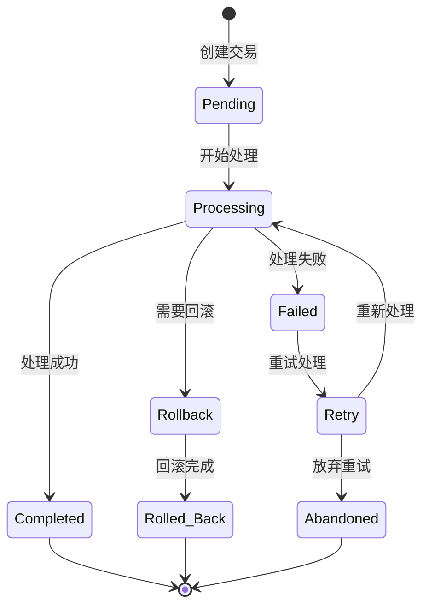

### 🎲 抽奖系统服务 (LotteryService.js - 794行)

#### 抽奖系统完整架构

```
LotteryService 抽奖系统核心
├── 🎪 抽奖活动管理模块
│   ├── createCampaign(campaignData) - 创建抽奖活动
│   │   ├── 验证活动参数
│   │   ├── 设置奖品池配置
│   │   ├── 初始化活动状态
│   │   └── 触发campaign_created事件
│   │
│   ├── updateCampaignStatus(campaignId, status) - 状态控制
│   │   ├── 活动启用/禁用
│   │   ├── 活动暂停/恢复
│   │   └── 活动结束处理
│   │
│   ├── configureCampaign(campaignId, config) - 参数配置
│   │   ├── 抽奖成本设置
│   │   ├── 参与条件配置
│   │   └── 时间范围调整
│   │
│   └── getCampaignStats(campaignId) - 效果统计
│       ├── 参与人数统计
│       ├── 中奖率统计
│       └── 奖品消耗统计
│
├── 🎁 奖品管理模块
│   ├── addPrizes(campaignId, prizes) - 奖品池配置
│   │   ├── 奖品信息录入
│   │   ├── 库存数量设置
│   │   └── 中奖概率配置
│   │
│   ├── updatePrizeStock(prizeId, quantity) - 库存管理
│   │   ├── 库存增加/减少
│   │   ├── 库存预警机制
│   │   └── 自动补货提醒
│   │
│   ├── setProbability(prizeId, probability) - 概率设置
│   │   ├── 单品概率设置
│   │   ├── 概率权重调整
│   │   └── 概率验证检查
│   │
│   └── distributePrize(drawId, prizeId) - 奖品发放
│       ├── 发放状态更新
│       ├── 库存扣减处理
│       └── 发放记录创建
│
├── 🎯 抽奖算法核心模块
│   ├── executeDraw(userId, campaignId) - 概率计算引擎
│   │   ├── 随机数生成 (加密级随机)
│   │   ├── 概率权重计算
│   │   ├── 中奖结果判定
│   │   └── 结果验证机制
│   │
│   ├── validateDrawEligibility(userId, campaignId) - 防作弊机制
│   │   ├── 用户资格验证
│   │   ├── 频率限制检查
│   │   ├── 积分余额验证
│   │   └── 黑名单检查
│   │
│   ├── applyGuaranteeLogic(userId, campaignId) - 保底机制
│   │   ├── 连续未中奖统计
│   │   ├── 保底阈值判断
│   │   └── 保底奖品发放
│   │
│   └── checkDrawLimits(userId, campaignId) - 限制机制
│       ├── 每日抽奖次数限制
│       ├── 单用户中奖次数限制
│       └── 总抽奖次数限制
│
└── 📈 抽奖统计分析模块
    ├── getWinRateStats(campaignId, period) - 中奖率统计
    │   ├── 整体中奖率
    │   ├── 分奖品中奖率
    │   └── 时间段中奖率
    │
    ├── getPrizeConsumption(campaignId) - 奖品消耗统计
    │   ├── 各奖品消耗速度
    │   ├── 预计消耗完时间
    │   └── 补货建议
    │
    ├── getUserParticipation(period) - 参与分析
    │   ├── 活跃用户统计
    │   ├── 新用户参与率
    │   └── 用户留存分析
    │
    └── getCampaignEffectiveness(campaignId) - 效果评估
        ├── ROI计算
        ├── 用户满意度
        └── 营销效果评估
```

#### 抽奖概率算法流程

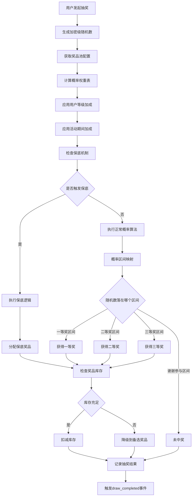

### 💬 WebSocket服务架构 (WebSocketService.js - 1118行)

#### WebSocket完整通信架构

```
WebSocketService 实时通信核心
├── 🔌 连接管理模块
│   ├── handleConnection(socket) - 连接处理
│   │   ├── 用户身份验证
│   │   ├── 连接状态记录
│   │   ├── 房间分配管理
│   │   └── 在线用户更新
│   │
│   ├── handleDisconnection(socket) - 断线处理
│   │   ├── 清理连接状态
│   │   ├── 更新在线状态
│   │   ├── 通知相关用户
│   │   └── 释放资源
│   │
│   ├── handleReconnection(socket) - 重连处理
│   │   ├── 恢复用户状态
│   │   ├── 同步离线消息
│   │   ├── 重新加入房间
│   │   └── 状态同步通知
│   │
│   └── maintainHeartbeat() - 心跳检测
│       ├── 定时心跳发送
│       ├── 心跳响应检测
│       ├── 连接健康监控
│       └── 异常连接清理
│
├── 📱 消息处理模块
│   ├── sendPrivateMessage(fromUser, toUser, message) - 私聊功能
│   │   ├── 消息内容验证
│   │   ├── 权限检查
│   │   ├── 消息存储
│   │   └── 实时推送
│   │
│   ├── broadcastMessage(message, room) - 消息广播
│   │   ├── 房间用户列表
│   │   ├── 批量消息发送
│   │   ├── 发送状态跟踪
│   │   └── 失败重试机制
│   │
│   ├── createChatRoom(roomInfo) - 群聊功能
│   │   ├── 房间创建
│   │   ├── 成员邀请
│   │   ├── 权限设置
│   │   └── 房间管理
│   │
│   └── storeMessage(messageData) - 消息存储
│       ├── 消息持久化
│       ├── 索引建立
│       ├── 历史记录管理
│       └── 消息检索优化
│
├── ⚡ 通知推送模块
│   ├── sendSystemNotification(users, notification) - 系统通知
│   │   ├── 系统公告推送
│   │   ├── 维护通知推送
│   │   ├── 安全提醒推送
│   │   └── 版本更新通知
│   │
│   ├── sendActivityNotification(users, activity) - 活动通知
│   │   ├── 新活动上线通知
│   │   ├── 活动开始提醒
│   │   ├── 活动结束倒计时
│   │   └── 限时优惠推送
│   │
│   ├── sendLotteryNotification(user, result) - 中奖通知
│   │   ├── 中奖结果推送
│   │   ├── 奖品领取提醒
│   │   ├── 中奖分享邀请
│   │   └── 后续抽奖推荐
│   │
│   └── sendPointsNotification(user, change) - 积分变动通知
│       ├── 积分获得通知
│       ├── 积分消费通知
│       ├── 等级升级通知
│       └── 积分过期提醒
│
└── 🔄 数据同步模块
    ├── syncDataRealtime(dataType, data) - 实时数据同步
    │   ├── 用户状态同步
    │   ├── 活动数据同步
    │   ├── 库存状态同步
    │   └── 排行榜同步
    │
    ├── notifyStateChange(entity, oldState, newState) - 状态变更通知
    │   ├── 活动状态变更
    │   ├── 用户状态变更
    │   ├── 订单状态变更
    │   └── 审核状态变更
    │
    └── pushBusinessEvent(event) - 业务事件推送
        ├── 重要业务事件推送
        ├── 实时业务提醒
        ├── 异常状态告警
        └── 业务数据更新
```

#### WebSocket消息流转图

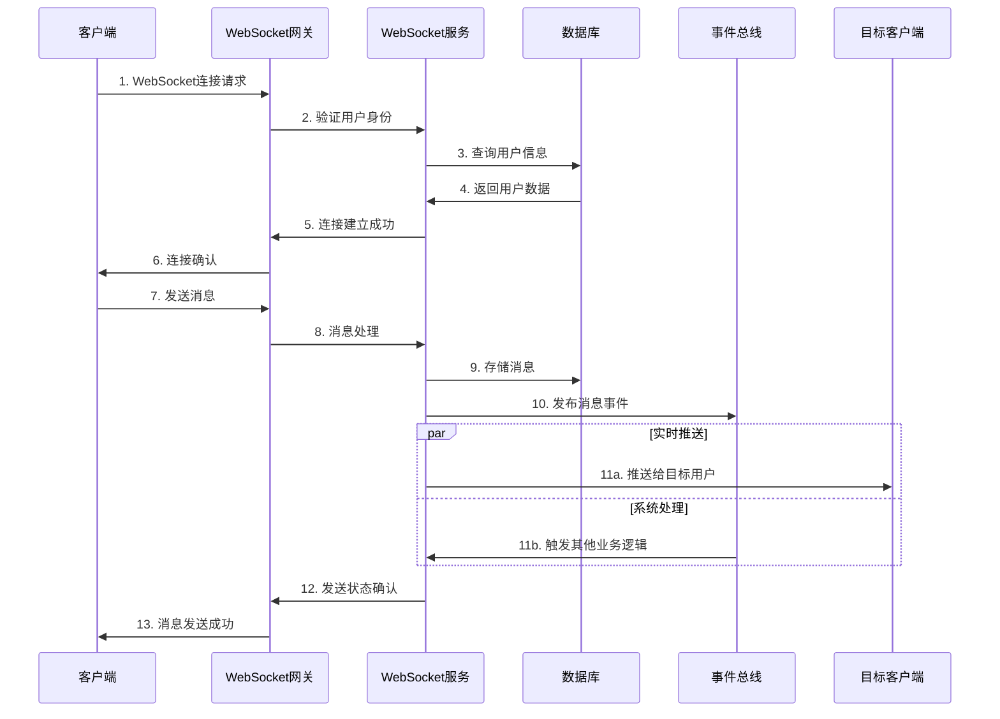

## 🛣️ API路由层详细分析

### 🔐 认证授权路由详解 (/api/v3/auth - 399行)

#### 认证系统完整流程

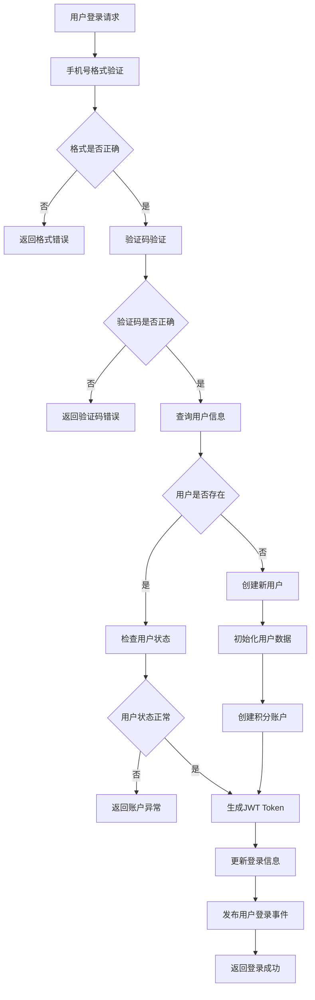

#### 权限控制架构

```
认证授权系统架构
├── 🔐 JWT Token管理
│   ├── Token生成 (包含用户ID、角色、过期时间)
│   ├── Token验证 (中间件自动验证)
│   ├── Token刷新 (7天有效期，自动刷新)
│   └── Token撤销 (安全登出，黑名单机制)
│
├── 👤 用户身份验证
│   ├── 手机号验证 (正则表达式验证)
│   ├── 验证码验证 (123456万能码 + 真实验证码)
│   ├── 设备指纹验证 (防止异常登录)
│   └── 登录频率限制 (防暴力破解)
│
├── 🛡️ 权限级别控制
│   ├── 普通用户权限
│   │   ├── 基础功能访问
│   │   ├── 个人数据查看
│   │   └── 基础操作权限
│   │
│   ├── 管理员权限
│   │   ├── 用户管理权限
│   │   ├── 活动管理权限
│   │   ├── 数据查看权限
│   │   └── 系统配置权限
│   │
│   └── 超级管理员权限
│       ├── 完整系统控制
│       ├── 权限分配管理
│       ├── 系统维护权限
│       └── 安全审计权限
│
└── 🔒 安全机制
    ├── 登录日志记录
    ├── 异常登录检测
    ├── IP白名单机制
    └── 会话安全管理
```

### 💰 积分系统路由详解 (/api/v3/points - 447行)

#### 积分API完整接口

```
积分系统API接口 (/api/v3/points)
├── GET /account - 获取积分账户信息
│   ├── 请求参数: 无 (从Token解析用户ID)
│   ├── 返回数据:
│   │   ├── total_points: 总积分
│   │   ├── available_points: 可用积分
│   │   ├── frozen_points: 冻结积分
│   │   ├── level: 用户等级
│   │   └── experience_points: 经验值
│   └── 业务逻辑: 实时查询用户积分账户状态
│
├── GET /transactions - 积分交易历史
│   ├── 请求参数:
│   │   ├── page: 页码 (默认1)
│   │   ├── limit: 每页数量 (默认20)
│   │   ├── type: 交易类型筛选
│   │   └── start_time/end_time: 时间范围
│   ├── 返回数据: 分页的交易记录列表
│   └── 业务逻辑: 查询用户积分交易历史，支持筛选
│
├── POST /earn - 积分获得接口
│   ├── 请求参数:
│   │   ├── amount: 获得积分数量
│   │   ├── reason: 获得原因
│   │   └── source: 积分来源
│   ├── 业务逻辑:
│   │   ├── 验证积分数量合法性
│   │   ├── 创建积分交易记录
│   │   ├── 更新用户积分账户
│   │   ├── 检查等级升级
│   │   └── 触发points:earned事件
│   └── 返回数据: 交易结果和最新余额
│
├── POST /consume - 积分消费接口
│   ├── 请求参数:
│   │   ├── amount: 消费积分数量
│   │   ├── reason: 消费原因
│   │   └── related_id: 关联业务ID
│   ├── 业务逻辑:
│   │   ├── 验证积分余额充足
│   │   ├── 创建消费交易记录
│   │   ├── 扣减用户积分
│   │   └── 触发points:consumed事件
│   └── 返回数据: 交易结果和剩余余额
│
├── POST /transfer - 积分转账接口
│   ├── 请求参数:
│   │   ├── to_user_id: 转入用户ID
│   │   ├── amount: 转账数量
│   │   └── message: 转账留言
│   ├── 业务逻辑:
│   │   ├── 验证转出用户余额
│   │   ├── 验证转入用户存在
│   │   ├── 执行转账事务
│   │   └── 记录转账流水
│   └── 返回数据: 转账结果确认
│
├── GET /rules - 积分规则查询
│   ├── 返回数据:
│   │   ├── 签到奖励规则
│   │   ├── 任务奖励规则
│   │   ├── 消费返点规则
│   │   └── 等级升级规则
│   └── 业务逻辑: 查询当前生效的积分规则
│
├── GET /leaderboard - 积分排行榜
│   ├── 请求参数:
│   │   ├── period: 统计周期 (day/week/month)
│   │   └── limit: 排行数量 (默认50)
│   ├── 返回数据: 用户积分排行列表
│   └── 业务逻辑: 按周期统计用户积分排行
│
├── GET /statistics - 积分统计数据
│   ├── 请求参数:
│   │   ├── period: 统计周期
│   │   └── type: 统计类型
│   ├── 返回数据:
│   │   ├── 积分收入统计
│   │   ├── 积分支出统计
│   │   └── 积分趋势分析
│   └── 业务逻辑: 个人积分数据统计分析
│
└── POST /freeze - 积分冻结接口 (管理员)
    ├── 请求参数:
    │   ├── user_id: 目标用户ID
    │   ├── amount: 冻结数量
    │   └── reason: 冻结原因
    ├── 权限要求: 管理员权限
    ├── 业务逻辑:
    │   ├── 验证管理员权限
    │   ├── 执行积分冻结
    │   └── 记录管理操作
    └── 返回数据: 冻结操作结果
```

### 🎲 抽奖系统路由详解 (/api/v3/lottery - 429行)

#### 抽奖API完整接口架构

```
抽奖系统API接口 (/api/v3/lottery)
├── GET /campaigns - 抽奖活动列表
│   ├── 请求参数:
│   │   ├── status: 活动状态筛选
│   │   ├── page: 页码
│   │   └── limit: 每页数量
│   ├── 返回数据:
│   │   ├── 活动基本信息
│   │   ├── 活动状态
│   │   ├── 开始/结束时间
│   │   └── 参与条件
│   └── 业务逻辑: 查询可参与的抽奖活动
│
├── GET /campaigns/:id - 活动详情
│   ├── 请求参数: campaignId (路径参数)
│   ├── 返回数据:
│   │   ├── 活动详细信息
│   │   ├── 奖品列表和概率
│   │   ├── 参与统计
│   │   └── 用户参与记录
│   └── 业务逻辑: 获取单个活动的完整信息
│
├── POST /draw - 执行抽奖核心接口
│   ├── 请求参数:
│   │   ├── campaign_id: 活动ID
│   │   └── draw_count: 抽奖次数 (默认1)
│   ├── 业务逻辑:
│   │   ├── 验证抽奖资格
│   │   │   ├── 活动状态检查
│   │   │   ├── 用户权限验证
│   │   │   ├── 积分余额验证
│   │   │   └── 频率限制检查
│   │   │
│   │   ├── 执行抽奖算法
│   │   │   ├── 生成随机数
│   │   │   ├── 概率计算
│   │   │   ├── 中奖判定
│   │   │   └── 保底机制
│   │   │
│   │   ├── 处理抽奖结果
│   │   │   ├── 扣减积分
│   │   │   ├── 扣减库存
│   │   │   ├── 创建抽奖记录
│   │   │   └── 发布抽奖事件
│   │   │
│   │   └── 触发后续处理
│   │       ├── 中奖通知推送
│   │       ├── 奖品发放流程
│   │       └── 统计数据更新
│   │
│   └── 返回数据:
│       ├── 抽奖结果 (中奖/未中奖)
│       ├── 获得奖品信息
│       ├── 剩余积分
│       └── 下次抽奖时间
│
├── GET /history - 抽奖历史记录
│   ├── 请求参数:
│   │   ├── campaign_id: 活动ID (可选)
│   │   ├── page: 页码
│   │   └── limit: 每页数量
│   ├── 返回数据:
│   │   ├── 抽奖记录列表
│   │   ├── 中奖状态
│   │   ├── 奖品信息
│   │   └── 抽奖时间
│   └── 业务逻辑: 查询用户抽奖历史
│
├── GET /prizes - 奖品列表
│   ├── 请求参数:
│   │   ├── campaign_id: 活动ID
│   │   └── include_probability: 是否包含概率
│   ├── 返回数据:
│   │   ├── 奖品详细信息
│   │   ├── 剩余库存
│   │   ├── 中奖概率 (可选)
│   │   └── 奖品图片
│   └── 业务逻辑: 查询活动奖品信息
│
├── POST /claim - 领取奖品接口
│   ├── 请求参数:
│   │   ├── draw_id: 抽奖记录ID
│   │   └── delivery_info: 配送信息 (如需要)
│   ├── 业务逻辑:
│   │   ├── 验证中奖记录
│   │   ├── 检查领取状态
│   │   ├── 更新发放状态
│   │   └── 触发发放流程
│   └── 返回数据: 领取结果确认
│
├── GET /my-prizes - 我的奖品
│   ├── 请求参数:
│   │   ├── status: 奖品状态筛选
│   │   └── page: 分页参数
│   ├── 返回数据:
│   │   ├── 已中奖品列表
│   │   ├── 领取状态
│   │   ├── 发放进度
│   │   └── 有效期信息
│   └── 业务逻辑: 查询用户获得的奖品
│
└── GET /statistics - 抽奖统计
    ├── 请求参数:
    │   ├── campaign_id: 活动ID (可选)
    │   └── period: 统计周期
    ├── 返回数据:
    │   ├── 参与次数统计
    │   ├── 中奖次数统计
    │   ├── 中奖率统计
    │   └── 获得奖品价值
    └── 业务逻辑: 个人抽奖数据统计
```

### 🧠 智能API路由详解 (/api/v3/smart - 365行)

#### 智能化功能架构

```
智能API系统 (/api/v3/smart) - 预留扩展
├── GET /recommendations - 个性化推荐引擎
│   ├── 推荐算法:
│   │   ├── 协同过滤算法 (基于用户行为相似性)
│   │   ├── 内容推荐算法 (基于物品特征)
│   │   ├── 混合推荐算法 (多算法融合)
│   │   └── 实时推荐算法 (基于当前行为)
│   │
│   ├── 推荐内容:
│   │   ├── 抽奖活动推荐
│   │   ├── 商品推荐
│   │   ├── 积分获取方式推荐
│   │   └── 个性化优惠推荐
│   │
│   └── 推荐策略:
│       ├── 新用户冷启动策略
│       ├── 活跃用户个性化策略
│       ├── 沉默用户召回策略
│       └── 高价值用户保持策略
│
├── GET /user-profile - 用户画像分析
│   ├── 画像维度:
│   │   ├── 人口统计学特征
│   │   │   ├── 年龄段推断
│   │   │   ├── 性别倾向分析
│   │   │   └── 地域分布
│   │   │
│   │   ├── 行为特征分析
│   │   │   ├── 活跃时间段
│   │   │   ├── 使用频率
│   │   │   ├── 功能偏好
│   │   │   └── 路径分析
│   │   │
│   │   ├── 消费特征分析
│   │   │   ├── 消费能力等级
│   │   │   ├── 消费偏好类型
│   │   │   ├── 价格敏感度
│   │   │   └── 消费周期
│   │   │
│   │   └── 兴趣偏好分析
│   │       ├── 内容偏好
│   │       ├── 品类偏好
│   │       ├── 品牌偏好
│   │       └── 活动偏好
│   │
│   └── 画像应用:
│       ├── 精准营销
│       ├── 个性化推荐
│       ├── 产品优化
│       └── 用户分群
│
├── GET /behavior-analysis - 用户行为分析
│   ├── 行为追踪:
│   │   ├── 页面访问轨迹
│   │   ├── 功能使用统计
│   │   ├── 停留时间分析
│   │   └── 转化漏斗分析
│   │
│   ├── 行为模式:
│   │   ├── 周期性行为识别
│   │   ├── 异常行为检测
│   │   ├── 流失风险预警
│   │   └── 价值用户识别
│   │
│   └── 行为洞察:
│       ├── 用户需求挖掘
│       ├── 产品改进建议
│       ├── 运营策略优化
│       └── 商业机会发现
│
├── GET /best-time - 最佳时机推荐
│   ├── 时机分析:
│   │   ├── 最佳抽奖时机
│   │   ├── 最佳活动参与时机
│   │   ├── 最佳消费时机
│   │   └── 最佳签到时机
│   │
│   ├── 算法模型:
│   │   ├── 历史数据分析
│   │   ├── 用户行为模式
│   │   ├── 外部因素影响
│   │   └── 实时环境分析
│   │
│   └── 推荐策略:
│       ├── 个人最佳时机
│       ├── 群体最佳时机
│       ├── 活动最佳时机
│       └── 系统最佳时机
│
├── GET /trends - 趋势分析系统
│   ├── 趋势类型:
│   │   ├── 用户增长趋势
│   │   ├── 活跃度趋势
│   │   ├── 消费趋势
│   │   └── 功能使用趋势
│   │
│   ├── 分析维度:
│   │   ├── 时间维度 (小时/日/周/月)
│   │   ├── 用户维度 (新/老/活跃/沉默)
│   │   ├── 功能维度 (各功能模块)
│   │   └── 地域维度 (不同地区)
│   │
│   └── 预测模型:
│       ├── 短期趋势预测
│       ├── 中期趋势预测
│       ├── 季节性分析
│       └── 异常检测
│
├── POST /feedback - 智能反馈收集
│   ├── 反馈类型:
│   │   ├── 推荐结果反馈
│   │   ├── 用户满意度反馈
│   │   ├── 产品改进建议
│   │   └── 异常情况反馈
│   │
│   ├── 反馈处理:
│   │   ├── 实时反馈分析
│   │   ├── 反馈分类处理
│   │   ├── 反馈价值评估
│   │   └── 反馈应用优化
│   │
│   └── 闭环优化:
│       ├── 推荐算法优化
│       ├── 用户画像更新
│       ├── 产品功能改进
│       └── 运营策略调整
│
└── GET /insights - 智能洞察报告
    ├── 洞察类型:
    │   ├── 用户洞察
    │   ├── 产品洞察
    │   ├── 市场洞察
    │   └── 运营洞察
    │
    ├── 洞察维度:
    │   ├── 数据驱动洞察
    │   ├── 行为驱动洞察
    │   ├── 趋势驱动洞察
    │   └── 反馈驱动洞察
    │
    └── 应用场景:
        ├── 产品决策支持
        ├── 运营策略制定
        ├── 营销活动优化
        └── 用户体验提升
```

## 🔧 系统环境架构（ASCII艺术版）

### 📡 网络架构图

```
                    🌐 外部网络
                         │
                ┌────────▼────────┐
                │   负载均衡器    │ (Nginx/CloudFlare)
                │  Load Balancer  │
                └────────┬────────┘
                         │
            ┌────────────▼────────────┐
            │      API网关/反向代理    │ (Kong/Nginx)
            │    API Gateway/Proxy    │
            └────────────┬────────────┘
                         │
        ┌────────────────▼────────────────┐
        │           安全中间件层            │
        │     Authentication Layer      │
        │  ┌─────────┐ ┌─────────────┐  │
        │  │ JWT验证 │ │ 权限控制   │  │
        │  │  Auth   │ │Permission│  │
        │  └─────────┘ └─────────────┘  │
        └────────────────┬────────────────┘
                         │
     ┌──────────────────▼──────────────────┐
     │            应用服务集群               │
     │        Application Cluster         │
     │  ┌────────┐ ┌────────┐ ┌────────┐  │
     │  │Node.js │ │Node.js │ │Node.js │  │
     │  │ App 1  │ │ App 2  │ │ App 3  │  │
     │  │:3000   │ │:3001   │ │:3002   │  │
     │  └────────┘ └────────┘ └────────┘  │
     └──────────────────┬──────────────────┘
                        │
    ┌───────────────────▼───────────────────┐
    │              数据服务层                │
    │           Data Service Layer          │
    │ ┌─────────┐ ┌─────────┐ ┌───────────┐ │
    │ │ MySQL   │ │ Redis   │ │  Sealos   │ │
    │ │Database │ │ Cache   │ │  Storage  │ │
    │ │ :42182  │ │ :6379   │ │   S3 API  │ │
    │ └─────────┘ └─────────┘ └───────────┘ │
    └───────────────────────────────────────┘
```

### 🏗️ 微服务分离架构

```
餐厅积分抽奖系统 v3.0 - 分离式微服务架构
═══════════════════════════════════════════════════════════════

                        🎯 客户端接入层
    ┌─────────────┐ ┌─────────────┐ ┌─────────────┐
    │  Web前端    │ │  移动端App  │ │  管理后台   │
    │ Vue/React   │ │   小程序    │ │ Admin Panel │
    └──────┬──────┘ └──────┬──────┘ └──────┬──────┘
           │               │               │
           └───────────────┼───────────────┘
                          │
                   ┌──────▼──────┐
                   │  API网关    │ (:3000)
                   │ Express.js  │
                   └──────┬──────┘
                          │
        ┌─────────────────┼─────────────────┐
        │                 │                 │
        ▼                 ▼                 ▼
┌─────────────┐  ┌─────────────┐  ┌─────────────┐
│  📊积分系统  │  │  🎲抽奖系统  │  │  🧠智能系统  │
│   Points    │  │   Lottery   │  │   Smart    │
│   Service   │  │   Service   │  │   Service  │
└──────┬──────┘  └──────┬──────┘  └──────┬──────┘
       │                │                │
       └────────────────┼────────────────┘
                        │
                ┌───────▼───────┐
                │  🔄事件总线    │
                │  Event Bus    │
                │   Service     │
                └───────┬───────┘
                        │
        ┌───────────────┼───────────────┐
        │               │               │
        ▼               ▼               ▼
┌─────────────┐  ┌─────────────┐  ┌─────────────┐
│  👤用户系统  │  │  💬聊天系统  │  │  📊分析系统  │
│    User     │  │  WebSocket  │  │ Analytics  │
│   Service   │  │   Service   │  │  Service   │
└──────┬──────┘  └──────┬──────┘  └──────┬──────┘
       │                │                │
       └────────────────┼────────────────┘
                        │
                ┌───────▼───────┐
                │    数据存储层   │
                │ ┌───────────┐ │
                │ │   MySQL   │ │ 主数据库
                │ │ :42182    │ │
                │ └───────────┘ │
                │ ┌───────────┐ │
                │ │   Redis   │ │ 缓存层
                │ │ :6379     │ │
                │ └───────────┘ │
                │ ┌───────────┐ │
                │ │  Sealos   │ │ 对象存储
                │ │  Storage  │ │
                │ └───────────┘ │
                └───────────────┘

═══════════════════════════════════════════════════════════════

系统特点:
✅ 完全分离式设计 - 积分与抽奖系统独立运行
✅ 事件驱动通信 - 模块间通过事件总线解耦
✅ 水平扩展能力 - 各服务可独立扩展部署
✅ 高可用架构 - 单点故障不影响其他服务
✅ 智能化预留 - 预留AI和机器学习接口
```

### 🔄 事件流转架构图

```
                     事件驱动架构流转图
    ╔════════════════════════════════════════════════════════╗
    ║                     用户操作触发                        ║
    ╚═══════════════════════┬════════════════════════════════╝
                           │
    ┌─────────────────────▼─────────────────────┐
    │              🎯 业务服务层                 │
    │                                          │
    │  📊积分系统    🎲抽奖系统    👤用户系统   │
    │      │              │              │     │
    │      └──────────────┼──────────────┘     │
    └───────────────────────┼────────────────────┘
                           │
                           ▼
    ┌─────────────────────────────────────────┐
    │            🔄 事件总线核心               │
    │                                        │
    │  ┌─────────────────────────────────┐   │
    │  │         事件发布器              │   │
    │  │   ┌─────────────────────────┐   │   │
    │  │   │  EventBusService.emit() │   │   │
    │  │   └─────────────────────────┘   │   │
    │  └─────────────────────────────────┘   │
    │                 │                      │
    │                 ▼                      │
    │  ┌─────────────────────────────────┐   │
    │  │        事件路由分发             │   │
    │  │  ┌───────────┐ ┌───────────┐   │   │
    │  │  │同步处理器│ │异步处理器│   │   │
    │  │  └───────────┘ └───────────┘   │   │
    │  └─────────────────────────────────┘   │
    │                 │                      │
    │                 ▼                      │
    │  ┌─────────────────────────────────┐   │
    │  │         事件订阅器              │   │
    │  │  ┌─────────┐ ┌─────────────┐    │   │
    │  │  │行为分析│ │WebSocket推送│    │   │
    │  │  └─────────┘ └─────────────┘    │   │
    │  └─────────────────────────────────┘   │
    └─────────────────────┬───────────────────┘
                         │
        ┌────────────────▼────────────────┐
        │           📊 后续处理            │
        │                                │
        │  ┌──────────┐ ┌──────────────┐ │
        │  │实时通知  │ │数据统计更新  │ │
        │  └──────────┘ └──────────────┘ │
        │  ┌──────────┐ ┌──────────────┐ │
        │  │用户画像  │ │推荐算法优化  │ │
        │  └──────────┘ └──────────────┘ │
        └─────────────────────────────────┘

事件类型:
├── points:earned - 积分获得事件
├── points:consumed - 积分消费事件
├── lottery:draw_completed - 抽奖完成事件
├── user:login - 用户登录事件
├── user:action - 用户行为事件
└── 更多业务事件...
```

## 🔮 未来技术演进规划

### 📈 分离式架构演进路线图

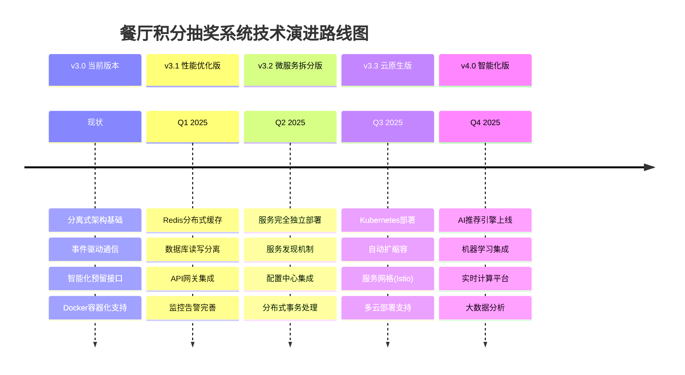

### 🚀 架构升级规划

```
技术演进规划
├── 🎯 短期目标 (3个月)
│   ├── CDN接入加速
│   ├── 数据库性能优化
│   ├── Redis集群部署
│   └── 监控体系完善
│
├── 🔄 中期目标 (6个月)
│   ├── 微服务完全拆分
│   ├── 服务网格部署
│   ├── 分布式事务
│   └── 多环境管理
│
└── 🌟 长期目标 (1年)
    ├── AI算法集成
    ├── 实时计算平台
    ├── 数据中台建设
    └── 国际化支持
```

---

## 📚 相关文档索引

- [API接口文档] → `/api/v3/docs`
- [数据库设计文档] → `数据库设计规范文档标准.md`
- [用户行为分析文档] → `用户行为检测系统设计方案.md`
- [技术规范文档] → `后端技术规范文档标准后端.md`
- [部署运维文档] → `deploy.sh` & `ecosystem.config.js`

---

**📝 文档版本**: v3.0.2  
**🔄 最后更新**: 2025年08月20日 20:28:27 UTC  
**👥 维护团队**: Restaurant Lottery System Team  
**📊 架构分析**: 基于实际代码深度分析，项目共约25,000行代码，采用分离式微服务架构设计  
**🎯 文档特色**: 包含详细流程图、ASCII艺术架构图、完整API接口说明和技术演进规划
